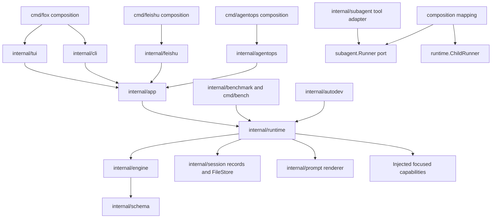

# Implementation Plan: Agent Architecture Decoupling

**Related Spec**: `.codexspec/specs/2026-0808-17255q-agent-architecture-decoupling/spec.md`
**Confirmed Requirements**: `.codexspec/specs/2026-0808-17255q-agent-architecture-decoupling/requirements.md`
**Created**: 2026-08-09
**Status**: Draft

## Context

The current repository has focused provider, tool, compaction, checkpoint, memory, telemetry, transport, and Autodev packages, but production assembly and live lifecycle ownership are duplicated or concentrated in the wrong places. Verified examples include:

- `internal/engine.AgentEngine` directly imports concrete provider, tool, session, compaction, recovery, reminder, metrics, tracing, and tool-result packages and retains streaming fallback state.
- `internal/app.AgentRunner` owns runtime assembly, a live session, provider, tools, memory, compaction, checkpoints, permissions, slash commands, and presentation-facing helpers.
- `app.RunCLI`, `app.RunTUI`, Feishu, AgentOps, benchmark, and child execution each own parts of runtime construction.
- `internal/session` exposes lifecycle-ambiguous `Session`, `Run`, and `Manager` names and duplicates working memory.
- `internal/runtime`, `internal/cli`, `internal/prompt`, and `docs/package-dependencies.md` do not yet exist.

The migration must preserve the corrected current behavior while replacing these ownership relationships. Phase 0 is an implementation prerequisite, not a later test phase.

## Goals and Non-Goals

**Goals:**

- Freeze a complete hermetic behavioral baseline before any production architecture moves.
- Build a thin engine, one runtime lifecycle owner, immutable profiles, and application/presentation boundaries through consumer-owned contracts.
- Move each production profile atomically while old and target test adapters execute the same contract scenarios.
- Enforce and document the target import DAG from the first migration commit with a decreasing allowlist.
- Finish with one production path per profile, an empty allowlist, no temporary facade, and full persisted-data compatibility.

**Covers**: NFR-001, NFR-002, NFR-005, NFR-008, NFR-012, NFR-013

**Non-Goals:**

- No product behavior change, profile normalization, persisted format change, generic TUI library, repository/module split, recursive child tree, RPC boundary, generic event bus, or aggregate infrastructure package.
- No duplicate repair of changes already merged by PRs `#61` and `#63`.
- No permanent compatibility guarantee for replaced `internal/...` Go APIs.

**Covers**: NFR-001, NFR-004, REQ-012, REQ-015

## Technology and Repository Constraints

- **Language and module**: Go 1.25, one module `github.com/Zts0hg/foxharness`.
- **Test and format**: `go test ./...`; focused package tests during TDD; `gofmt -w` for changed Go files.
- **UI**: Bubble Tea remains isolated in `internal/tui`.
- **Persistence**: Existing session, message, transcript, compact-state, checkpoint, memory, metrics, and tracing formats remain compatibility authorities.
- **External boundaries**: LLM, Lark/Feishu, GitHub, clocks, IDs, processes, and network behavior use deterministic local fakes in mandatory tests.
- **Repository policy**: `vendor/` is not modified.

**Covers**: NFR-004, NFR-006, NFR-009, NFR-011

## Target Architecture



The graph is a DAG, not a universal linear layer chain. Composition roots close concrete edges but stop participating after startup. Runtime control clients bypass `app` because they control or evaluate core execution rather than adapt user interaction.

**Covers**: REQ-001, REQ-008, REQ-011, REQ-015, NFR-003, NFR-012

## Planned Source Structure

```text
cmd/*                              process configuration, composition, dispatch
internal/app                       commands, DTOs, notification and interaction ports
internal/cli                       non-interactive terminal presentation
internal/tui                       Fox-specific Bubble Tea presentation
internal/runtime                   harness, profiles, sessions, run scopes, context, children
internal/engine                    turn coordinator and consumer-owned turn ports
internal/prompt                    pure prompt-fragment rendering
internal/session                   stored records, identifiers, logs, FileStore
internal/schema                    narrow model protocol values
internal/benchmark                 evaluation control client
internal/subagent                  invocation adapters and consumer-owned Runner port
internal/autodev                   deterministic runtime control plane
internal/testsupport/runtimecontract shared scenario DSL, fakes, adapter contract
internal/testsupport/entryfixture  deterministic entry and transport fixtures
testdata/characterization/v1       immutable manifest, sessions, and outputs
docs/package-dependencies.md       normative dependency contract and Mermaid diagrams
```

No `internal/infrastructure` package and no premature `runtime/*` subpackages are created.

**Covers**: REQ-003, REQ-006, REQ-007, REQ-008, REQ-010, REQ-011, REQ-015, NFR-002, NFR-009, NFR-012

## Component and Interface Design

### Shared Characterization Harness

`internal/testsupport/runtimecontract` will define implementation-neutral scenario inputs and assertions: scripted model steps, tool definitions/results, run inputs, interaction replies, ordered expected facts, outcomes, and artifact expectations. `CurrentAdapter` targets the existing production path; `TargetAdapter` is introduced with the target runtime and initially fails behavior-sensitive tests. Scenario definitions are not duplicated per adapter.

Entry-specific tests remain in their owning packages or `cmd/*` test packages and use deterministic process, terminal, HTTP, messenger, approval, local Git, and fake GitHub boundaries. A trace manifest records every stable ID, test, fixture, command, and result.

**Covers**: NFR-005, NFR-006, NFR-007, NFR-008, NFR-009, NFR-010

### Engine

`internal/engine` exposes `AgentEngine`, `RunInput`, `RunOutcome`, `RunContext`, `ModelInvoker`, `ToolExecutor`, `TurnPolicy`, `Conversation`, and `Observer`:

- `ModelInvoker` owns one frozen model request plus streaming and fallback state at its required lifetime.
- `ToolExecutor` derives model-visible and executable tools from one immutable snapshot and returns a correlated ordered batch.
- `Conversation` prepares immutable projections and requests ordered changes; runtime controls commits.
- `TurnPolicy` returns completion, TODO, reminder, and recovery decisions without persistence or tool selection.
- `Observer` synchronously accepts typed facts in canonical order.
- `AgentEngine` coordinates the loop using immutable collaborators and retains no cross-run state.

Provider, tool, compaction, persistence, artifact, and telemetry failures remain explicit at their owning boundaries. Turn counters, retries, policies, and fallback state are unexported and run-scoped.

**Covers**: REQ-004, REQ-005, REQ-009, NFR-002, NFR-003

### Runtime

- `RuntimeHarness` stores immutable configuration, concurrency-safe dependencies, profile resolvers, and factories; it never stores a current session.
- `Profile` resolves a flat snapshot with defaults, allowed variation, scheduling, and ceilings. `RunSpec` carries dynamic run values and can only narrow the snapshot.
- `AgentSession` serializes operations for one live session and is the only committer of recoverable state.
- `RunScope` freezes model, tools, permission, observer, cancellation, budget, and run-local policy instances.
- `ContextController` gathers resolved instructions, collaboration, memory, automemory, skills, history, and compact state; calls pure prompt and compaction capabilities; and returns change proposals.
- `ChildRunner` snapshots lineage and ceilings, enforces depth one, creates an isolated child, filters delegation, propagates cancellation, and returns one typed result.
- Runtime owns the consumer-side `SessionStore` port; `session.FileStore` implements storage mechanics.

Recoverable changes are explicit proposals committed in one characterized order by `AgentSession`. Proposals have no storage access.

**Covers**: REQ-002, REQ-003, REQ-006, REQ-007, REQ-012, REQ-014, NFR-001, NFR-003

### Session, Memory, and Prompt

`internal/session` retains serialized formats while Go names migrate to `StoredSession`, `StoredRun`, `FileStore`, `ID`, `RunID`, `TranscriptEvent`, and `TranscriptLog`. Temporary wrappers are compile-time aids only. `MessageRecord`, `MessageLog`, and `CompactState` remain. `memory.Store` becomes the only working-memory implementation.

`internal/prompt` receives deterministic rendering currently under `internal/context`; discovery, injection timing, collaboration, memory access, skills, model invocation, and context mutation remain outside it.

**Covers**: REQ-006, REQ-007, NFR-001, NFR-009

### Application and Presentation

`internal/app` uses narrow interfaces grouped by use case for run submission/results, sessions, future-run model/effort selection, compaction, rewind/checkpoint projections, notifications, and correlated interactions. DTOs contain no engine, runtime, session-record, provider, registry, Bubble Tea, or Lark types.

Runtime facts map once into application notifications. Permission, question, and plan review use request/response ports. TUI owns queueing, overlays, terminal input, and rendering. CLI owns stdout/stderr bytes, artifact labels, exit mapping, output-before-extraction-drain, and exit-after-drain. Feishu and AgentOps own transport, scheduling, deduplication, messaging, and approval callbacks.

**Covers**: REQ-008, REQ-009, REQ-010, REQ-014, NFR-001, NFR-002, NFR-003

### Runtime Control Clients

- Benchmark receives runtime factories and retains cases, fixture workspaces, repeats, validators, reports, and process mapping. Profile snapshots produce fidelity metadata.
- `internal/subagent` defines the consumer-owned `Runner` used by `delegate_task` and fork skills. Composition adapts it to `runtime.ChildRunner` without package imports between them.
- Autodev keeps `CoreRunnerFactory`, ledger, stages, worktrees, gates, Engineer, Git/GitHub, recovery, and reporting; its production factory becomes runtime-backed.

**Covers**: REQ-011, REQ-012, REQ-013, REQ-014, NFR-003

### Dependency Documentation and Architecture Tests

`docs/package-dependencies.md` contains the normative Mermaid DAG, responsibilities, forbidden edges, composition exceptions, interaction flow, fact mapping, and injection points. A hermetic architecture test parses Go imports with `go/parser` and `go/ast`, normalizes module paths, and compares violations with a checked-in exact allowlist. Entries identify concrete edges and deletion boundaries; tests reject additions or broadening; `M27` requires an empty set.

**Covers**: NFR-003, NFR-006, NFR-012, NFR-013

## Plan-Level Decisions

### PLD-001: Shared contracts use test-support values and test-only adapters

**Decision**: Put the scenario DSL, scripted collaborators, and adapter contract in `internal/testsupport/runtimecontract`. Keep concrete old and target adapters in test files close to their implementation when package-private access is required.

**Evidence and Rationale**: One behavioral authority must test both implementations without exporting obsolete APIs or duplicating expectations.

**Alternatives Considered**: A production compatibility package; duplicated suites; entry-only tests.

**Covers**: NFR-007, NFR-008

### PLD-002: Architecture enforcement parses imports with the Go standard library

**Decision**: Parse repository Go files with `go/parser` and `go/ast`, excluding `vendor`, generated outputs, and testdata. Normalize module paths and assert target edges plus the exact allowlist.

**Evidence and Rationale**: This is deterministic, offline, and requires no new tooling dependency or writable global Go cache.

**Alternatives Considered**: Text matching; shelling out to `go list`; adding `golang.org/x/tools/go/packages`.

**Covers**: NFR-006, NFR-012

### PLD-003: Ports live with their consumers

**Decision**: Define engine ports in engine, `SessionStore` and lifecycle capabilities in runtime, application ports in app, and child invocation `Runner` in subagent. Composition injects concrete implementations.

**Evidence and Rationale**: Consumer ownership maintains the confirmed DAG and produces interfaces from actual use without a shared ports package.

**Alternatives Considered**: Provider-owned interfaces; one package per interface; generic infrastructure APIs.

**Covers**: REQ-004, REQ-008, REQ-012, REQ-015, NFR-003

### PLD-004: Recoverable changes use proposals and one runtime commit path

**Decision**: Engine and context collaborators return typed ordered change proposals; `AgentSession` validates and commits them through `SessionStore`. Proposal values have no storage access.

**Evidence and Rationale**: This makes `AgentSession` the only state authority without introducing a generic transaction or event-sourcing framework.

**Alternatives Considered**: Direct engine/compactor writes; mutable `RunContext`; generic event sourcing.

**Covers**: REQ-003, REQ-005, REQ-006, REQ-007

### PLD-005: Observation uses one synchronous fact pipeline

**Decision**: Engine emits a fact once; runtime adds session/run identity; app maps it to UI-neutral notification DTOs; adapters format it. Artifact and telemetry consumers attach through explicit runtime composition without defining competing event order.

**Evidence and Rationale**: Current Reporter variants can independently encode order. One mapping chain preserves canonical ordering and distinct failure policies.

**Alternatives Considered**: Generic event bus; parallel Reporter/Event/Journal chains; completion-only observation.

**Covers**: REQ-009, NFR-001, NFR-002

### PLD-006: Fixture authority uses a versioned hashed manifest

**Decision**: Store baseline artifacts under `testdata/characterization/v1`. Its manifest records source commit, profile/entry, semantics, explicit normalization, and SHA-256 for every fixture. Tests verify hashes before copying mutable fixtures to temporary directories.

**Evidence and Rationale**: A manifest makes accidental regeneration or editing visible and supplies the required source and semantic traceability.

**Alternatives Considered**: Runtime-generated fixtures; developer-home samples; unhashed golden files.

**Covers**: NFR-006, NFR-009

### PLD-007: Compatibility facades are one-way and deletion-tested

**Decision**: `internal/context` forwards only to prompt until `M26`; session aliases/wrappers forward only to new persistence names until `M26`; app entry facades only support unmigrated profiles until `M24`. Architecture tests reject new importers.

**Evidence and Rationale**: Intermediate commits remain buildable without dual production behavior or permanent compatibility debt.

**Alternatives Considered**: Big-bang moves; bidirectional adapters; long-lived feature flags.

**Covers**: NFR-001, NFR-013

## Data and Compatibility Strategy

- Treat existing JSON, JSONL, transcripts, compact state, checkpoints, memory, metrics, and traces as observable compatibility data even when Go types move.
- Preserve `session.ID`/`RunID` encodings and persisted source metadata. AgentOps stays Feishu-source; benchmark and Autodev stay CLI-source unless a separately approved defect changes the baseline.
- Type renames are Go migrations only; introduce no storage rewrite or migration command.
- Copy mutable fixtures to test-owned temporary roots and verify committed fixture hashes before use.
- Freeze current behavior plus separately corrected `DV-*` behavior in the manifest before naming `B00`.

**Covers**: REQ-006, REQ-014, NFR-001, NFR-009, NFR-010

## Implementation Phases and Commit Boundaries

### Phase 0: Characterization and baseline freeze (`B00`)

1. Inventory every stable scenario ID against existing tests; add the trace manifest and architecture test with the exact current violation allowlist.
2. Add the shared runtime DSL, current adapter, deterministic model/tool/clock/ID/process/transport collaborators, and immutable fixture manifest.
3. Implement all shared `RT`, `ST`, `TL`, `CX`, `PL`, and `RS` scenarios.
4. Implement all `PF-*`, `UI-*`, `EV-BEN`, `IA-CHD`, and `CP-AUT` scenarios in their owning test surfaces.
5. Implement every `DV-*` proof. A proven defect stops that profile baseline for separate semantics, Red evidence, and a defect-focused correction commit; an unproven risk records behavior without production change.
6. Run `go test ./...`, fixture hashes, trace completeness, and architecture baseline checks. Record the corrected source commit and declare `B00` only with no missing, skipped, or unresolved item.

No production architecture move is permitted in this phase.

**Covers**: NFR-005, NFR-006, NFR-007, NFR-008, NFR-009, NFR-010, NFR-011, NFR-012

### Phase 1: Pure and persisted endpoints (`M01`-`M03`)

- `M01`: Move rendering to `internal/prompt`; retain a one-way context facade; pass prompt and context contracts.
- `M02`: Introduce persistence names and `FileStore`; retain temporary aliases; pass versioned state fixtures.
- `M03`: Replace duplicate working-memory behavior with `memory.Store`; pass memory, session, compaction, checkpoint, and rewind contracts.

**Covers**: REQ-006, REQ-007, NFR-001, NFR-009, NFR-011, NFR-013

### Phase 2: Target engine (`M04`-`M08`)

- `M04`: Red/Green engine contracts for tool-free execution, provider failure, and ordered facts.
- `M05`: Model turns, thinking/action, streaming/fallback, limits, usage, and provider outcomes; run old/target `RT` and `ST` contracts.
- `M06`: Immutable tool snapshots, scheduling, ordered results, large outputs, cancellation, and failures; run `TL` contracts.
- `M07`: Run-scoped completion, TODO, reminder, and recovery; run `PL` and isolation contracts.
- `M08`: Remove target engine access to context ownership, compaction, persistence, artifacts, telemetry, and concrete infrastructure.

**Covers**: REQ-004, REQ-005, REQ-009, NFR-002, NFR-003, NFR-007, NFR-008, NFR-011, NFR-013

### Phase 3: Runtime lifecycle (`M09`-`M13`)

- `M09`: Seven profile resolvers, snapshots, `RunSpec`, narrowing, and ceiling validation.
- `M10`: `AgentSession`, `RunScope`, `SessionStore`, same-session serialization, and sole recoverable commits.
- `M11`: `ContextController`, injection, projection, compaction proposals, resume, and rewind.
- `M12`: `RuntimeHarness` assembly and complete target shared-runtime suite.
- `M13`: `ChildRunner`, frozen parent lineage, depth/capability ceilings, cancellation, partial outcomes, and cleanup.

**Covers**: REQ-002, REQ-003, REQ-006, REQ-007, REQ-012, REQ-014, NFR-003, NFR-007, NFR-011, NFR-013

### Phase 4: Profile-atomic cutovers (`M14`-`M23`)

- `M14`: Benchmark and `cmd/bench`.
- `M15`: `delegate_task` and fork-skill child invocation.
- `M16`: Narrow application contracts and temporary unmigrated-entry facade.
- `M17`: CLI adapter and all CLI construction paths.
- `M18`: Autodev production `CoreRunnerFactory`.
- `M19`: Feishu runtime execution; transport remains in Feishu.
- `M20`: AgentOps runtime execution and shared migrated Feishu approval/transport.
- `M21`: TUI run/session/model/memory/compaction/checkpoint/rewind capabilities.
- `M22`: TUI permissions, questions, Formal Plan, notifications, cancellation, and queue coordination.
- `M23`: `tui.Run` entry and composition-only `cmd/fox` startup.

Each cutover proves old/target parity, switches every construction path, removes profile-obsolete production wiring in the same commit, retains old access only in tests, and decreases the allowlist.

**Covers**: REQ-001, REQ-008, REQ-010, REQ-011, REQ-012, REQ-013, REQ-014, NFR-001, NFR-007, NFR-008, NFR-011, NFR-013

### Phase 5: Mandatory cleanup and final gate (`M24`-`M27`)

- `M24`: Delete `app.AgentRunner`, old app assembly, `app.RunCLI`, `app.RunTUI`, and entry facades.
- `M25`: Delete old engine, differential adapter, Reporter chain, old configuration, and cross-run state.
- `M26`: Delete context facade, session aliases/wrappers, and duplicate memory owner.
- `M27`: Finalize dependency documentation, empty the allowlist, run every scenario and fixture plus `go test ./...`, publish compatibility trace evidence, and verify that no generated worktree artifact is included.

**Covers**: REQ-001, REQ-004, REQ-006, REQ-007, REQ-008, REQ-009, REQ-010, REQ-015, NFR-001, NFR-003, NFR-011, NFR-012, NFR-013

Adjacent boundaries may be combined only when they are purely mechanical and cross neither a Runtime Profile cutover nor a recoverable-state ownership boundary. Profile cutovers and state-owner changes remain independent commits.

## Verification Strategy

### TDD evidence per boundary

Each task introducing a package, port, coordinator, behavior, or correction records:

1. Red command, failing test, and expected behavior-sensitive reason.
2. Minimal Green implementation and relevant package/contract/profile commands.
3. Refactor changes and repeated Green commands.
4. Architecture allowlist and documentation deltas when dependencies change.

Mechanical renames use already-green characterization and do not manufacture Red.

**Covers**: NFR-011

### Gate hierarchy

| Gate | Required verification |
|---|---|
| Task | Focused package test and exact new or changed contract scenario. |
| Commit | Affected packages, shared subset, affected profile/adapter catalog, architecture test, fixture hashes. |
| Profile cutover | Old and target adapters pass identical applicable catalogs; production resolves only target; obsolete wiring is absent. |
| Phase | Every completed boundary is independently green; trace evidence and decreasing allowlist are current. |
| Final PR | `go test ./...`, every catalog ID, every immutable fixture, empty allowlist, dependency-document parity, one production path per profile. |

**Covers**: NFR-005, NFR-007, NFR-011, NFR-013

### Hermetic collaborators

- Scripted model invoker with streaming deltas, fallback failures, usage, protocol/model snapshots, and barriers.
- Deterministic tool executor with parallel/exclusive barriers, cancellation, large results, failures, aliases, and correlation.
- Fake clocks, IDs, filesystem failure points, bounded process fixtures, process-tree probes, and test-owned local Git repositories.
- `httptest` transport boundaries and fake messengers for Feishu/AgentOps; fake GitHub and command boundaries for Autodev.
- Temporary HOME, config, session, and workspace roots; no ambient settings, credentials, fixed ports, or external network.

**Covers**: NFR-005, NFR-006, NFR-007, NFR-008, NFR-009, NFR-010, NFR-011

## Security Considerations

- Capability ceilings are intersected into immutable model-visible and executable snapshots; aliases and permission assessment use that same snapshot.
- Runtime rejects delegation depth above one independently of child tool filtering.
- Child permission evidence may be inherited but never widened; memory inputs remain read-only as characterized.
- Fixture, benchmark, log, and Autodev paths are tested lexically and after symlink resolution according to separately confirmed defect outcomes.
- Cancellation and timeout proofs cover process-tree and pending-interaction cleanup plus terminal correlation.
- No external credential or user-home data appears in mandatory tests or fixtures.

**Covers**: REQ-002, REQ-005, REQ-012, NFR-006, NFR-010

## Performance and Concurrency Considerations

- Preserve profile scheduling, turn limits, timeouts, and serialization; introduce no new parallel behavior.
- Parallel-safe tool batches overlap, exclusive tools form barriers, and result commitment preserves model order.
- Harness dependencies are concurrency-safe; mutable state resides only in `AgentSession` or `RunScope`.
- Large output, validator process, and transport bounds follow characterized behavior or separately approved corrections.
- Tests use synchronization barriers instead of wall-clock sleeps to prove concurrency.

**Covers**: REQ-003, REQ-005, REQ-014, NFR-001, NFR-006, NFR-010

## Observability

- Engine facts contain turn-level execution information only.
- Runtime facts add session/run identity while preserving canonical synchronous order.
- Application notifications remain UI-neutral; adapters own visible strings and stream mapping.
- Transcripts remain potentially model-visible artifacts, not telemetry or recoverable-state authority.
- Metrics and tracing remain best effort with current warning semantics and cannot change run outcomes.
- Baseline evidence records scenario IDs, commands, hashes, profile snapshots, and cutover results without adding production behavior.

**Covers**: REQ-009, REQ-014, NFR-001, NFR-007

## Risks and Trade-offs

| Risk | Likelihood | Impact | Mitigation |
|---|---|---|---|
| Characterization proves an unclassified defect and delays `B00`. | High | High | Follow CON-005: proof, explicit semantics, independent TDD correction, corrected baseline. |
| Shared scenarios accidentally freeze old Go APIs. | Medium | High | Keep scenarios behavioral and adapters test-only; reject obsolete production compatibility APIs. |
| `AgentSession` becomes a replacement monolith. | Medium | High | Keep mechanics in focused collaborators; runtime coordinates lifecycle and commits only; enforce imports. |
| Temporary facades attract callers. | Medium | Medium | Reject new importers and bind each facade to `M24` or `M26` deletion. |
| Observation migration duplicates or reorders output. | High | High | Emit one fact once; differential ordered-fact and exact adapter-output tests precede cutover. |
| TUI breadth creates a half-migrated runner. | Medium | High | Split internal movement into `M21`/`M22` but keep production entry cutover atomic at `M23`. |
| Fixture normalization hides compatibility changes. | Low | High | Manifest normalization and forbid normalizing tested fields; verify hashes. |
| Sequential migration accumulates temporary code. | Medium | Medium | Fixed deletion boundaries, decreasing allowlist, and mandatory cleanup before PR. |

## Assumptions

None. Plan-level decisions are implementation refinements supported by confirmed requirements and verified repository facts.

## Requirements Coverage

| Spec Requirement | Plan Coverage | Result |
|---|---|---|
| `REQ-001` | Target Architecture; Runtime; Phases 4-5 | Full |
| `REQ-002` | Runtime; Phase 3; Security | Full |
| `REQ-003` | Runtime; PLD-004; Phase 3; Concurrency | Full |
| `REQ-004` | Engine; PLD-003; Phases 2 and 5 | Full |
| `REQ-005` | Engine; PLD-004; Phase 2; Security; Concurrency | Full |
| `REQ-006` | Runtime; Session/Memory/Prompt; Data Strategy; Phases 1, 3, 5 | Full |
| `REQ-007` | Runtime; Session/Memory/Prompt; Phases 1, 3, 5 | Full |
| `REQ-008` | Application/Presentation; PLD-003; Phases 4-5 | Full |
| `REQ-009` | Engine; Application/Presentation; PLD-005; Observability; Phase 5 | Full |
| `REQ-010` | Application/Presentation; Phases 4-5 | Full |
| `REQ-011` | Runtime Control Clients; Phase 4 | Full |
| `REQ-012` | Runtime; Runtime Control Clients; Phases 3-4; Security | Full |
| `REQ-013` | Runtime Control Clients; Phase 4 | Full |
| `REQ-014` | Runtime; Application/Presentation; Data Strategy; Phases 3-4; Observability | Full |
| `REQ-015` | Target Architecture; Source Structure; PLD-003; Phase 5 | Full |
| `NFR-001` | Goals; Runtime; Data Strategy; Phases 1, 4, 5; Observability | Full |
| `NFR-002` | Goals; Source Structure; Engine; PLD-005; Phases 2 and 4 | Full |
| `NFR-003` | Architecture; Runtime; Control Clients; Architecture Tests; Phases 2-5 | Full |
| `NFR-004` | Non-Goals; Repository Constraints | Full |
| `NFR-005` | Characterization Harness; Phase 0; Verification | Full |
| `NFR-006` | Harness; Architecture Tests; PLD-002; PLD-006; Phase 0; Verification | Full |
| `NFR-007` | Harness; PLD-001; Phase 0; Phases 2-4; Verification | Full |
| `NFR-008` | Harness; PLD-001; Phase 0; Phases 2 and 4; Verification | Full |
| `NFR-009` | Harness; PLD-006; Data Strategy; Phases 0-1; Verification | Full |
| `NFR-010` | Harness; Data Strategy; Phase 0; Verification; Security | Full |
| `NFR-011` | Repository Constraints; all Phases; Verification | Full |
| `NFR-012` | Architecture; Source Structure; Architecture Tests; Phases 0 and 5 | Full |
| `NFR-013` | Goals; Architecture Tests; PLD-007; all migration phases | Full |
