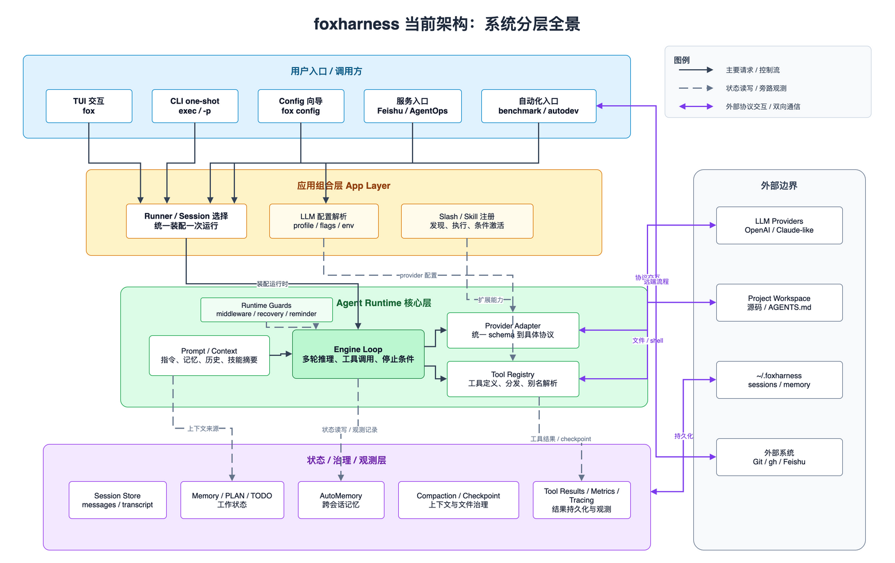

# foxharness 当前架构

本文面向 foxharness 的维护者和贡献者，解释当前代码结构背后的架构边界、运行链路、扩展机制和状态体系。阅读本文不需要先了解具体函数实现；包名和模块名只用于定位职责边界。

foxharness 的核心形态是一个运行在本地项目目录中的 AI 编程 Agent。它既提供交互式 TUI，也支持一次性 CLI、服务入口、自动化评测和自动化开发流水线。不同入口共享同一套 Agent Runtime，而不是各自实现一套推理、工具调用和状态管理逻辑。

从维护角度看，当前架构最重要的线索不是目录树，而是请求进入系统后的职责迁移：入口层接收不同形态的请求，应用组合层把请求装配成一次 Agent 运行，Agent Runtime 执行模型推理和工具调用，状态/治理/观测层为长任务提供连续性和可诊断性，外部边界承接模型服务、本地工作区和远端系统交互。

## 系统分层全景

当前系统可以按五个稳定层次理解：用户入口、应用组合层、Agent Runtime、状态/治理/观测层，以及外部边界。

用户入口层解决的是“请求从哪里来、以什么交互方式进入系统”的问题。它包含三类入口：第一类是人直接使用的终端入口，用于持续对话或一次性执行任务；第二类是配置和运维辅助入口，用于完成运行前的 provider 配置或特定诊断任务；第三类是自动化入口，用于把 Agent 能力嵌入评测、服务集成或无人值守开发流程。TUI、`fox exec`、`fox -p`、`fox config`、Feishu、AgentOps、benchmark 和 autodev 都属于这些入口的具体实现。入口层只应该处理输入形态、展示形态和入口特有的适配逻辑，不应该承载核心 Agent 行为。

应用组合层解决的是“如何把入口请求变成一次可执行的 Agent 运行”的问题。它负责选择或创建 session，解析 LLM 配置，加载 slash command 和 skill，设置 reporter，并构造运行时依赖。这个层次的价值是隔离入口差异：无论请求来自交互式终端、一次性命令、服务入口还是自动化流程，普通 Agent 任务最终都应该尽量复用同一个 Runner 和 Agent Runtime；需要额外流程控制的能力，则通过专用 orchestrator 在组合层之外编排。

Agent Runtime 解决的是“模型如何基于上下文进行多轮推理，并安全地调用本地能力”的问题。Prompt/Context 负责组装系统提示、项目指令、记忆摘要、历史消息和可用能力；Engine Loop 负责多轮推理、工具调用、结果回填和停止条件；Provider Adapter 负责把内部统一消息与工具 schema 转换为具体模型协议；Tool Registry 负责向模型暴露工具定义，并在模型请求工具时分发执行。

状态、治理和观测层解决的是“长任务如何保持连续、可恢复、可排查”的问题。Session Store 保存连续会话和运行历史；Memory、PLAN 和 TODO 保存当前会话的工作状态；AutoMemory 保存跨会话的长期知识；Compaction 管理上下文预算；Checkpoint 保护文件修改；Tool Results、Transcript、Metrics 和 Tracing 支持结果持久化、问题排查和运行分析。

外部边界解决的是“系统与哪些外部资源发生交互，以及这些交互应被隔离在哪里”的问题。外部资源包括模型服务、本地项目工作区、用户级 `.foxharness` 存储，以及 Git、GitHub CLI、Feishu 等外部系统。架构上应把这些外部交互视为边界：内部运行时通过 adapter、tool 或 orchestration 层访问它们，避免把外部协议细节泄漏到核心推理循环中。

## 入口与组合层

入口层的职责是把用户或系统请求转成统一的运行意图。这个职责可以拆成三步：先接收请求，再补齐入口侧上下文，最后把请求交给组合层。

接收请求时，不同入口关心的内容不同。交互式终端入口关心输入框、侧栏、运行中事件流、slash command 交互和用户澄清；一次性命令入口关心命令行参数、stdin、stdout 和退出码；服务或评测入口关心外部事件、任务封装、结果回传和批量执行；自动化开发入口还需要关心 backlog、worktree、阶段验证和远端发布流程。

补齐入口侧上下文时，入口只处理自己必须知道的信息。例如 TUI 知道如何展示 reporter 事件和提问表单，但不应该知道 Engine 如何解析工具调用；CLI 知道如何打印最终结果和 session 路径，但不应该直接操作模型协议；Feishu 入口知道消息平台的事件格式，但不应该把平台协议传入核心运行循环。

Runner 是普通 Agent 运行的组合边界。它持有工作目录、LLM 配置、session、memory store、slash registry、provider、checkpoint 和 user asker 等运行依赖。每次用户请求进入 Runner 后，Runner 负责准备上下文、工具注册表和 engine 配置，然后启动 Engine Loop。对于 autodev 这类需要固定流程和事实验证的能力，组合方式会变成 orchestrator 驱动 Runner，而不是入口直接调用一次普通运行。

这种分层避免了入口和运行时互相污染。新增入口时，优先考虑如何适配到 Runner、Reporter 或已有 orchestrator，而不是复制一条新的 Agent 执行链路。

## Agent Runtime

Agent Runtime 的核心目标是维持一个稳定的内部协议：无论底层使用 OpenAI 兼容协议、Claude 兼容协议，还是其他 provider，Engine Loop 都只处理 foxharness 内部的 message、tool definition、tool call 和 tool result。

一次运行进入 Agent Runtime 后，会经历上下文组装、模型调用、响应解析、工具执行和结果回填。这个循环可能重复多轮，直到模型不再请求工具、运行达到停止条件，或外部上下文取消。

Prompt/Context 是模型行为的输入边界。它把项目指令、工作记忆、长期记忆索引、历史消息、技能摘要和交互能力提示组合成模型可见上下文。它关心“模型应该知道什么”，不关心“模型具体通过哪个 provider 调用”。

Engine Loop 负责执行多轮 agent turn。每轮运行时，它检查上下文预算，必要时触发 compaction；调用 provider 生成模型响应；解析文本和工具调用；把工具结果回填到上下文；在没有工具调用或达到停止条件时产出最终回答。Engine 关心“如何推进一轮 Agent 执行”，不应该直接理解具体外部系统。

Provider Adapter 是模型协议隔离层。OpenAI/Claude 等协议差异体现在 adapter 内部，核心运行时依赖统一 schema。这样可以在不重写 Engine 的情况下支持新的 provider 或协议变体。Tool Registry 则是本地能力隔离层，Engine 只看到工具定义和工具结果，不直接操作文件系统、shell 或外部服务。

维护者调整 Agent 行为时，应先判断变更属于上下文输入、engine 控制逻辑、provider 适配，还是工具能力。这个判断比直接寻找最近的代码位置更重要，因为它决定了变更是否会破坏运行时边界。

## 工具与安全边界

Tool Registry 是 Agent 能力的统一入口。模型看到的是工具定义，执行时进入同一个 registry 分发路径。内置工具覆盖读文件、写文件、编辑文件、执行 shell、读写 TODO、调用 skill、委托 subagent 和交互式提问等能力。

工具系统可以从两个角度理解。对模型来说，工具是“可调用能力列表”；对运行时来说，工具是“受控副作用入口”。文件读写、shell、TODO、skill invocation、subagent delegation 和用户提问都属于副作用或外部交互，因此必须经过同一个工具执行边界。

工具能力必须经过控制边界。Middleware 在工具执行前介入，用于 checkpoint、工作目录约束、审批或其他安全策略。Slash/skill 命令可以通过 allowed-tools 收缩某次运行的工具面。`ask_user_question` 只应在存在交互 asker 的入口中注册，非交互运行不能暴露一个无法获得回答的工具。

Subagent 是工具化的委托能力，而不是新的主执行核心。它允许主 Agent 把边界清晰的子任务交给隔离运行，但依旧通过统一工具系统接入。维护者扩展工具时，应优先保证工具定义清晰、边界可控、结果可被 Engine 消化，而不是让工具绕过 registry 或直接耦合入口层。

## 会话、上下文与记忆

foxharness 同时维护短期上下文、session 状态和跨会话记忆。短期上下文是当前模型调用可见的内容；session 状态是一次连续对话的工作记录；AutoMemory 是多次运行之间复用的长期知识。

这三类状态的生命周期不同。短期上下文随着每轮模型调用被重新估算和裁剪；session 状态伴随一次连续会话存在；跨会话记忆则跨越多个 session，服务于后续任务的经验复用。区分生命周期可以避免把所有状态都塞进 prompt，也可以避免把观测日志误当成模型记忆。

Session 保存会话元数据、原始模型消息、transcript、run artifacts、metrics、trace、working memory、PLAN 和 TODO。它是“这次连续工作发生了什么”的权威记录。Transcript、metrics 和 trace 主要用于观测和排查，不应被误认为模型上下文本身。

Working Memory、PLAN 和 TODO 是 session-local 的工作状态。它们服务于当前会话的计划、待办和上下文连续性。AutoMemory 则是跨 session 的长期记忆层，按用户级和项目级范围保存经验、反馈、参考和项目知识，并通过索引进入后续 prompt。

Compaction 解决上下文窗口限制问题。它管理模型可见上下文的体积，但不应该替代 message log 或 transcript 这些原始记录。大工具结果通过持久化和引用进入上下文，避免把大量输出直接塞回模型窗口。

## 扩展系统

Slash command 和 skill 是 foxharness 的主要扩展机制。它们来自项目级和用户级文件，经过 registry 发现、frontmatter 解析、参数替换、条件激活和 executor 处理后，可以作为用户可调用命令，也可以通过 skill tool 暴露给模型。

扩展系统的关键边界是“发现与执行”和“运行时能力”分离。Registry 负责知道有哪些命令和技能，Executor 负责把命令内容转成可运行 prompt 或 fork-mode 任务，Tool Registry 负责把模型侧的 skill invocation 纳入统一工具执行链。

Conditional activation 允许系统在满足路径或上下文条件时激活技能。它减少默认上下文负担，同时保留按需扩展能力。维护者新增扩展能力时，应注意其是否需要进入模型上下文、是否需要工具权限收缩、是否应该 fork 到 subagent，以及是否会影响 session 里的长期状态。

## 自动化开发平面

Autodev 是独立的自动化开发平面，不应被理解为普通 slash command 的简单包装。它面向无人值守地处理 backlog item，按 CodexSpec 的 requirements-first 流程驱动开发、验证、提交、推送、issue 和 PR。

Autodev 的核心架构是控制平面和执行平面分离。Go 控制平面负责选择 backlog item、准备隔离 worktree、驱动固定阶段、验证磁盘和远端事实、维护 ledger，并协调 Git/GitHub 远端流程。LLM 执行平面负责在 worktree 内完成实际开发操作。阶段是否完成由 Go 验证决定，而不是由模型自称完成。

Engineer Agent 用于无人值守场景下的澄清和纠偏。Core Agent 仍然复用现有 Agent Runtime，在隔离 worktree 中执行任务。这个设计让 autodev 可以利用现有 Agent 能力，同时避免把流程控制权交给模型。

## 维护原则

维护当前架构时，应优先保护以下边界：

- 入口层只做适配，不复制 Agent Runtime。
- Runner 负责装配运行依赖，Engine 负责多轮推理与工具调用。
- Engine 依赖统一 schema，不直接耦合具体 provider 协议。
- 工具能力必须通过 Tool Registry 和 middleware 控制边界。
- Session、AutoMemory、Compaction、Checkpoint 和 Observability 是共享基础设施。
- Autodev 的 Go 控制平面负责事实验证和流程推进，LLM 执行平面负责开发操作。

当新增能力时，先判断它属于入口适配、运行时控制、工具能力、状态治理、扩展系统还是自动化编排。把能力放进正确边界，比复用最近的代码路径更重要。
