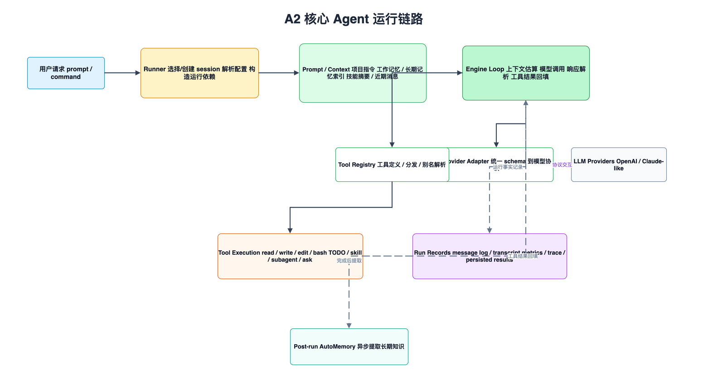
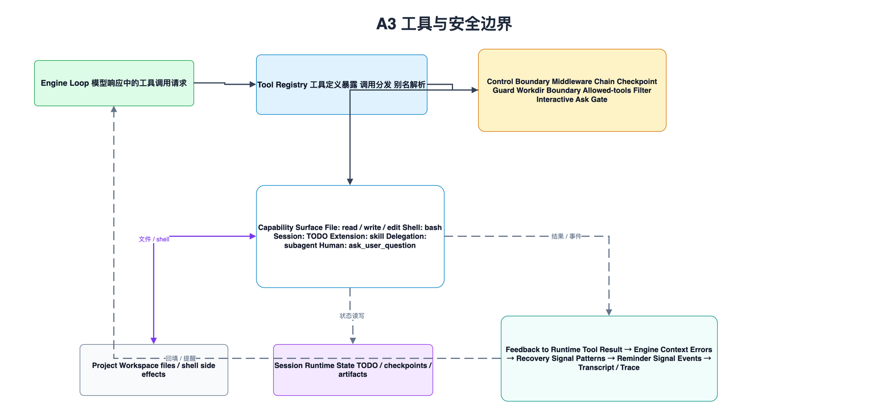
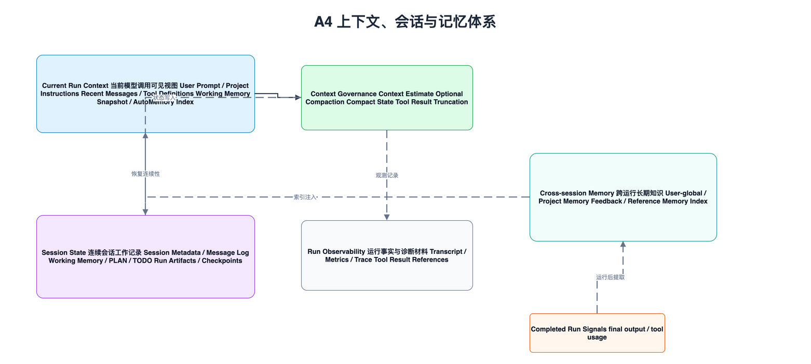
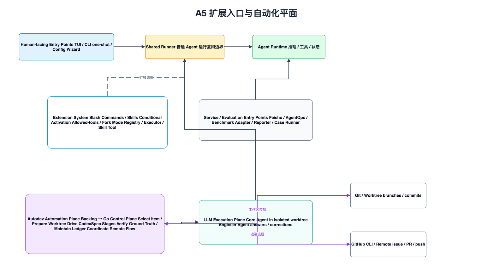

# foxharness 当前架构

本文面向 foxharness 的维护者和贡献者，解释当前代码结构背后的架构边界、运行链路、扩展机制和状态体系。阅读本文不需要先了解具体函数实现；包名和模块名只用于定位职责边界。

foxharness 的核心形态是一个运行在本地项目目录中的 AI 编程 Agent。它既提供交互式 TUI，也支持一次性 CLI、服务入口、自动化评测和自动化开发流水线。不同入口共享同一套 Agent Runtime，而不是各自实现一套推理、工具调用和状态管理逻辑。

从维护角度看，当前架构最重要的线索不是目录树，而是请求进入系统后的职责迁移：入口层接收不同形态的请求，应用组合层把请求装配成一次 Agent 运行，Agent Runtime 执行模型推理和工具调用，状态/治理/观测层为长任务提供连续性和可诊断性，外部边界承接模型服务、本地工作区和远端系统交互。

## 系统分层全景

当前系统可以按五个稳定层次理解：用户入口、应用组合层、Agent Runtime、状态/治理/观测层，以及外部边界。

用户入口层解决的是“请求从哪里来、以什么交互方式进入系统”的问题。它包含三类入口：第一类是人直接使用的终端入口，用于持续对话或一次性执行任务；第二类是配置和运维辅助入口，用于完成运行前的 provider 配置或特定诊断任务；第三类是自动化入口，用于把 Agent 能力嵌入评测、服务集成或无人值守开发流程。TUI、`fox exec`、`fox -p`、`fox config`、Feishu、AgentOps、benchmark 和 autodev 都属于这些入口的具体实现。入口层只应该处理输入形态、展示形态和入口特有的适配逻辑，不应该承载核心 Agent 行为。

应用组合层解决的是“如何把入口请求变成一次可执行的 Agent 运行”的问题。它负责选择或创建 session，解析 LLM 配置，加载 slash command 和 skill，设置 reporter，并构造运行时依赖。这个层次的价值是隔离入口差异：无论请求来自交互式终端、一次性命令、服务入口还是自动化流程，普通 Agent 任务最终都应该尽量复用同一个 Runner 和 Agent Runtime；需要额外流程控制的能力，则通过专用 orchestrator 在组合层之外编排。

Agent Runtime 解决的是“模型如何基于上下文进行多轮推理，并安全地调用本地能力”的问题。Prompt/Context 负责组装系统提示、项目指令、记忆摘要、历史消息和可用能力；Engine Loop 负责多轮推理、工具调用、结果回填和停止条件；Provider Adapter 负责把内部统一消息与工具 schema 转换为具体模型协议；Tool Registry 负责向模型暴露工具定义，并在模型请求工具时分发执行。

状态、治理和观测层解决的是“长任务如何保持连续、可恢复、可排查”的问题。Session Store 保存连续会话和运行历史；Memory、PLAN 和 TODO 保存当前会话的工作状态；AutoMemory 保存跨会话的长期知识；Compaction 管理上下文预算；Checkpoint 保护文件修改；Tool Results、Transcript、Metrics 和 Tracing 支持结果持久化、问题排查和运行分析。

外部边界解决的是“系统与哪些外部资源发生交互，以及这些交互应被隔离在哪里”的问题。外部资源包括模型服务、本地项目工作区、用户级 `.foxharness` 存储，以及 Git、GitHub CLI、Feishu 等外部系统。架构上应把这些外部交互视为边界：内部运行时通过 adapter、tool 或 orchestration 层访问它们，避免把外部协议细节泄漏到核心推理循环中。

## 核心 Agent 运行链路

一次普通 Agent 运行可以理解为“Runner 装配，Engine 推进，Provider 和 Tools 对外交互，Session 与观测系统记录事实”。这条链路是维护者定位问题时最重要的执行路径。

运行从用户请求开始。请求可能来自 TUI 输入、CLI 参数、stdin、服务事件或自动化流程，但进入普通 Agent 执行时，都会先被转成一次明确的 user prompt 或 command prompt。入口层在这里结束，后续由 Runner 负责把这个请求装配成可执行运行。

Runner 首先确定运行上下文。它会选择或创建 session，解析本次要使用的 LLM 配置，准备 provider，加载 slash/skill registry，确认是否有交互式 asker，并构造工具注册表。Runner 的职责不是执行推理，而是保证 Engine 启动前所有依赖都已明确。

Prompt/Context Composer 随后生成模型可见上下文。它把项目指令、当前 session 的工作记忆、跨会话记忆索引、最近消息、技能摘要和交互能力提示组合起来。这个阶段的输出是当前运行的上下文视图，而不是完整历史的简单拼接。

Engine Loop 接管后进入多轮执行。每一轮都会先估算上下文预算，必要时触发 compaction；然后调用 provider 生成模型响应；再解析响应中的文本和工具调用。如果没有工具调用，Engine 产出最终文本；如果存在工具调用，Engine 通过 Tool Registry 执行工具，并把工具结果回填到后续上下文中。

Provider Adapter 和 Tool Registry 是 Engine 的两个主要外部交互边界。Provider Adapter 处理模型协议差异，Tool Registry 处理本地能力和副作用。Engine 只依赖统一 schema，不直接耦合模型 API、文件系统、shell 或外部平台。

运行过程中，message log、transcript、metrics、trace 和 tool result persistence 会记录不同粒度的事实。message log 偏模型可见历史，transcript 偏人类可读事件流，metrics 和 trace 用于运行分析，大工具结果则通过持久化引用降低上下文压力。运行结束后，AutoMemory extraction 可以异步提取值得跨会话保留的长期知识。

## 工具与安全边界

工具系统是 foxharness 从“聊天程序”变成“能操作项目的 Agent”的关键边界。模型不能直接读写文件、执行 shell 或修改 TODO；它只能提出工具调用请求，由 Engine 交给 Tool Registry 处理。

Tool Registry 同时承担两个职责。第一，它向模型暴露工具定义，让模型知道当前运行可用的能力。第二，它在执行阶段根据工具名和参数分发到具体实现，并把结果标准化为 Tool Result。工具别名也在这个边界解析，避免上层 prompt 或外部命令格式差异泄漏到工具实现中。

所有工具执行都必须经过控制边界。Middleware 在工具真正执行前运行，用于建立 checkpoint、约束工作目录、执行审批或阻止危险操作。Slash/skill 命令可以进一步通过 allowed-tools 把某次运行的工具面缩小到必要范围。这个机制让“模型能看到哪些能力”和“模型实际能执行哪些能力”保持一致且可审计。

内置工具可以按副作用类型理解。文件工具负责读取、写入和模糊编辑项目文件；shell 工具负责本地命令执行；TODO 工具负责 session-local 任务状态；skill tool 把文件化命令和技能暴露给模型；subagent tool 允许委托边界清晰的子任务；ask_user_question tool 负责在交互入口中向人类提问。

不同工具的可用性取决于运行场景。非交互式运行不应该注册 `ask_user_question`，因为没有人可以回答；受限 skill 运行应该通过 allowed-tools 缩小能力范围；涉及文件修改的工具应该被 checkpoint 保护。维护者新增工具时，应先判断它引入了哪类副作用，再决定需要哪些 middleware、权限收缩和结果持久化策略。

工具结果不仅返回给模型，也会进入观测链路。错误结果可能触发 recovery 提示，重复模式可能触发 reminder，工具事件会写入 transcript 和 trace。这样一来，工具系统既是能力入口，也是诊断长任务行为的重要数据来源。

## 上下文、会话与记忆体系

foxharness 的状态体系分为三层：当前运行上下文、session 状态和跨会话记忆。这三层服务不同生命周期，不能混用。

当前运行上下文是模型本轮调用能看到的内容。它包括用户请求、项目指令、近期消息、工具定义、技能摘要、工作记忆快照和长期记忆索引。它是一个经过预算约束后的视图，因此会受到 context estimate、compaction 和 tool result truncation 影响。

Session 状态是一次连续会话的权威工作记录。它保存 session metadata、message log、working memory、PLAN、TODO、run artifacts 和 checkpoints。用户多次运行同一 session 时，Runner 会从这些状态中恢复连续性。Session 状态强调“本次连续工作如何推进”，不是跨项目或跨长期周期的知识库。

Run observability 保存的是运行事实。Transcript 面向人类阅读，展示运行中的消息和事件；metrics 记录 token 与性能数据；trace 记录 span 级调用过程；tool result references 指向被持久化的大输出。它们主要用于排查、审计和性能分析，不应该被当作模型默认记忆。

AutoMemory 负责跨会话长期知识。它按用户级和项目级范围保存经验、反馈、参考和项目事实，并维护 Memory Index。后续运行通常只把索引注入 prompt，模型需要具体内容时再通过文件读取工具展开。这种设计避免把长期记忆全部塞进上下文，同时保留按需访问能力。

Compaction 是上下文治理机制，而不是历史删除机制。它解决模型窗口限制，但原始 message log、transcript 和 artifacts 仍保留在 session 里。维护者处理上下文问题时，应区分“模型当前看不到”和“系统没有记录”这两种不同状态。

## 扩展入口与自动化平面

foxharness 的扩展能力分为普通扩展系统、多入口适配和自动化开发平面。它们都复用 Agent 能力，但控制方式不同。

普通扩展系统由 slash command、skill、conditional activation、allowed-tools 和 fork mode 组成。Slash command 和 skill 来自文件系统，Registry 负责发现与合并，Executor 负责参数替换、shell 嵌入、变量处理和 fork-mode 调度。模型侧通过 skill tool 调用这些能力时，仍然进入统一工具执行链。

多入口适配让同一套 Agent Runtime 可以服务不同场景。TUI 负责交互体验，CLI one-shot 负责脚本化执行，Feishu 负责聊天平台事件，AgentOps 负责事件分析，benchmark 负责评测用例。它们的共同目标不是创造新的运行时，而是把各自输入和输出适配到共享 Runner、Reporter 或专用 runner。

Autodev 是更高层的自动化开发平面。它不只是一个命令，而是一个确定性 Go 控制平面加 LLM 执行平面的组合。控制平面读取 backlog，准备隔离 worktree，驱动 CodexSpec 阶段，验证磁盘和远端事实，维护 ledger，并协调 commit、push、issue 和 PR。

LLM 执行平面由 Core Agent 和 Engineer Agent 协作。Core Agent 在隔离 worktree 中复用普通 Agent Runtime 完成开发操作；Engineer Agent 在无人值守场景下回答问题并提供纠偏。阶段是否完成由 Go 侧验证决定，而不是由模型自称完成。这是 autodev 与普通交互式运行最大的架构差异。

维护者扩展自动化能力时，应保持控制权边界清晰：流程顺序、完成条件和远端事实验证属于确定性控制平面；代码修改、命令执行和文档撰写属于 LLM 执行平面。把这两类职责混在一起，会降低自动化流程的可恢复性和可信度。

## 维护原则

维护当前架构时，应优先保护以下边界：

- 入口层只做适配，不复制 Agent Runtime。
- Runner 负责装配运行依赖，Engine 负责多轮推理与工具调用。
- Engine 依赖统一 schema，不直接耦合具体 provider 协议。
- 工具能力必须通过 Tool Registry 和 middleware 控制边界。
- Session、AutoMemory、Compaction、Checkpoint 和 Observability 是共享基础设施。
- Autodev 的 Go 控制平面负责事实验证和流程推进，LLM 执行平面负责开发操作。

当新增能力时，先判断它属于入口适配、运行时控制、工具能力、状态治理、扩展系统还是自动化编排。把能力放进正确边界，比复用最近的代码路径更重要。
