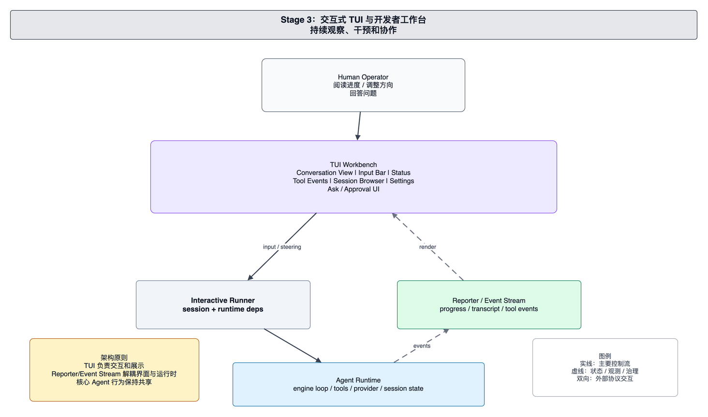

# foxharness 项目演进架构

本文面向 foxharness 的维护者和贡献者，解释项目架构如何从一个 hello 级别的 Agent demo 演进到当前多入口、可扩展、可治理、可自动化的工程化结构。这里的“演进”不是提交历史的逐条回放，而是按照架构能力成熟度梳理系统为什么需要新增边界，以及这些边界如何共同形成当前结构。

阅读本文时可以把每个阶段理解为一个稳定的架构台阶：前一阶段暴露出新的复杂度，后一阶段通过新的职责边界吸收这些复杂度。当前系统不是所有阶段简单叠加后的目录集合，而是把早期能力沉淀到共享 Runtime、状态系统、工具边界、扩展系统和自动化控制平面中。

## Stage 0：Hello Agent Demo

最早的 Agent 形态可以抽象为一个最小闭环：用户输入一段 prompt，Demo Runner 选择 provider 配置并调用模型，模型返回文本，程序把结果打印给用户。这个阶段的核心目标是验证模型调用链路可用，而不是构建完整的工程化 Agent。

在这个阶段，系统通常只有一个很薄的入口和一个简单的 LLM client。入口负责读取用户输入，LLM client 负责向模型服务发送请求并接收响应。由于没有工具调用，模型只能基于 prompt 中已有的信息回答问题，无法主动读取项目文件、执行命令或修改代码。

这个结构的优势是简单，适合验证 provider、鉴权、基础提示词和终端输出。但它也有明显限制：运行逻辑和 provider 协议容易耦合；每次请求都是孤立的；系统无法感知项目状态；用户也无法让 Agent 对工作区产生受控副作用。

Stage 0 为后续演进提供了最小核心：用户请求、模型调用和文本输出。后续阶段要做的事情，本质上都是围绕这个核心逐步增加工具、状态、交互、治理和自动化能力。

## Stage 1：Tool-Using Agent

当 Agent 需要处理真实工程任务时，单纯的文本问答不够。模型必须能够查看项目文件、根据结果继续推理，并在必要时修改文件或执行命令。Stage 1 的关键变化，是从“一次模型调用”演进为“模型推理和工具调用交替推进”的 Agent Loop。

Agent Loop 在每一轮调用模型后解析响应。如果响应只是最终答案，运行结束；如果响应包含工具调用，系统把调用交给 Tool Dispatcher 执行，再把工具结果作为新的上下文交回模型。这样一来，模型可以通过多轮观察和行动逐步完成任务。

工具面在这个阶段通常从最基础能力开始：读取文件、写入或编辑文件、执行 shell 命令。这些能力让 Agent 能够真正作用于项目工作区，但也第一次引入了本地副作用。文件修改和命令执行不再只是输出文本，而会改变用户机器上的状态。

因此，Stage 1 的架构价值不只是“加了工具”，更重要的是形成了工具调度边界。模型不能直接操作文件系统或 shell，而是提出结构化工具请求，由运行时统一解释、执行和回填结果。这个边界是后续权限控制、checkpoint、观测和 allowed-tools 的前提。

## Stage 2：持久会话与工程上下文

具备工具能力后，Agent 可以完成更复杂的任务，但复杂工程任务往往不是一次运行就能解决。用户可能会暂停、继续、修正方向，也可能希望 Agent 记住当前计划、已读信息、待办事项和历史决策。Stage 2 的关键变化，是把一次性 Agent Loop 放进持久 session 和工程上下文中。

Session-aware Runner 负责选择或创建 session，并在启动运行前恢复工作状态。恢复的内容包括历史消息、当前工作记忆、计划、TODO 和运行产物。这样，新的用户请求不是从空白 prompt 开始，而是在连续会话的上下文中继续推进。

与此同时，项目指令开始成为上下文的一部分。Agent 不只读取用户当前输入，也会加载项目级规则、维护约定和工作目录相关信息。Context Composer 的职责由简单拼接 prompt，演进为根据运行预算组织用户请求、项目指令、历史消息和状态摘要。

这个阶段带来的核心边界是状态生命周期分离。当前模型调用能看到的是经过组装和预算约束的运行上下文；session store 保存的是连续工作的权威记录；项目文件则是外部工作区事实。维护者排查问题时，需要区分模型“当前没看到”、session“没有记录”和工作区“事实不存在”这三种情况。

## Stage 3：交互式 TUI 与开发者工作台

当 Agent 开始承担长时间工程任务后，用户需要的不再只是命令执行结束后的最终文本，而是一个可以持续观察、干预和协作的工作台。Stage 3 的关键变化，是在共享 Agent Runtime 之上增加交互式 TUI。

TUI Workbench 负责对人类友好的交互体验：展示对话、接收输入、显示运行状态、呈现工具事件、浏览 session、调整设置，并在需要时让用户回答问题或处理审批。它关注的是交互和展示，不应该复制模型推理、工具执行或状态管理逻辑。

为了让 TUI 和 Runtime 解耦，系统需要稳定的 Reporter 或 Event Stream。Runtime 在执行过程中持续产生文本、工具事件、错误、状态变化和观测信息；TUI 订阅这些事件并渲染给用户。用户输入和交互决策再通过 Interactive Runner 回到运行时。

这个阶段确立了一个重要原则：入口层可以有丰富的交互形态，但核心 Agent 行为必须共享。交互式入口、一次性 CLI 和后续服务入口都应该通过适配层接入 Runner 和 Runtime，而不是各自实现一套 Agent Loop。

## Stage 4：可靠性与治理层

随着工具能力、持久状态和交互入口变多，系统复杂度的主要风险从“能不能完成任务”转向“长任务是否可控、可恢复、可诊断”。Stage 4 的关键变化，是把可靠性和治理能力提升为共享架构层。

上下文治理解决模型窗口有限的问题。Runtime 在调用模型前估算上下文预算，必要时触发 compaction，把长历史压缩成模型可继续使用的状态。Compaction 不是删除历史，而是生成当前调用可承载的视图；原始 session 记录和运行产物仍然保留。

工具治理解决本地副作用的安全边界问题。工具执行前经过 middleware chain，工作目录限制、allowed-tools、交互式 ask gate 和 checkpoint 都在这个边界生效。这样，模型能够看到和执行的能力可以被按运行场景收缩，文件修改也可以被保护和追踪。

观测体系解决长任务排查问题。Transcript 面向人类阅读，metrics 记录 token 和性能，trace 记录调用过程，大工具结果通过持久化引用降低上下文压力。这些事实记录让维护者能够判断任务失败是 provider 问题、工具问题、上下文问题、入口问题还是用户工作区问题。

Stage 4 之后，可靠性能力不应该散落在某个入口或某个工具里，而应该成为 Agent Runtime 的共享基础设施。新增入口、工具或自动化流程时，都应复用同一套上下文治理、工具治理和观测机制。

## Stage 5：扩展生态与多入口集成

当核心 Runtime 稳定后，系统会自然扩展到更多入口和更多可复用工作流。Stage 5 的关键变化，是从单一 Agent 产品演进为多入口共享能力平台。

多入口集成把不同来源的请求接入同一套应用组合层。TUI 负责交互式使用，CLI one-shot 负责脚本化任务，配置入口负责 provider 与运行参数管理，Feishu 等服务入口负责平台事件适配，AgentOps 和 benchmark 负责事件分析与评测。它们面对的用户场景不同，但普通 Agent 任务应尽量汇入共享 Runner、Reporter、Provider Config 和 Session Selection。

扩展系统让项目维护者可以把重复流程文件化。Slash command 和 skill 提供可发现、可复用、可组合的命令入口；conditional activation 让扩展可以按项目或上下文启用；allowed-tools 让扩展声明执行时需要的工具面；fork mode 和 subagent delegation 让复杂任务可以在边界清晰的执行上下文中展开。

这一阶段最需要防止的是运行时分叉。服务入口、评测入口和扩展入口都可能因为自身场景特殊而倾向于复制逻辑，但架构上应优先通过 adapter、specialized runner 或 extension executor 接入共享 Runtime。只有这样，provider 适配、工具治理、session、memory 和观测能力才能持续复用。

## Stage 6：CodexSpec + Autodev 自动化开发流水线

最后一个阶段是自动化开发流水线。它不是简单地把交互式 Agent 放进循环里运行，而是在共享 Agent Runtime 之外增加确定性的 Go 控制平面，用来选择任务、准备隔离环境、驱动阶段、验证事实并协调远端协作。

CodexSpec 为自动化流程提供显式阶段边界。需求澄清、规格生成、技术计划、任务拆分和实现验证被组织成可追溯流程。模型仍然可以参与文档撰写、代码修改和问题分析，但阶段是否完成不能只依赖模型自述，而要由控制平面检查磁盘、Git、测试和远端状态。

Autodev 的 Go Control Plane 负责确定性流程：读取 backlog 或 issue，选择工作项，准备 worktree，驱动 CodexSpec 阶段，维护 ledger，执行验证，并在满足条件时 commit、push、创建或更新 PR 和 issue。这个平面强调事实检查和流程推进。

LLM Execution Plane 负责需要智能判断的开发操作。Core Agent 在隔离 worktree 中复用普通 Agent Runtime，使用工具、provider、session、memory 和检查机制完成实现工作；Engineer Agent 可以在无人值守场景下回答澄清问题或提供纠偏。两者都服务于控制平面设定的阶段目标。

Stage 6 的核心架构原则是“确定性控制”和“智能执行”分离。流程顺序、完成条件、远端事实验证和账本记录属于 Go 控制平面；需求理解、代码编辑、命令执行和文档更新属于 LLM 执行平面。保持这个边界，是自动化开发流水线可恢复、可审计、可信任的基础。

## 演进后的架构结论

从 Stage 0 到 Stage 6，foxharness 的架构逐步形成了几条稳定边界：

- 模型调用从简单 client 演进为 provider adapter 边界。
- 工具能力从直接副作用演进为 Tool Registry 和 middleware 控制边界。
- 单次运行从孤立 prompt 演进为 session、context、memory 和 observability 体系。
- 用户界面从命令输出演进为多入口适配，但核心 Runtime 保持共享。
- 可复用流程从内置逻辑演进为 slash command、skill 和 allowed-tools 扩展生态。
- 自动化开发从人工交互演进为 Go 控制平面与 LLM 执行平面的协作。

维护者评估新能力时，可以先判断它对应哪个演进维度：它是在新增入口、扩展工具、增强状态、改善治理、接入外部系统，还是提升自动化控制。明确维度后，再把实现放到相应边界内，避免把短期便利变成长期架构耦合。
