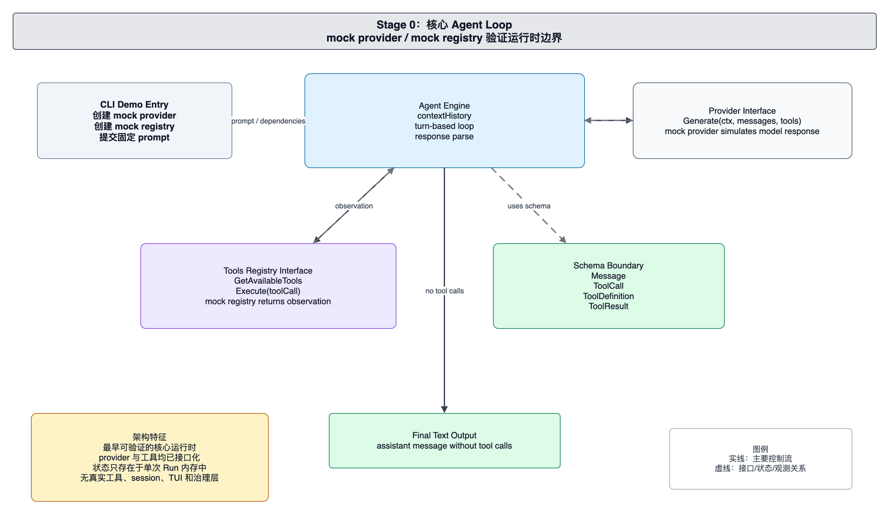

# foxharness 当前架构：核心 Agent Loop

本文面向 foxharness 的维护者和贡献者，解释当前代码中的核心 Agent Loop 架构。当前系统的目标是验证 Agent 运行时的最小边界：入口负责装配依赖，Engine 负责多轮控制流，Provider 接口负责模型生成边界，Tools Registry 接口负责工具能力边界。

当前架构还不是完整产品形态，而是一个可以运行、可以推演工具调用、可以验证接口方向的最小运行时。维护者阅读这份结构时，应重点关注职责方向是否清晰，而不是入口功能是否丰富。

## 系统边界

当前系统由 CLI demo 入口、Agent Engine、Provider Interface、Tools Registry Interface 和 Schema Boundary 组成。

CLI demo 入口负责创建运行依赖。它创建 provider，创建 registry，准备工作目录，并把固定用户请求交给 Engine。入口本身不承担多轮推理，不解析工具调用，也不维护模型上下文。

Agent Engine 是当前系统的运行中心。它持有 provider、registry 和 workdir，并在一次 `Run` 内维护 `contextHistory`。Engine 负责组装初始 system/user message，调用 provider 生成 assistant message，解析 assistant message 中的 tool calls，并把工具 observation 追加回上下文。

Provider Interface 是模型生成边界。Engine 只依赖统一的 `Generate(ctx, messages, tools)` 形态，不关心具体模型服务如何鉴权、发送请求或解析响应。当前 provider 可以是 mock 实现，只要满足接口即可被 Engine 使用。

Tools Registry Interface 是工具能力边界。Engine 通过 registry 获取可用工具定义，并把模型请求的 tool call 交给 registry 执行。工具调用和工具结果都通过 schema 表达，Engine 不直接耦合具体工具实现。

Schema Boundary 定义 Engine、Provider 和 Registry 之间交换的数据形态。Message、ToolCall、ToolDefinition 和 ToolResult 是当前运行时最重要的共享契约。

## 核心运行链路

一次运行从 CLI demo 入口开始。入口创建依赖后调用 Engine，Engine 构造初始上下文并进入 turn-based loop。

每一轮中，Engine 先从 registry 获取工具定义，再把当前上下文和工具定义交给 provider。Provider 返回 assistant message 后，Engine 先把该消息追加到上下文。如果 assistant message 没有 tool calls，本次运行结束并输出最终文本。

如果 assistant message 包含 tool calls，Engine 会逐个把 tool call 交给 registry。Registry 返回 ToolResult 后，Engine 将结果转换为 observation message 并追加到上下文。下一轮 provider 调用可以基于这些 observation 继续生成响应。

这个链路已经具备工具型 Agent 的核心控制结构：模型可以通过结构化 tool call 请求外部能力，运行时负责执行并把结果反馈给模型。

## 状态体系

当前系统的状态只存在于单次运行内存中。`contextHistory` 是模型可见历史，也是 Engine 推进多轮循环的工作状态。

运行结束后，消息历史、工具结果和最终输出不会成为下一次运行的输入。当前架构没有持久 session，也没有独立的运行记录系统。维护者排查当前阶段的问题时，应直接从一次 `Run` 的上下文构造、provider 返回值和 registry 执行结果入手。

## 维护原则

维护当前架构时，应优先保护以下边界：

- 入口只负责装配依赖，不复制 Engine Loop。
- Engine 只依赖 Provider 和 Registry 抽象，不直接耦合具体模型或具体工具。
- Provider 只负责模型生成，不执行工具。
- Registry 只负责工具目录和工具执行，不维护模型推理流程。
- Schema 是跨边界契约，修改时要同时考虑 Engine、Provider 和 Registry。

新增能力时，应先判断它属于入口装配、模型生成、工具执行还是共享 schema。把能力放进正确边界，比在 demo 入口中快速拼接逻辑更重要。
