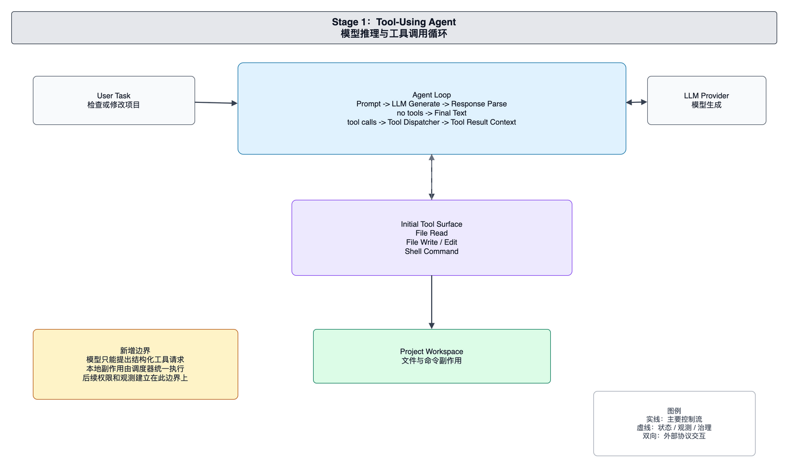

# foxharness 当前架构：Tool-Using Agent

本文面向 foxharness 的维护者和贡献者，解释当前工具型 Agent 的架构边界。当前系统已经从运行时骨架进入可操作工作区的形态：CLI 入口装配真实 provider 和工具 registry，Agent Engine 执行多轮推理，工具系统负责读取文件、写入文件和执行 shell 命令。

当前架构的核心问题不是如何展示交互界面，而是如何让模型通过统一工具边界安全地接触项目工作区。

## 系统边界

当前系统可以按五个边界理解：CLI 入口、Agent Engine、Provider Adapter、Tool Registry、Project Workspace。

CLI 入口负责运行前装配。它读取环境变量，确定工作目录，创建 provider，创建工具 registry，并注册 `read_file`、`write_file` 和 `bash` 等基础工具。入口把用户请求交给 Engine 后，不参与多轮推理细节。

Agent Engine 负责请求推进。它维护本次运行的上下文，每一轮把上下文和工具定义交给 provider，并根据 provider 返回的 assistant message 决定继续调用工具还是输出最终文本。

Provider Adapter 负责模型协议边界。Engine 使用统一 provider 接口，不直接处理具体模型 API 的请求格式和响应格式。

Tool Registry 负责工具目录和工具分发。工具通过统一接口暴露名称、schema 和执行函数。Engine 只看到工具定义和 ToolResult，不需要知道文件读取、文件写入和 shell 执行的实现细节。

Project Workspace 是工具副作用发生的位置。文件工具和 bash 工具都以工作目录为边界运行。维护者应把 workspace 视为外部事实来源，而不是 Engine 的内部状态。

## 核心运行链路

一次任务从 CLI 入口传入用户请求。Engine 将用户请求放入上下文，并向 provider 暴露当前可用工具定义。

Provider 返回的 assistant message 可能是最终文本，也可能包含一个或多个 tool calls。没有 tool calls 时，Engine 结束运行并输出 assistant 文本。有 tool calls 时，Engine 把每个调用交给 Tool Registry。

Tool Registry 根据工具名查找具体工具，解析参数并执行。`read_file` 返回文件内容，`write_file` 写入工作区文件，`bash` 在工作目录中执行命令并返回 stdout/stderr 汇总结果。工具执行结果被标准化为 ToolResult，并回填到模型上下文中。

模型通过下一轮调用继续基于工具结果推理。这个循环让 Agent 能够先观察项目，再决定下一步操作。

## 工具边界

当前工具边界有两个职责。第一，它把可用能力声明给模型，让模型知道可以请求哪些操作。第二，它在执行阶段控制具体副作用，避免 Engine 或 provider 直接操作文件系统和 shell。

`bash` 工具包含命令超时和输出截断逻辑。文件工具绑定工作目录。Registry 对未知工具返回错误结果，而不是让调用穿透到未定义能力。维护者新增工具时，应先定义清楚工具名、输入 schema、执行副作用和错误输出。

## 状态与上下文

当前上下文仍以单次运行为生命周期。工具结果会直接进入模型上下文，成为下一轮推理依据。上下文记录是运行时内存状态，不是长期项目知识库。

工具副作用发生在项目工作区。模型上下文里的工具结果只是对副作用的观察，不等同于 workspace 的权威状态。维护者排查问题时，应同时检查上下文里的 ToolResult 和磁盘上的真实文件。

## 维护原则

维护当前架构时，应优先保护以下边界：

- CLI 入口负责装配，不直接执行工具。
- Engine 负责循环控制，不包含具体工具逻辑。
- Provider Adapter 负责模型协议，不触碰工作区。
- Tool Registry 是模型能力和本地副作用之间的唯一执行入口。
- Workspace 是外部边界，工具必须显式声明并控制对它的影响。

新增能力时，应通过工具接口接入 Registry，而不是让 Engine 或 provider 直接调用本地能力。
