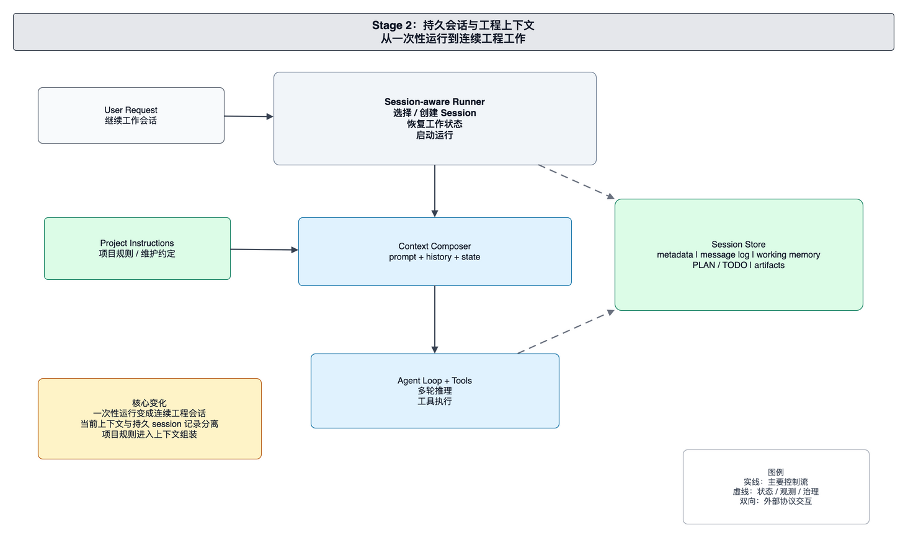

# foxharness 当前架构：持久会话与工程上下文

本文面向 foxharness 的维护者和贡献者，解释当前会话化 Agent 架构。当前系统围绕 `AgentRunner` 组织运行：入口把请求交给 Runner，Runner 选择或创建 session，恢复工程上下文，构造 Engine，并把运行事实写回 session。

当前架构的重点是让 Agent 可以在连续工程任务中保持上下文、计划、TODO 和可恢复状态。

## 系统边界

当前系统由入口层、AgentRunner、Context Composer、Agent Engine、Session Store、Memory Store、TODO 工具和 Checkpoint/Rewind 机制组成。

入口层负责接收用户请求和 CLI 配置，并把配置转换为 Runner 可以理解的运行参数。入口不直接创建 Engine，不直接管理 session 文件，也不直接写 TODO。

AgentRunner 是应用组合层。它负责解析工作目录，选择或创建 session，初始化 memory store，创建 provider，构建工具 registry，并为每次用户请求启动一次 run。Runner 的职责是装配运行，不承担模型推理。

Context Composer 负责构造模型可见上下文。它把用户请求、项目上下文、session memory 和当前工作状态组合成系统提示或上下文输入。模型看到的是 Composer 生成的视图，而不是磁盘状态的简单拼接。

Agent Engine 负责多轮推理和工具调用。它仍通过 provider 生成响应，通过 registry 执行工具，并通过 reporter 输出运行事件。

Session Store 是连续会话的权威记录。Session 目录保存 message log、transcript、TODO、运行产物和相关状态。Runner 通过 session 恢复连续性。

## 会话运行链路

一次运行从入口层提交用户请求开始。Runner 根据配置选择已有 session 或创建新 session，然后初始化该 session 对应的 memory store 和工具集。

Runner 构造 Context Composer，把 session memory 绑定到当前运行。随后 Runner 创建 Engine，并注册文件工具、bash 工具、TODO 工具和子任务工具。Engine 执行多轮模型推理和工具调用。

运行过程中，模型可见消息写入 message log，人类可读事件写入 transcript，TODO 通过专用工具读写，文件副作用由 checkpoint 记录。用户需要回退时，系统可以根据消息序号截断 message log，并恢复对应的 session state。

## 状态体系

当前状态体系分为三类。

当前运行上下文是模型本轮调用能看到的内容。它服务一次 run，会随着工具结果和模型消息不断增长。

Session 状态是连续工作的权威记录。`messages.jsonl` 保存模型可见历史，transcript 保存人类可读事件，session 目录保存 TODO 和运行相关文件。继续会话时，Runner 以 session 状态为恢复来源。

Memory Store 保存项目工作记忆和计划文件。它为 Context Composer 提供工程上下文，让模型理解当前工作目标和项目约束。

TODO 工具是任务清单的专用边界。模型通过 `read_todo` 和 `update_todo` 读取或替换 session TODO，而不是用普通文件工具绕过任务状态协议。

## Checkpoint 与 Rewind

Checkpoint/Rewind 机制负责把文件副作用和会话状态联系起来。文件修改会被记录，用户可以把会话恢复到某条消息之前。恢复不仅是删除该消息之后的记录，也包括恢复工作记忆和相关 session state。

这条边界让工具型 Agent 更适合长任务：模型可以持续推进，用户也可以在必要时回退错误路径。

## 维护原则

维护当前架构时，应优先保护以下边界：

- Runner 负责运行装配，Engine 负责推理循环。
- Session 是连续工作的权威记录，TUI 或 CLI 展示状态不能替代 session 文件。
- TODO 必须通过专用工具维护，避免任务状态和普通文件编辑混在一起。
- Checkpoint/Rewind 应与 message log 和 memory state 一起考虑。
- Context Composer 生成模型视图，不应被当成磁盘事实本身。

新增状态能力时，应先判断它属于当前 run、session 持久状态、项目工作区事实，还是用户可见展示状态。
