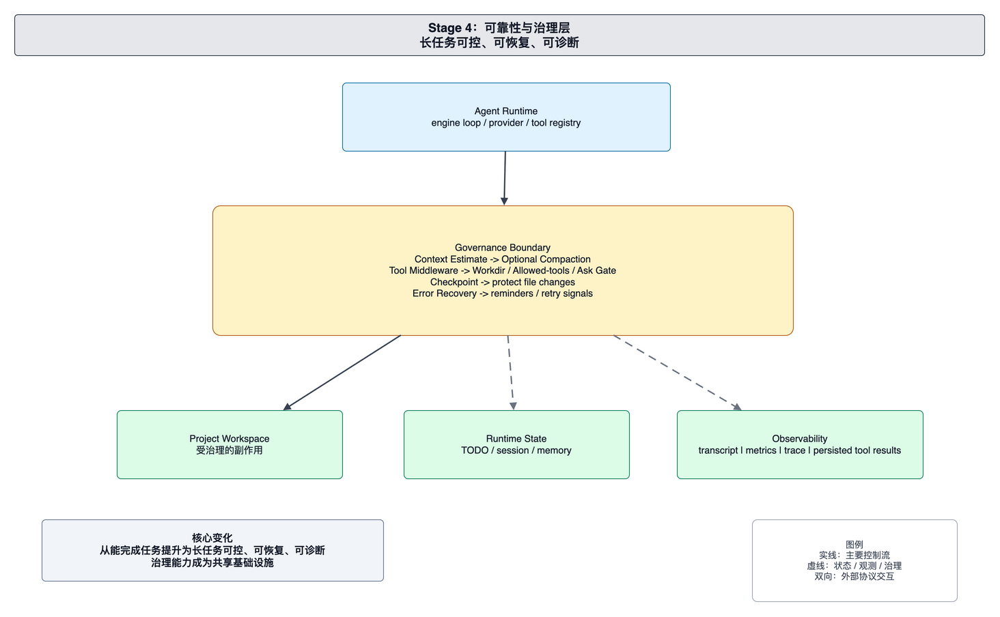

# foxharness 当前架构：可靠性与治理层

本文面向 foxharness 的维护者和贡献者，解释当前可靠性与治理架构。当前系统已经把长任务运行中的上下文预算、工具结果大小、运行观测、错误恢复和提醒机制纳入 Agent Runtime 的共享边界。

当前架构的目标是让 Agent 运行可继续、可诊断、可约束，而不是只追求模型能完成一次工具调用。

## 系统边界

当前系统由 Agent Runtime、Context Governance、Tool Result Persistence、Observability、Recovery/Reminder 和 Session Store 组成。

Agent Runtime 仍是多轮推理中心。它调用 provider，执行工具，写入 session，并通过 reporter 发出运行事件。可靠性能力围绕 Runtime 工作，而不是分散在各个入口中。

Context Governance 负责模型窗口管理。Estimator 估算消息、工具调用和工具结果的 token 成本；threshold 决定是否需要压缩；compactor 生成可继续推理的上下文摘要；boundary 保护必须保留的上下文片段。

Tool Result Persistence 负责大工具输出。小结果直接进入上下文；大结果写入 session 文件，模型上下文中保留路径和预览。这样既保留完整事实，又降低上下文压力。

Observability 负责运行事实记录。Metrics 记录 token 和运行成本，Tracing 记录 provider 与 tool call 过程，Transcript 面向人类阅读，session artifacts 保存大输出和相关产物。

Recovery/Reminder 负责运行中反馈。工具错误会形成恢复信号，重复模式会形成提醒信号。它们帮助模型在同一运行中调整行为。

## 核心运行链路

一次运行开始后，Engine 在每一轮调用 provider 前检查上下文状态。若上下文接近窗口限制，Compactor 生成摘要并更新当前模型视图。

Provider 返回 tool calls 后，Engine 执行工具并收集结果。工具结果先经过大小和预算处理；需要落盘的结果写入 session 目录，内联上下文只保留预览和引用路径。

每个关键步骤都会产生观测事实。Trace 记录调用过程，metrics 记录成本，transcript 记录人类可读事件，reporter 将运行状态发送给入口。错误和重复模式会进入 recovery/reminder 机制，影响当前运行接下来的 prompt。

## 状态体系

当前状态体系可以按用途划分。

Session Store 保存权威历史和运行产物。Message log、transcript、tool result 文件和 artifacts 都属于 session 范围。

Compaction State 是模型当前可见视图的一部分。它解决的是模型窗口限制，不是删除历史。完整事实仍保存在 session 中。

Metrics 和 Trace 是诊断状态。它们服务排查和分析，不应被当作模型默认上下文。

Tool Result 文件保存大输出。模型通过预览和路径知道完整结果在哪里，维护者也可以直接打开文件排查。

## 治理边界

当前治理层集中在 Runtime 周围。入口不需要各自实现上下文压缩、工具输出落盘、trace 或 metrics。只要入口通过共享 Runner 和 Engine 执行任务，就能得到同一套治理能力。

工具执行仍通过 registry 进入 Runtime。可靠性层记录工具调用、处理工具结果、观察错误模式，但不替代工具本身的职责。工具负责执行具体能力，Runtime 负责把工具行为纳入可诊断运行。

## 维护原则

维护当前架构时，应优先保护以下边界：

- 上下文治理属于 Runtime，不属于入口。
- Compaction 生成模型视图，不删除 session 历史。
- 大工具输出必须可追溯到 session 文件。
- Metrics、trace 和 transcript 记录不同粒度的事实，不能互相替代。
- Recovery 和 reminder 影响当前运行中的模型行为，但不应绕过工具结果和 session 事实。

新增入口、provider 或工具时，应确认它能接入同一套治理和观测链路。
