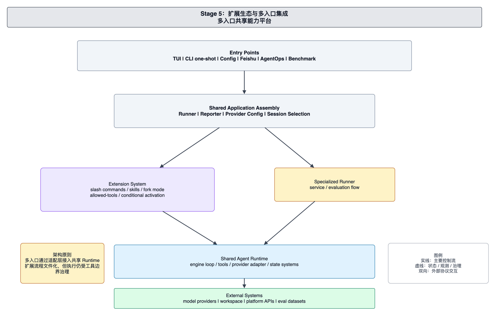

# foxharness 当前架构：扩展生态与多入口集成

本文面向 foxharness 的维护者和贡献者，解释当前扩展系统与多入口集成架构。当前系统通过 slash command、skill、conditional activation、allowed-tools 和 fork/subagent 执行，把可复用工作流纳入共享 Agent Runtime。

当前架构的重点是让入口差异、扩展发现和工具能力控制保持分离。

## 系统边界

当前系统由 Entry Points、Shared Application Assembly、Extension System、Filtered Tool Surface、Subagent/Fork 执行和 Shared Agent Runtime 组成。

Entry Points 包含 TUI、CLI one-shot、服务入口、评测入口和相关运维入口。不同入口负责不同输入输出形态，但普通 Agent 任务应进入共享 Runner 和 Runtime。

Shared Application Assembly 负责装配 provider、session、reporter、slash registry、工具 registry 和运行配置。入口把请求交给组合层，而不是自行发现和执行扩展。

Extension System 负责命令发现、命令合并、参数处理和执行。Slash command 可以来自项目目录、用户目录或内置定义。Registry 负责优先级、缓存、别名、条件激活和可调用视图。

Filtered Tool Surface 负责收缩单次运行的工具面。扩展可以声明 allowed-tools；执行时系统创建受限 registry，使模型看到的工具定义和实际允许执行的工具保持一致。

Subagent/Fork 执行为复杂扩展提供隔离上下文。扩展可以选择 inline 执行，也可以通过 fork/subagent 在边界更清晰的上下文中运行。

Shared Agent Runtime 继续负责模型推理、工具调用、session、compaction 和观测。扩展系统只把工作流转成 Runtime 可以执行的输入和工具面。

## 扩展运行链路

用户或模型发起扩展调用后，系统先通过 Registry 解析命令。Registry 判断命令来源、别名、可调用范围和条件激活状态。

Executor 处理参数、变量、shell 嵌入和 hook，然后决定 inline 或 fork 执行。Inline 模式把处理后的内容并入当前上下文；fork 模式创建隔离执行上下文，并可配合 allowed-tools 限制工具能力。

模型侧调用通过 `skill` 工具进入同一套扩展系统。Skill Tool 先验证命令是否允许 model invocation，再交给 Executor 执行。模型不能绕过 registry 直接运行项目命令。

## 多入口关系

多入口集成不意味着多套 Runtime。TUI 可以提供 slash autocomplete，CLI 可以执行一次性任务，服务入口可以适配平台事件，benchmark 可以组织评测，但这些入口都应复用共享 provider、tool registry、session 和观测体系。

入口层关注请求来源和结果展示；扩展系统关注可复用流程；Runtime 关注模型推理和工具执行。维护者新增入口或扩展时，应先判断它属于哪一层。

## 工具与安全边界

Allowed-tools 是扩展系统和工具系统之间的关键协议。扩展声明所需工具面后，运行时通过 filtered registry 同时约束工具定义暴露和执行阶段。

Fork/subagent 模式适合需要更强隔离的扩展。它可以把复杂任务放进独立上下文，同时保留主会话的边界和可观察性。

## 维护原则

维护当前架构时，应优先保护以下边界：

- Registry 负责发现、合并、别名和条件激活。
- Executor 负责参数处理、hook 和执行模式。
- Skill Tool 只把模型调用接入扩展系统，不绕过 Registry。
- Allowed-tools 必须同时影响模型可见能力和实际执行能力。
- 多入口共享 Runtime，不复制 provider、session、tools 和 observability。

新增扩展能力时，应同时考虑用户调用、模型调用、inline 执行、fork 执行和工具面限制。
