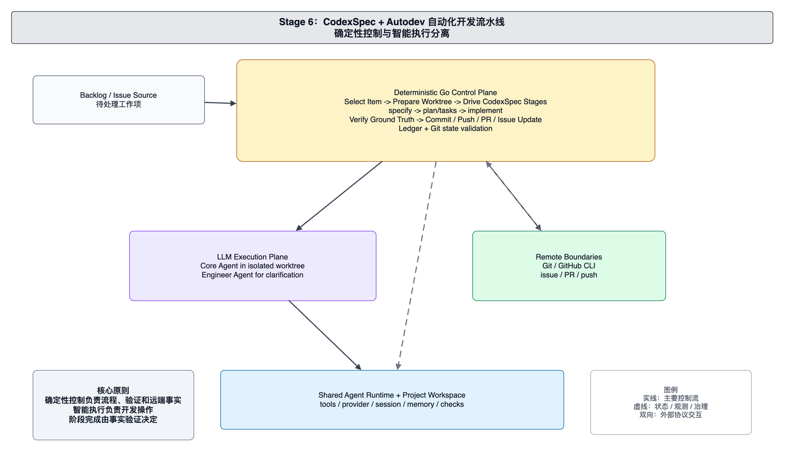

# foxharness 当前架构：CodexSpec + Autodev 自动化开发流水线

本文面向 foxharness 的维护者和贡献者，解释当前 CodexSpec 与 Autodev 自动化开发架构。当前系统在共享 Agent Runtime 之外建立确定性的 Go 控制平面，用于读取 backlog、准备 worktree、驱动规格化开发阶段、验证事实并协调远端协作。

当前架构的核心原则是：流程控制和事实验证由确定性代码负责，具体开发操作由 LLM Agent 执行。

## 系统边界

当前系统由 Backlog Source、Autodev Control Plane、CodexSpec Workflow、LLM Execution Plane、Remote Boundaries、AutoMemory 和 Shared Agent Runtime 组成。

Backlog Source 是自动化开发输入。Backlog 条目包含标题、优先级、状态和完整需求描述。Autodev 读取 backlog 后，以 ledger 记录每个条目的处理状态。

Autodev Control Plane 是确定性流程核心。Orchestrator 负责检查前置条件、解析 backlog、维护 ledger、创建 worktree、选择工作项、驱动阶段、验证完成条件、发布远端结果并清理 worktree。

CodexSpec Workflow 负责需求优先的开发阶段。规格、计划、任务和实现被组织为可追溯流程。每个阶段都有明确输入、输出文件和完成条件。

LLM Execution Plane 负责具体开发操作。Core Agent 在隔离 worktree 中复用普通 Agent Runtime，执行文档撰写、代码编辑、命令运行、提交准备等工作。Engineer Agent 负责回答澄清问题，并在验证失败时给出纠偏指令。

Remote Boundaries 包括 Git、GitHub CLI、issue、PR 和 push。控制平面通过接口化 runner 调用这些外部系统，并用只读查询验证远端事实。

AutoMemory 负责跨会话长期知识。它保存 user-global 和 project 范围的记忆，维护 memory index，并通过运行 hook 提取值得保留的知识。

## 自动化运行链路

一次 Autodev 运行从读取 backlog 开始。控制平面解析条目并加载 ledger。已完成条目不重复处理，进行中的条目从 ledger 记录的位置继续。

控制平面为当前条目创建隔离 worktree，并创建绑定该 worktree 的 Core Agent。随后 StageMachine 按 CodexSpec 工作流驱动每个阶段。每个阶段先生成 seed prompt 或 materialized command，交给 Core Agent 执行。

Core Agent 执行后，控制平面运行 Go 侧 Verify。Verify 只检查磁盘、Git、测试或远端查询等事实。若 Verify 通过，流程进入下一个已定义步骤；若 Verify 失败，Engineer Agent 根据 gap 生成纠偏指令，Core Agent 继续执行。

发布阶段由控制平面协调 commit、push、issue 和 PR。远端步骤完成后，控制平面通过 Git 或 GitHub CLI 查询确认事实，并把结果写回 ledger。

## 控制平面与执行平面

控制平面负责顺序、状态和事实。它决定当前处理哪个条目、处于哪个阶段、是否可以推进、是否可以发布，以及 ledger 如何更新。

执行平面负责需要语言理解和工程判断的工作。它可以修改文件、运行工具、撰写规格和实现代码，但不能自行声明阶段完成。

两个平面之间通过 prompt、reporter、Verify gap 和 engineer correction 协作。完成条件只来自控制平面的事实验证。

## 状态体系

当前状态体系包含三类权威记录。

Ledger 是 Autodev 流程进度的权威记录。它保存条目的 status、branch、stage、issue、PR 和 spec dir。

Session 是 Core Agent 运行历史的权威记录。它保存 message log、transcript、工具结果和运行相关状态。

AutoMemory 是长期知识的权威索引。它保存跨会话可复用的用户偏好、项目事实、反馈和参考信息。

这三类状态服务不同生命周期，不能互相替代。维护者排查自动化问题时，应先判断问题属于流程进度、单次 Agent 运行，还是长期知识注入。

## 远端边界

Git 和 GitHub CLI 都属于外部边界。控制平面可以调用它们执行 worktree、branch、push、issue 和 PR 操作，但每一步完成后都必须通过查询确认事实。

PR 不等同于本地完成，issue 也不等同于需求完成。远端状态要以 `gh` 或 git 查询结果为准，ledger 只记录经过验证后的结果。

## 维护原则

维护当前架构时，应优先保护以下边界：

- Autodev Control Plane 负责流程推进和事实验证。
- Core Agent 负责开发操作，不决定完成条件。
- Engineer Agent 负责澄清和纠偏，不跳过 Verify。
- CodexSpec Workflow 负责规格化开发阶段和产物约束。
- Ledger、Session 和 AutoMemory 分别服务流程进度、运行历史和长期知识。
- Git/GitHub 操作必须有可查询的 ground truth。

新增自动化阶段时，应同时定义阶段输入、Agent 执行方式、Go 侧 Verify 和 ledger 更新语义。
