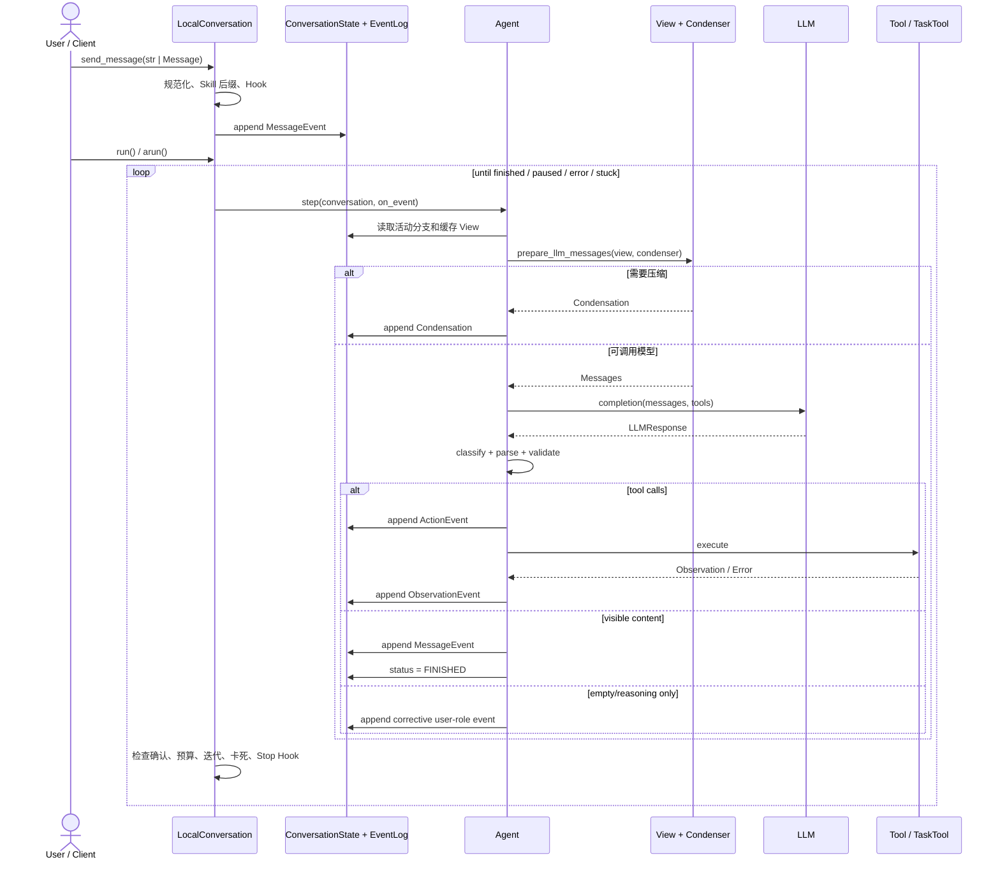

# OpenHands 官方 Agent 内核架构与上下文压缩机制分析

> 分析日期：2026-08-02
>
> 文档性质：基于官方 GitHub 源码的静态架构审查
>
> 目标：还原 OpenHands Agent 的真实执行脉络，分析模块职责、高内聚低耦合程度、可维护性，并解释用户可配置的上下文压缩机制。

## 1. 结论摘要

### 1.1 最重要的版本边界

OpenHands 的 Agent 内核已经从 `OpenHands/OpenHands` 单体仓库迁出。分析时必须区分以下三套代码，不能把它们拼接成同一版本的架构：

| 对象 | 本文固定版本 | 实际角色 |
|---|---|---|
| [`OpenHands/software-agent-sdk`](https://github.com/OpenHands/software-agent-sdk/tree/abeb884cacace1d6950afd378cb9245420c21b9b) | commit `abeb884c`，SDK `1.40.0`，2026-08-01 | **当前官方 Agent 内核**，包含 Agent、Conversation、事件、上下文、Condenser、工具协议、子 Agent、Critic、可观测性和 Agent Server |
| [`OpenHands/OpenHands`](https://github.com/OpenHands/OpenHands/tree/1708efc446082894e244c78af3c67da780d33369) | commit `1708efc4`，2026-08-01 | 当前 Agent Canvas/应用与前端控制面，调用 `software-agent-sdk` 中的 Agent Server，不再是内核源码所在地 |
| [`OpenHands/OpenHands` `0.62.0`](https://github.com/OpenHands/OpenHands/tree/7fbb48c40679afd674970966b96185657d92a487) | commit `7fbb48c4`，2025-11-11 | 历史单体内核；用户可在 TOML 中选择多种上下文压缩策略的完整实现位于这里 |

官方当前 SDK README 也明确把 SDK 称为 OpenHands CLI 和 OpenHands Cloud 背后的引擎，参见 [`software-agent-sdk/README.md`](https://github.com/OpenHands/software-agent-sdk/blob/abeb884cacace1d6950afd378cb9245420c21b9b/README.md#L30-L43)。当前 Canvas 的架构文档则把 Agent Server 指向 `software-agent-sdk`，参见 [`OpenHands/docs/architecture.md`](https://github.com/OpenHands/OpenHands/blob/1708efc446082894e244c78af3c67da780d33369/docs/architecture.md)。

### 1.2 对用户所给执行脉络的核对

用户给出的执行脉络是正确的抽象：

```text
用户消息
 -> 构造上下文
 -> 调用模型
 -> 解析模型返回
 -> 分发工具 / 委派其他 Agent / 询问用户
 -> 收集执行结果
 -> 更新状态
 -> 进行下一轮，或者结束
```

当前 OpenHands SDK 将其实现为两个嵌套层次：

```text
LocalConversation.run()/arun()       # 任务级生命周期循环
  -> Agent.step()/astep()            # 单轮推理与动作周期
       -> state.view + condenser     # 上下文视图与压缩
       -> LLM completion             # 模型调用
       -> classify_response          # 纯响应分类
       -> ActionEvent                # 工具调用或 Finish
       -> ToolDefinition.executor    # 工具/子 Agent 执行
       -> ObservationEvent           # 结果回流
  -> 状态、预算、确认、卡死、停止钩子检查
  -> 下一轮或结束
```

历史 `0.62.0` 的总体脉络相同，但采用事件总线驱动：`AgentController`、`Runtime` 和 `Memory` 都订阅 `EventStream`，Action 和 Observation 的发布会触发下一步。当前 SDK 改成了更直接的 Conversation 循环和回调链，控制流更容易追踪。

### 1.3 可维护性总评

当前 SDK 的总体判断是：**核心领域模型内聚、核心包边界较清晰、扩展点丰富，但发布包依赖有不一致，编排层仍有大文件和具体类型耦合，属于“较好的模块化架构”，还不能称为完全低耦合。**

主要优点：

- `openhands-sdk` 作为核心层，不导入 Tools、Workspace 或 Agent Server；`openhands-tools` 和 `openhands-agent-server` 对核心层的依赖方向也有 AST 门禁。
- Agent 配置、Event、Action、Observation、Tool、Condenser、Critic 都有显式类型契约。
- 完整事件日志与 LLM 上下文视图分离，压缩不会破坏审计和恢复数据。
- 工具、MCP、Condenser、Critic、Hook、Workspace、子 Agent 都有可替换或可注册的扩展点。
- 测试目录按领域镜像源码，并有 API 兼容、持久化配置兼容、弃用周期和安全扫描等 CI 门禁。

主要问题：

- `LocalConversation` 2,937 行、`Agent` 1,446 行、`ACPAgent` 4,160 行、`LLM` 3,197 行、设置模型 2,334 行，编排责任仍然集中。
- `Agent.step()` 直接依赖 `LocalConversation`，工具执行器也接收具体 Conversation，领域层与本地运行实现之间仍有具体耦合。
- 同步与异步执行路径存在大量近似重复，长期存在语义漂移风险。
- `ResponseDispatchMixin` 通过隐式宿主方法协作，类型检查能发现一部分问题，但接口不如显式 Protocol/组合对象清楚。
- `Agent` 与 `ACPAgent` 是两套上下文所有权模型；后者由外部 ACP Server 管理会话，明确不支持 SDK Condenser，因此“同一个 Agent 接口”下并非完全相同的运行语义。
- Workspace 与 Agent Server 的边界存在明确不一致：检查脚本声称 Workspace 不应依赖 Agent Server，却没有扫描 Workspace；实际 Workspace 包声明了该依赖，`DockerDevWorkspace` 还直接导入 Agent Server 的构建代码。
- Agent Server 源码直接导入 Tools，但发布 manifest 未声明该依赖；自动门禁只检查 import 方向，没有验证安装依赖完备性。
- Critic 标准接入使用完整 EventLog 而非活动分支，并且始终传 `git_patch=None`；契约存在，但评估语义尚未闭环。
- 子 Agent registry 是进程级 first-write-wins；Server 预注册 built-ins 会改变覆盖优先级，恢复子任务时迭代/预算设置也会丢失。

### 1.4 上下文压缩的核心结论

OpenHands 的上下文压缩本质不是修改或删除原始事件，而是：

1. 保存完整、追加式 Event Log。
2. 从当前活动分支导出给 LLM 使用的 `View`。
3. Condenser 判断是否需要压缩。
4. 若需要，生成一个 `Condensation` 事件，其中记录要遗忘的 event ID、摘要和摘要插入位置。
5. `View` 应用该事件，过滤被遗忘事件并插入摘要。
6. 下一轮模型只看压缩后的 View，完整日志仍保留用于审计、恢复和分支。

当前 SDK 设置层只内置两种可序列化选择：

- `llm_summarizing`：LLM 摘要压缩。
- `no_op`：不压缩。

历史 `0.62.0` 的 `config.toml` 对用户公开了六种主要策略：`noop`、`observation_masking`、`recent`、`llm`、`amortized`、`llm_attention`。此外代码内部还有 browser masking、structured summary、pipeline 和 conversation window。当前 Canvas 通过服务端导出的 settings schema 动态渲染 `condenser_kind` 下拉框，可选 `llm_summarizing` 和 `no_op`，同时提供开关与阈值；它没有恢复历史六选一界面。因此，“用户可自行选择压缩方式”对历史高级 TOML 配置成立；对当前产品，应准确表述为“UI/设置层提供两种变体，SDK 编程接口可注入任意 Condenser”。

---

## 2. 分析范围与方法

### 2.1 取证范围

本次分析直接拉取并阅读官方 GitHub 仓库，不以第三方博客或旧文档替代源码：

- 当前内核：`OpenHands/software-agent-sdk` commit `abeb884cacace1d6950afd378cb9245420c21b9b`。
- 当前应用层：`OpenHands/OpenHands` commit `1708efc446082894e244c78af3c67da780d33369`。
- 历史多策略内核：`OpenHands/OpenHands` tag `0.62.0`，commit `7fbb48c40679afd674970966b96185657d92a487`。

辅助参照了官方文档：

- [SDK Architecture Overview](https://docs.openhands.dev/sdk/arch/overview)
- [Agent Architecture](https://docs.openhands.dev/sdk/arch/agent)
- [Context Condenser Guide](https://docs.openhands.dev/sdk/guides/context-condenser)

### 2.2 阅读和验证方法

分析步骤如下：

1. 确认仓库、commit、发布版本和代码迁移边界。
2. 从公开入口 `Conversation.send_message()`、`run()` 追踪到 `Agent.step()`。
3. 反向追踪 Event、State、View、Condenser、ToolDefinition、Observation 的数据关系。
4. 检查委派、确认、安全分析、Hooks、Critic、指标和 tracing 等横切能力。
5. 对历史 `0.62.0` 还原 EventStream 驱动的旧循环和全部 Condenser 注册机制。
6. 统计代码热点、测试数量，检查包级依赖门禁。

本地静态验证结果：

- 当前 SDK 四个发布包共 443 个 Python 文件，约 110,122 行。
- 当前仓库有 544 个 `test_*.py`，其中 `tests/sdk` 331 个。
- 历史 `0.62.0` 的 `openhands` 包有 425 个 Python 文件，测试文件 183 个。
- 对当前 SDK 执行 `scripts/check_import_rules.py`，结果为 `All import dependency rules satisfied!`。

这些数字用于识别复杂度和测试面，不代表测试覆盖率，也不能单独证明正确性。

### 2.3 Subagent 独立核实与修订记录

初稿完成后，使用三个只读 subagent 分别核实：

1. 当前 SDK/Canvas 的执行循环、事件、工具、子 Agent、依赖边界和维护性判断。
2. 当前与历史 Condenser 的触发、算法、配置、UI、默认 pipeline 和 capability 例外。
3. 整篇文档的版本边界、源码引用、论据与结论一致性，以及是否逐项回应用户提出的 Agent 执行脉络和组成。

Subagent 没有编辑文档，只报告可复现的源码证据；主分析再回到对应文件逐项确认并修订。核实过程实际纠正了这些重要问题：

- 当前 Canvas 在 `All` 视图可从 schema 生成两种 condenser 选择，不只是开关/阈值。
- 历史 Web Session 在开关启用时会覆盖 TOML strategy，固定使用三段 pipeline。
- `conversation_window` 的“不支持 TOML”注释与类型映射实现冲突。
- Workspace/Agent Server 的声明规则与真实依赖冲突，Agent Server 还存在未声明的 Tools 依赖。
- Critic 使用完整 EventLog 且缺少 git patch，子 Agent 并发/registry/resume 也有初稿未识别的边界。
- Hook 顺序、hard reset 异常范围、NoOp 构造、subscription LLM、tracing 容错和 View 可变性等表述被收窄到源码可证明范围。

最终验证包括：46 个带 commit 的 GitHub blob 链接都能映射到锁定源码中的真实文件，Markdown code fence 成对，文档无非预期尾随空白，当前项目 `go test ./...` 通过。没有执行三个上游仓库的完整测试套件；因此本文是经多路源码交叉核实的静态架构审查，不是运行时、性能或覆盖率审计。

---

## 3. 当前官方内核的代码结构

### 3.1 Monorepo 的四个包

当前 `software-agent-sdk` 使用 uv workspace，成员定义见 [`pyproject.toml`](https://github.com/OpenHands/software-agent-sdk/blob/abeb884cacace1d6950afd378cb9245420c21b9b/pyproject.toml#L1-L4)：

| 包 | 责任 | 依赖方向 |
|---|---|---|
| `openhands-sdk` | Agent、Conversation、LLM、Event、State、Context、Condenser、Tool 协议、Hooks、Critic、Security、Subagent 注册等核心领域与运行时 | 最底层，不应依赖其他三个包 |
| `openhands-tools` | Terminal、File Editor、Browser、Task、Delegate、Task Tracker 等具体工具 | 可依赖 SDK，不应依赖 Workspace/Agent Server |
| `openhands-agent-server` | FastAPI、REST/WebSocket、远程 Conversation、设置和持久化服务 | manifest 只声明 SDK，但源码直接导入 Tools；不依赖 Workspace |
| `openhands-workspace` | Docker、Apptainer、Cloud 和 API-remote Workspace | 实际包依赖 SDK 与 Agent Server；`DockerDevWorkspace` 直接复用 Agent Server build 模块 |

核心向外的主要依赖方向是正确的，但四包不能只按 manifest 理解。源码层的实际 DAG 是 SDK 位于底部，Tools 依赖 SDK，Agent Server 又直接使用 Tools，Workspace 再依赖 Agent Server 以构建或启动远端运行环境。这个方向本身可以有合理的部署语义，但必须与架构规则和发布清单保持一致。

### 3.2 包依赖门禁

[`scripts/check_import_rules.py`](https://github.com/OpenHands/software-agent-sdk/blob/abeb884cacace1d6950afd378cb9245420c21b9b/scripts/check_import_rules.py) 使用 Python AST 提取 import，并检查：

```text
openhands.sdk          -X-> tools / workspace / agent_server
openhands.tools        -X-> workspace / agent_server
openhands.agent_server -X-> workspace
```

以上三条实际进入 pre-commit/CI，是保护核心层最有价值的工程措施之一。

但脚本存在比“少扫一个目录”更实质的问题：

- 文件头和结尾输出都声明 `openhands.workspace` 可以依赖 SDK/Tools、但不能依赖 Agent Server。
- `main()` 实际只扫描 SDK、Tools、Agent Server，没有 workspace checker。
- [`openhands-workspace/pyproject.toml`](https://github.com/OpenHands/software-agent-sdk/blob/abeb884cacace1d6950afd378cb9245420c21b9b/openhands-workspace/pyproject.toml#L1-L13) 明确依赖 `openhands-agent-server`。
- [`docker/dev_workspace.py`](https://github.com/OpenHands/software-agent-sdk/blob/abeb884cacace1d6950afd378cb9245420c21b9b/openhands-workspace/openhands/workspace/docker/dev_workspace.py#L81-L86) 直接导入 `openhands.agent_server.docker.build`。
- `openhands-agent-server/pyproject.toml` 只声明 `openhands-sdk`，但 `tool_router.py`、`conversation_router.py`、`api.py` 等在导入期直接使用 `openhands.tools`；这是未声明的运行时包依赖。现有 import gate 允许 Server 导入 Tools，却不校验 manifest 是否完备。

因此不能说“当前代码满足脚本所声明的全部四包规则”。准确结论是：**已实现的三组检查通过，但声明的 Workspace 规则与真实依赖冲突且未被执行**。维护者需要选择并固化一种权威方向：若 Workspace 作为 Agent Server 的部署/启动适配器，更新规则和架构文档；若希望两者解耦，则应把共享 build 能力下沉到独立包或窄接口。

### 3.3 核心领域对象

| 对象 | 核心责任 | 关键源码 |
|---|---|---|
| `AgentBase` | 冻结、可序列化的 Agent 配置和抽象接口；Agent 被声明为无状态 | [`agent/base.py`](https://github.com/OpenHands/software-agent-sdk/blob/abeb884cacace1d6950afd378cb9245420c21b9b/openhands-sdk/openhands/sdk/agent/base.py#L97-L108) |
| `Agent` | 标准 OpenHands 单轮推理、响应解析、动作构造和工具执行 | [`agent/agent.py`](https://github.com/OpenHands/software-agent-sdk/blob/abeb884cacace1d6950afd378cb9245420c21b9b/openhands-sdk/openhands/sdk/agent/agent.py#L354) |
| `ACPAgent` | 通过 Agent Client Protocol 驱动外部 Claude Code/Codex/Gemini 等 Agent Server | [`agent/acp_agent.py`](https://github.com/OpenHands/software-agent-sdk/blob/abeb884cacace1d6950afd378cb9245420c21b9b/openhands-sdk/openhands/sdk/agent/acp_agent.py) |
| `Conversation` | 根据 Local/Remote Workspace 选择 LocalConversation 或 RemoteConversation 的工厂 | [`conversation/conversation.py`](https://github.com/OpenHands/software-agent-sdk/blob/abeb884cacace1d6950afd378cb9245420c21b9b/openhands-sdk/openhands/sdk/conversation/conversation.py#L34-L43) |
| `LocalConversation` | 本地运行循环、状态生命周期、回调、Hooks、插件、Skills、MCP、持久化协调 | [`conversation/impl/local_conversation.py`](https://github.com/OpenHands/software-agent-sdk/blob/abeb884cacace1d6950afd378cb9245420c21b9b/openhands-sdk/openhands/sdk/conversation/impl/local_conversation.py) |
| `ConversationState` | Agent、Workspace、状态机、事件日志、活动分支、缓存 View、确认和指标 | [`conversation/state.py`](https://github.com/OpenHands/software-agent-sdk/blob/abeb884cacace1d6950afd378cb9245420c21b9b/openhands-sdk/openhands/sdk/conversation/state.py#L82) |
| `EventLog` | 文件持久化、追加、索引、线程/进程锁、事件树遍历 | [`conversation/event_store.py`](https://github.com/OpenHands/software-agent-sdk/blob/abeb884cacace1d6950afd378cb9245420c21b9b/openhands-sdk/openhands/sdk/conversation/event_store.py#L30) |
| `View` | 从活动事件分支导出的 LLM 可见投影，应用压缩语义并维护消息结构不变量 | [`context/view/view.py`](https://github.com/OpenHands/software-agent-sdk/blob/abeb884cacace1d6950afd378cb9245420c21b9b/openhands-sdk/openhands/sdk/context/view/view.py#L22) |
| `CondenserBase` | 压缩策略接口，输入 View，输出 View 或 Condensation | [`context/condenser/base.py`](https://github.com/OpenHands/software-agent-sdk/blob/abeb884cacace1d6950afd378cb9245420c21b9b/openhands-sdk/openhands/sdk/context/condenser/base.py#L16) |
| `ToolDefinition` | 类型化 Action/Observation、JSON Schema、Executor、资源声明 | [`tool/tool.py`](https://github.com/OpenHands/software-agent-sdk/blob/abeb884cacace1d6950afd378cb9245420c21b9b/openhands-sdk/openhands/sdk/tool/tool.py) |

这里的“Agent 无状态”是设计层对 Conversation 状态所有权的描述，不应按字面理解为运行对象完全没有可变字段。`AgentBase` 和 `Agent` 仍有 `_tools`、`_initialized`、`_parallel_executor` 等 Pydantic PrivateAttr；真正成立的是会话历史和执行状态由 ConversationState 持有，而不是 Agent 实例完全不可变。

---

## 4. 当前 Agent 的端到端执行脉络

### 4.1 总体时序



### 4.2 用户输入规范化

`LocalConversation.send_message()` 的职责不是复杂 NLP 预处理，而是协议级规范化：

1. `str` 转为 `Message(role="user", TextContent(...))`。
2. 验证传入 Message 必须是 user role。
3. 当上一次状态是 FINISHED/STUCK 时恢复到 IDLE，使会话可继续。
4. 通过 `AgentContext.get_user_message_suffix()` 匹配 knowledge skill trigger，先注入扩展内容并记录已激活 skill，防止重复注入。
5. 构造 `MessageEvent` 并交给统一 `_on_event` 回调链。
6. 回调链运行 `UserPromptSubmit` Hook；Hook 可以追加 context，或把 event ID 标记为 blocked，然后仍把事件交给原 callback 持久化和广播。

因此“Hook 阻止消息”的准确语义不是丢弃用户事件，而是保留审计事实、让下一次 Agent step 检测 blocked 标记并跳过处理。Skill 激活发生在 Hook 之前；即使消息随后被阻断，已激活 skill 状态也已经更新，这是扩展 Hook 时需要留意的顺序语义。

这说明 OpenHands 没有单独的“自然语言清洗器”；输入规范化集中在消息协议、Hook 和上下文增强层。

### 4.3 意图识别

当前标准 Agent 没有独立 Intent Classifier。意图路由主要由 LLM 在工具 schema、系统提示和技能目录的共同约束下完成：

- LLM 选择工具调用，等价于主要的动态意图路由。
- keyword/task/path skill trigger 是窄范围、确定性的上下文路由。
- `Task` 工具中的 `subagent_type` 选择特定子 Agent。

这是一种合理的简化：避免在每轮模型调用前增加一个分类模型，但工具选择错误会直接表现为主模型行为错误。若业务有严格、稳定、可枚举的路由，应在 OpenHands 之外加确定性策略，而不是误认为内核已有通用意图识别模块。

### 4.4 Conversation 任务循环

[`LocalConversation.run()`](https://github.com/OpenHands/software-agent-sdk/blob/abeb884cacace1d6950afd378cb9245420c21b9b/openhands-sdk/openhands/sdk/conversation/impl/local_conversation.py#L1800-L1971) 是任务级循环：

1. 确保插件、Skills、MCP 和 Agent 已初始化。
2. 把 IDLE/PAUSED/ERROR/STUCK 转为 RUNNING。
3. 每轮持有状态锁，检查 PAUSED、STUCK 和 FINISHED。
4. FINISHED 时运行 Stop Hook；Hook 可以拒绝结束并注入反馈，使 Agent 继续。
5. 运行 stuck detector。
6. 清理 WAITING_FOR_CONFIRMATION，调用 `agent.step()`。
7. 检查是否需要等待确认。
8. 检查预算和 `max_iteration_per_run`。
9. 失败时写入 `ConversationErrorEvent`，状态变 ERROR，并包装为 `ConversationRunError`。

`arun()` 提供相同意图的异步路径，并额外处理：

- LLM 网络等待时暂时释放状态锁。
- `interrupt()` 对 asyncio task 和工具 CancellationToken 发出取消。
- 对中断后没有配对 Observation 的 Action 补合成错误事件，保持消息历史合法。

### 4.5 Agent 单轮执行

[`Agent.step()`](https://github.com/OpenHands/software-agent-sdk/blob/abeb884cacace1d6950afd378cb9245420c21b9b/openhands-sdk/openhands/sdk/agent/agent.py#L613-L797) 的顺序如下：

1. 查找无匹配 Observation 的 pending Action；若存在，按隐式确认语义先执行，不采样新动作。
2. 若最近用户消息被 Hook 阻断，结束当前运行。
3. 构造 per-conversation `LLMCallContext`，避免把会话可变信息塞进共享 LLM 实例。
4. 从 `state.view` 和 Condenser 准备 LLM Messages。
5. 若 Condenser 返回 `Condensation`，先发出压缩事件，本轮结束，下一轮再采样。
6. 处理非视觉模型收到图片的兼容路径。
7. 调用 LLM，并传入工具定义。
8. 对 malformed function call、content policy、malformed history、context overflow 分别处理。
9. 使用纯函数 `classify_response()` 将返回分为 TOOL_CALLS、CONTENT、REASONING_ONLY、EMPTY。
10. 工具调用进入 Action 构造、确认、安全判断和执行；文本返回写 MessageEvent 并结束；空返回写纠正消息后继续。

### 4.6 模型返回解析

[`response_dispatch.py`](https://github.com/OpenHands/software-agent-sdk/blob/abeb884cacace1d6950afd378cb9245420c21b9b/openhands-sdk/openhands/sdk/agent/response_dispatch.py#L44-L77) 把分类规则提取为纯函数，优先级为：

```text
tool_calls > 非空可见文本 > reasoning-only > empty
```

工具参数还会经历：

- tool call 名称标准化。
- JSON 参数解析和常见畸形参数修复。
- Pydantic Action 类型验证。
- Security Risk 注入和 Confirmation Policy 判断。
- ActionEvent 和 ObservationEvent 配对。

相较于把解析、执行、状态更新混在单个函数中，这个边界清晰；但 dispatch handler 是 Mixin，并通过一组隐式宿主方法调用 Agent，仍有结构耦合。

### 4.7 工具分发与结果收集

工具定义的关键边界是：

```text
Tool spec (name + params)
 -> Tool Registry
 -> ToolDefinition[Action, Observation]
 -> JSON schema 发给 LLM
 -> ActionEvent
 -> executor
 -> ObservationEvent / AgentErrorEvent
```

工具异常不会直接破坏主循环；[`ParallelToolExecutor`](https://github.com/OpenHands/software-agent-sdk/blob/abeb884cacace1d6950afd378cb9245420c21b9b/openhands-sdk/openhands/sdk/agent/parallel_executor.py) 将预期 ValueError 和未知 Exception 转为带分类的 `AgentErrorEvent`。

并发工具执行采用资源锁：

- 未声明资源：退化为同名工具互斥锁。
- 显式声明空资源：允许无锁并发。
- 声明资源 key：对相同资源串行，不同资源可并行。
- 默认并发数为 1，因此只有用户主动提高 `tool_concurrency_limit` 才会并行。

这是一套务实设计，但正确性依赖工具作者准确实现 `declared_resources()`；漏报共享文件、终端或浏览器资源会引入竞态。

### 4.8 询问用户与确认

OpenHands 没有一个独立的 `ask_user()` 内核分支，用户交互主要有两类：

- Agent 返回可见 MessageEvent，Conversation 进入 FINISHED，等待下一条用户消息。
- 高风险 Action 被 Confirmation Policy 拦截，Conversation 进入 WAITING_FOR_CONFIRMATION；用户批准后下一次 run 执行 pending action，拒绝则写 UserRejectObservation。

PreToolUse、UserPromptSubmit、PostToolUse 和 Stop Hooks 还提供了额外的人机与策略控制点。

### 4.9 状态更新与事件溯源

`ConversationState.append_event()` 是唯一持久化入口：

1. 给 Event 盖上当前活动叶子的 `parent_id`。
2. 追加到 `EventLog`。
3. 推进活动 HEAD。

参见 [`conversation/state.py`](https://github.com/OpenHands/software-agent-sdk/blob/abeb884cacace1d6950afd378cb9245420c21b9b/openhands-sdk/openhands/sdk/conversation/state.py#L304-L334)。

EventLog 不只是线性列表，而是父指针事件树：

- `path_to_root(leaf)` 得到当前活动分支。
- navigate/fork 后，被放弃的分支仍留在完整日志中，但不会进入当前 Agent 的 View。
- 旧事件没有 `parent_id` 时按线性前驱兼容。

`state.view` 缓存当前活动分支的 LLM 投影：线性追加只增量重放尾部，成本 O(k)；分支切换和恢复时完整重建，成本 O(n)。这种“事实日志 + 派生视图”分离是当前架构最值得借鉴的设计之一。

---

## 5. 按 Agent 项目组成逐项分析

### 5.1 用户输入规范化

**实现状态：有，但保持轻量。**

相关职责位于 `LocalConversation.send_message()`、Message Pydantic 模型、Hooks 和 AgentContext。它规范化协议结构，不做额外的通用 NLP 重写。

评价：高内聚。消息验证、上下文增强和事件发布都围绕“接受用户消息”这一用例；但 LocalConversation 本身承担的其他职责过多，类级内聚度低于方法级内聚度。

### 5.2 意图识别

**实现状态：没有独立通用模块。**

主模型根据 prompt 和 tool schema 选择动作，skill trigger 提供确定性补充。不能把工具调用解析器误称为意图分类器。

评价：作为通用 Coding Agent 合理；如果产品路由成本高或权限差异大，需要外围显式策略。

### 5.3 Agent 运行与任务循环

**实现状态：完整。**

Conversation 负责任务级 lifecycle，Agent 负责单轮 reasoning/action。状态包括 IDLE、RUNNING、PAUSED、WAITING_FOR_CONFIRMATION、FINISHED、ERROR、STUCK 和 DELETING。

评价：职责划分方向正确，但 LocalConversation 与 Agent 各自仍然偏大，同步/异步两套路径加重了维护成本。

### 5.4 上下文管理

**实现状态：完整且分层。**

上下文来源包括：

- 静态系统提示和动态 prompt sections。
- repository skills、项目 `AGENTS.md`、runtime 信息。
- user/public/project skills。
- keyword/task trigger 的 knowledge skills。
- 文件触达触发的 path rules。
- persistent memory 的 `MEMORY.md` 索引。
- secret 名称和描述，不直接把明文值展示给模型。
- EventLog 当前分支导出的 View。
- Condenser 生成的摘要。

[`AgentContext`](https://github.com/OpenHands/software-agent-sdk/blob/abeb884cacace1d6950afd378cb9245420c21b9b/openhands-sdk/openhands/sdk/context/agent_context.py#L56-L76) 是 prompt 扩展的主要容器，`View` 则管理会话历史；两者分别回答“系统/项目有什么上下文”和“本轮历史看什么”，边界总体清楚。

### 5.5 检索与 RAG

**实现状态：有确定性检索，没有内核级通用向量 RAG。**

内核支持：

- keyword/task trigger skill 检索。
- path rule 文件路径匹配。
- progressive skill disclosure，模型通过 `invoke_skill` 加载完整内容。
- persistent memory index 注入。

`openhands-tools` 中的 `TomConsultTool` 可包装外部 `tom-swe` 并选择启用 RAG，但它是可选具体工具，不是 Conversation/Agent 的基础能力。因此架构图中应把 RAG 标为可插拔外围能力，而不是内核必经步骤。

### 5.6 评估与反馈机制

**实现状态：当前 SDK 有实验性 Critic 契约和主循环接入，但活动分支与 git patch 语义尚未闭环；历史内核主要依赖外部 eval。**

[`CriticBase`](https://github.com/OpenHands/software-agent-sdk/blob/abeb884cacace1d6950afd378cb9245420c21b9b/openhands-sdk/openhands/sdk/critic/base.py#L57-L86) 接受事件序列和可选 git patch，返回 `CriticResult`。运行模式：

- `finish_and_message`：只在 Finish 或 Agent Message 时评估。
- `all_actions`：每个 Agent Action 后评估，成本更高。

若配置 iterative refinement，分数低于阈值时会生成 follow-up prompt，最多重试指定次数。Critic 错误采用 fail-open，避免评估服务故障阻断 Agent 主任务。

当前标准接入有两个不能忽略的缺口：

- `CriticMixin._evaluate_with_critic()` 传入 `list(conversation.state.events) + [event]`，不是 `active_branch()`；发生事件树分叉后，API critic 的 `View.from_events()` 仍可能看到已经放弃的分支。
- 同一入口把 `git_patch` 硬编码为 `None`。因此要求 non-empty patch 的 `AgentFinishedCritic` 和 `EmptyPatchCritic` 通过这条标准路径时必然不能满足 patch 条件。

评价：协议和 iterative refinement 流程清楚，错误也 fail-open，但当前只能称为“已接入的实验能力”，不能称为完整评估闭环。应优先统一 active branch 投影并提供真实 patch，再评估长会话性能和压缩后质量。

### 5.7 工具管理

**实现状态：完整。**

包括静态 registry、ToolDefinition、类型化 Action/Observation、MCP 工具适配、默认工具集、工具过滤、安全 schema、确认策略、并发资源锁、取消和错误分类。

评价：协议层高内聚，具体执行仍依赖 LocalConversation，使工具层不是完全依赖倒置。

### 5.8 可观测性

**实现状态：完整且可选。**

三层能力：

1. EventLog 和 callbacks：所有 Agent 事实与状态变化的基础轨迹。
2. LLM Metrics：成本、prompt/completion token、cache read/write、reasoning token、延迟和 response ID。
3. Laminar/OpenTelemetry tracing：Conversation 根 span，以及 send/run/step、LLM summarizer、Hook executor、MCP tool executor 等已显式 `@observe` 的子 span。

[`observability/laminar.py`](https://github.com/OpenHands/software-agent-sdk/blob/abeb884cacace1d6950afd378cb9245420c21b9b/openhands-sdk/openhands/sdk/observability/laminar.py#L118-L197) 在未配置时是惰性透传，root/child span 和 parent attach 等若干辅助路径也有容错。但 `observe()` 构建 wrapper 与被包装调用并没有统一 catch，不能据此声称所有 tracing 失败都保证不影响主业务。

评价：横切关注点隔离较好，但通用 `ParallelToolExecutor`/`ToolDefinition` 并没有统一 trace decorator，不能推断所有工具调用都有 tool span。另需注意 EventLog 是行为事实，Metrics 是资源使用，Trace 是调用时序，三者用途不同，不应只保留其中一种。

---

## 6. 子 Agent 委派机制

### 6.1 当前实现

当前默认委派入口是 `task_tool_set`，由 `enable_sub_agents` 控制是否加入默认工具。`TaskAction` 包含：

- `prompt`
- `description`
- `subagent_type`
- `resume` task ID

参见 [`task/definition.py`](https://github.com/OpenHands/software-agent-sdk/blob/abeb884cacace1d6950afd378cb9245420c21b9b/openhands-tools/openhands/tools/task/definition.py#L37-L62)。

子 Agent 定义来自 Markdown + YAML frontmatter，支持 model、tools、skills、system prompt、hooks、permission mode、预算、迭代和 condenser。registry 的真实规则是“先注册者胜出”；standalone discovery 希望通过调用顺序表达程序化、插件、项目、用户、built-ins 的优先级，但这不是来源级不可变规则。

Agent Server 是重要反例：`tool_router.py` 模块导入时先注册 built-ins，客户端转发的 AgentDefinition 直到创建会话时才 `register_agent_if_absent()`；同名冲突时 built-in 会胜过客户端定义。由于 registry 是进程级、跨会话共享，且生产代码没有公开 reset，这还存在跨会话乃至多租户定义污染风险。

`TaskManager` 的实际运行方式：

1. 根据 `subagent_type` 从 registry 获取工厂。
2. 从父 Agent LLM 派生一个关闭 streaming、重置 metrics 的子实例。
3. 创建独立 `LocalConversation`。
4. 共享父会话 Workspace 工作目录，但使用独立 conversation ID 和持久化子目录。
5. 新任务继承或覆盖确认策略、迭代上限和预算。
6. 阻塞运行到 FINISHED 或错误。
7. 提取最终文本或带 partial result 的错误作为 `TaskObservation` 返回父 Agent。
8. 以 `task:<id>` usage ID 把子 Agent 指标纳入父会话统计。
9. `resume` 使用原 conversation ID 恢复子会话，并按当前 factory 重建 Agent、传入 hooks 和 confirmation policy；但没有重新传入原来的 `max_iteration_per_run` 和 `max_budget_per_run`，这两个运行约束会退回 LocalConversation 默认值。

参见 [`task/manager.py`](https://github.com/OpenHands/software-agent-sdk/blob/abeb884cacace1d6950afd378cb9245420c21b9b/openhands-tools/openhands/tools/task/manager.py#L162-L199) 和 [任务执行收敛逻辑](https://github.com/OpenHands/software-agent-sdk/blob/abeb884cacace1d6950afd378cb9245420c21b9b/openhands-tools/openhands/tools/task/manager.py#L346-L445)。

### 6.2 内聚与耦合评价

优点：

- 委派以普通工具协议进入主循环，主 Agent 不需要特殊分支。
- 子任务拥有独立 Conversation、EventLog、metrics 和恢复 ID。
- AgentDefinition 把能力、模型、权限和压缩策略聚合成一个可序列化单元。

不足：

- `TaskManager` 直接导入并创建 `LocalConversation`，只支持本地具体实现，无法自然替换成 RemoteConversation 或测试端口。
- 父子会话共享工作目录；`TaskTool.declared_resources()` 又显式声明空资源，表示允许无锁并行。当 `tool_concurrency_limit > 1` 且模型同批返回多个 TaskAction 时，多个 worker 会同时运行阻塞式 `start_task()`，因此存在明确文件竞态。默认并发数 1 才是默认规避条件。
- registry 是进程级全局可变状态；Server 的 built-in 预注册顺序、跨会话同名冲突、测试隔离和插件卸载都需要处理，不能只依赖 first-write-wins。
- resume 没有保留 fresh task 的迭代/预算限制，长任务恢复前后执行约束会漂移。

### 6.3 与历史委派的差异

历史 `0.62.0` 的 `AgentController.start_delegate()` 递归创建另一个 `AgentController`，父控制器只允许一个活动 delegate，并把同一个 EventStream 后续事件转发给子控制器；结束后生成 `AgentDelegateObservation` 返回父 Agent，参见 [`agent_controller.py`](https://github.com/OpenHands/OpenHands/blob/7fbb48c40679afd674970966b96185657d92a487/openhands/controller/agent_controller.py#L724-L850)。

当前 TaskTool 方案比旧递归控制器更内聚：委派生命周期被收敛到具体工具包，父循环只理解 Action/Observation。但 TaskManager 对 LocalConversation 的具体耦合仍可继续改善。

---

## 7. 当前上下文压缩的实现

### 7.1 核心抽象

[`CondenserBase`](https://github.com/OpenHands/software-agent-sdk/blob/abeb884cacace1d6950afd378cb9245420c21b9b/openhands-sdk/openhands/sdk/context/condenser/base.py) 的关键契约：

```python
condense(view: View, agent_llm: LLM | None) -> View | Condensation
acondense(view: View, agent_llm: LLM | None) -> View | Condensation
```

含义：

- 返回 View：不产生新的历史事实，本轮可以直接调用 LLM。
- 返回 Condensation：先把压缩结果作为 Event 写入日志，本轮不采样，下一轮用新 View。

`CondenserBase` 文档明确要求把输入 View 当成只读对象，但这只是契约约定：`View.events` 是公开可变 list，`state.view` 又返回缓存的同一对象。自定义 condenser 若原地修改 View，会直接污染 ConversationState 缓存；类型系统和不可变容器目前没有强制这条规则。

`RollingCondenser` 进一步拆分：

- `condensation_requirement()`：返回 SOFT、HARD，或用 Python `None` 表示无需压缩；枚举本身没有 `NONE` 成员。
- `get_condensation()`：正常压缩。
- `hard_context_reset()`：正常压缩无法推进时的硬重置兜底。

### 7.2 LLM Summarizing Condenser 的触发条件

[`LLMSummarizingCondenser`](https://github.com/OpenHands/software-agent-sdk/blob/abeb884cacace1d6950afd378cb9245420c21b9b/openhands-sdk/openhands/sdk/context/condenser/llm_summarizing_condenser.py) 支持三种理由：

| Reason | 触发条件 | 强度 |
|---|---|---|
| `REQUEST` | View 中存在尚未处理的 CondensationRequest | HARD |
| `TOKENS` | 当前 View token 数超过 `max_tokens` | HARD |
| `EVENTS` | View 事件数超过 `max_size` | SOFT |

多个理由同时出现时，压缩范围取最严格结果，目标通常是降到阈值的一半，避免刚压缩完立即再次触发。

`max_tokens` 默认是 `None`，所以默认自动触发主要来自 `max_size` 的 EVENTS/SOFT 条件。只有用户配置 token 阈值后 TOKENS/HARD 才会生效；未配置时，真实的 LLM context overflow 仍会由 Agent 追加 CondensationRequest，转入 REQUEST/HARD 恢复路径。

### 7.3 如何选择被遗忘事件

基本规则：

1. 保留 `keep_first` 个初始事件。
2. 保留足够的新近尾部事件。
3. 中间区域进入摘要。
4. 若同时受 event 和 token 阈值约束，选择能同时满足两者的更大压缩范围。

它没有简单按数组位置任意切断。`View.manipulation_indices` 会求所有消息结构属性允许切割位置的交集，以避免：

- 保留 Observation 却删除对应 Action。
- 拆散 tool call/tool result。
- 破坏 Anthropic thinking/tool loop 等供应商消息约束。

这比历史早期“保留头尾”的实现更稳健，是上下文管理中的关键不变量。

### 7.4 如何生成和应用摘要

Condenser 把待遗忘事件转换为字符串，使用独立的 summary prompt 调用 condenser LLM，生成：

```text
Condensation {
  forgotten_event_ids,
  summary: str | None,
  summary_offset: int | None,
  llm_response_id: str | None
}
```

`View.append_event()` 遇到该事件时调用 `Condensation.apply()`：

- 从 View 中过滤 forgotten IDs。
- 当 summary 与 offset 均存在时，在 `summary_offset` 插入摘要事件。
- 清除未处理 request 标记。

完整 EventLog 中原事件不被物理删除，因此可以追溯“摘要基于哪些事件生成”。需要注意一个边界：若摘要 LLM 返回的首个内容不是 `TextContent`，当前实现可能仍遗忘选中事件而不插入摘要；这使摘要返回类型和质量监控不能被当成可忽略细节。

### 7.5 手动压缩与溢出恢复

压缩入口有三类：

1. **自动阈值**：事件数或 token 数超过配置。
2. **手动请求**：`conversation.condense()` 发布 CondensationRequest，并执行一个 Agent step。
3. **模型错误恢复**：LLM 抛出 context-window-exceeded 或 malformed-history 时，Agent 发布 CondensationRequest，下一轮压缩后重试。

malformed history 路径还会先 `state.rebuild_view()`，防止增量 View 本身已经不一致。

手动入口不是对所有配置都可用：只有 condenser 存在且 `handles_condensation_requests()` 返回 true 时才能调用。选择 `no_op` 或关闭 condenser 时，`conversation.condense()` 会抛出 `ValueError`。

### 7.6 硬重置

HARD 要求下，只要 `get_condensation()` 抛出 `NoCondensationAvailableException`，RollingCondenser 就可以调用 `hard_context_reset()`。触发原因不只包括无合法切点和进展低于 `minimum_progress`，也包括正常摘要 LLM 调用失败：

- 尝试摘要整个 View。
- 若 summary LLM 调用发生任何异常，则逐次缩短每个事件的字符串长度后重试。
- 默认最多重试 5 次，缩放因子 0.8。
- 成功后 summary 插入 offset 0。

这是必要的可用性兜底，但会丢失比正常滚动摘要更多的细节，应当在 metrics/trace 中单独标记和告警。

### 7.7 Pipeline

SDK 仍提供 `PipelineCondenser`，可以顺序组合多个 Condenser；某一步返回 Condensation 时终止本次 pipeline。虽然当前设置 union 只暴露 summarizing/no-op，编程接口仍可以构造 pipeline 或自定义 Condenser。

### 7.8 配置默认值不能混淆

当前源码中存在两个不同的默认构造点：

- Settings 模型默认：`max_size=240`、`keep_first=2`，参见 [`settings/model.py`](https://github.com/OpenHands/software-agent-sdk/blob/abeb884cacace1d6950afd378cb9245420c21b9b/openhands-sdk/openhands/sdk/settings/model.py#L150-L227)。
- `default_condenser(llm)` helper：`max_size=80`、`keep_first=4`，用于标准默认 Agent/子 Agent 的直接工厂路径，参见 [`llm_summarizing_condenser.py`](https://github.com/OpenHands/software-agent-sdk/blob/abeb884cacace1d6950afd378cb9245420c21b9b/openhands-sdk/openhands/sdk/context/condenser/llm_summarizing_condenser.py#L482-L492)。

两者不是同一个配置入口。分析运行行为时必须先确认 Agent 是由 Settings、Profile、直接 Python 构造还是子 Agent 工厂创建。

---

## 8. “用户选择上下文压缩方式”究竟如何实现

### 8.1 历史 `0.62.0`：TOML 类型判别 + Config/Class Registry

历史版本的用户配置入口见 [`config.template.toml`](https://github.com/OpenHands/OpenHands/blob/7fbb48c40679afd674970966b96185657d92a487/config.template.toml#L380-L441)：

```toml
[condenser]
type = "llm"
llm_config = "condenser"
keep_first = 1
max_size = 100
```

实现分三层：

1. `condenser_config_from_toml_section()` 读取 `type` 字段。
2. `create_condenser_config()` 把字符串映射为对应的 Pydantic Config。
3. 每个 Condenser 通过 `Condenser.register_config(ConfigType)` 注册；Agent 初始化时调用 `Condenser.from_config()`，以 Config 的 Python 类型从 registry 创建实现。

源码见：

- [`core/config/condenser_config.py`](https://github.com/OpenHands/OpenHands/blob/7fbb48c40679afd674970966b96185657d92a487/openhands/core/config/condenser_config.py)
- [`memory/condenser/condenser.py`](https://github.com/OpenHands/OpenHands/blob/7fbb48c40679afd674970966b96185657d92a487/openhands/memory/condenser/condenser.py#L34-L166)

这个设计避免在 Agent 中写一个不断扩张的 `if type == ...`，扩展新策略时主要新增 Config、实现和注册语句，内聚性较好。

### 8.2 历史公开的六种策略

| type | 算法 | 成本 | 主要优点 | 主要风险 |
|---|---|---:|---|---|
| `noop` | 原样返回 View | 无 | 行为最可预测、无信息损失 | 长任务必然可能超上下文 |
| `observation_masking` | 对 attention window 之前的 Observation 内容替换为 `<MASKED>`，Action 结构保留 | 很低 | 大量工具输出时快速降 token | 旧命令结果、错误细节全部丢失 |
| `recent` | 保留 `keep_first` 和最近尾部，截掉中间 | 很低 | 简单、确定、无额外模型调用 | 中期做出的关键决定可能丢失；旧实现不以摘要补偿 |
| `llm` | 保留头尾，用 LLM 把中间事件和上次摘要重新汇总 | 一次额外 LLM 调用 | 连贯性最好，保留语义而非原文 | 成本、延迟、幻觉、遗漏、隐私边界扩大 |
| `amortized` | `len(view) > max_size` 或收到显式 request 时，直接遗忘中间一大段并缩到约一半 | 很低 | 压缩不频繁、成本稳定 | 名称中的“intelligently”并非语义智能选择，实质是确定性头尾遗忘 |
| `llm_attention` | 用 LLM 排序重要 event ID，保留前若干；不足时从最近事件补齐 | 一次额外 LLM 调用 | 可保留非连续的重要事件 | 破坏上下文连续性；要求模型支持 response schema；动作结果配对保障弱于当前 manipulation indices |

需要特别纠正一个容易产生的误解：`amortized` 的实现并不会理解事件语义。它把历史压到 `max_size/2`，保留前缀和尾部，并对中间连续 ID 生成 CondensationAction。算法见 [`amortized_forgetting_condenser.py`](https://github.com/OpenHands/OpenHands/blob/7fbb48c40679afd674970966b96185657d92a487/openhands/memory/condenser/impl/amortized_forgetting_condenser.py)。

### 8.3 历史内部还有四种策略

虽然模板只列出六种，Config union 和注册表还包含：

| type | 用途 |
|---|---|
| `browser_output_masking` | 只遮蔽较旧的 BrowserOutput，保留 URL；针对 screenshot/accessibility tree 的超大体积优化 |
| `structured` | 强制 LLM 通过 `create_state_summary` function call 生成结构化状态摘要 |
| `pipeline` | 顺序组合多个 Condenser |
| `conversation_window` | 只在显式 request 时触发，保留 system、首条 user、首个 recall 及近期约一半事件，并避免以 dangling observation 开头 |

`conversation_window` 的 Config 类注释称其不支持 TOML/环境变量，但同文件的通用 TOML 解析最终调用 `create_condenser_config()`，而该映射明确包含 `conversation_window`。它未在模板中公开，注释和实现却互相矛盾；因此只能说它不是公开推荐的普通选项，不能断言技术上无法从 TOML 构造。这也是一个真实的可维护性信号。

### 8.4 历史默认 pipeline 与 UI

历史 Web Session 在 `settings.enable_default_condenser=true` 时会无条件用下面的 pipeline 覆盖 `agent_config.condenser`，不会继续使用已从 TOML 载入的单一策略：

```text
ConversationWindowCondenser
 -> BrowserOutputCondenser
 -> LLMSummarizingCondenser
```

其目的是分别处理显式溢出、浏览器大输出和总事件数。`enable_default_condenser` 在历史 Settings 中默认是 true；只有关闭这个 Web 设置时，Web Session 才不会执行这段覆盖。历史前端主要持久化开关和 `condenser_max_size`，并不是完整六策略下拉框。

历史 TOML 还有另一条启动路径：配置文件存在 `[condenser]` 时把所选策略写入默认 AgentConfig；没有该 section 且全局 `enable_default_condenser=true` 时，配置加载器回退为单个 LLM summarizer。证据见 [`core/config/utils.py`](https://github.com/OpenHands/OpenHands/blob/7fbb48c40679afd674970966b96185657d92a487/openhands/core/config/utils.py#L303-L339) 和 [Web Session 覆盖逻辑](https://github.com/OpenHands/OpenHands/blob/7fbb48c40679afd674970966b96185657d92a487/openhands/server/session/session.py#L213-L250)。

因此更准确的结论是：**OpenHands 历史内核提供多策略 TOML 配置机制，评估脚本还提供 condenser 命令行参数；Web 产品默认改用固定三段 pipeline，UI 只暴露开关和最大事件数。源码没有证明标准 OpenHands CLI 曾提供通用六策略选择器。**

### 8.5 当前 `1.40.0` 的选择机制

当前 SDK Settings 用 discriminated union 取代旧 TOML 字符串 registry：

```text
CondenserSettingsConfig =
    LLMSummarizingCondenserSettings(condenser_kind="llm_summarizing")
  | NoOpCondenserSettings(condenser_kind="no_op")
```

旧持久化 payload 没有 `condenser_kind` 时，兼容逻辑默认按 `llm_summarizing` 读取，参见 [`settings/model.py`](https://github.com/OpenHands/software-agent-sdk/blob/abeb884cacace1d6950afd378cb9245420c21b9b/openhands-sdk/openhands/sdk/settings/model.py#L289-L331)。

`build_condenser()` 按变体执行：

1. 检查 `enabled`。
2. `LLMSummarizingCondenserSettings` 从 Agent LLM `model_copy()` 出 usage ID 为 `condenser` 的实例，重置其 metrics，再创建 summarizer。
3. `NoOpCondenserSettings` 忽略传入 LLM，直接创建 `NoOpCondenser`。

当前 Canvas 的 `/settings/condenser` 页面是服务端 schema 驱动的通用 Settings 页面：

1. Agent Server 的 `/api/settings/agent-schema` 调用 `export_agent_settings_schema()`。
2. SDK 合并 discriminated union 的同名字段，并把 `condenser_kind` 的 choices 导出为 `llm_summarizing`、`no_op`；对应测试明确断言这两个值。
3. Canvas 只声明渲染 `condenser` section；通用 `SchemaField` 对具有 choices 的字段渲染下拉框。
4. 同一页面还渲染 `enabled`、`max_size`、`max_tokens`、`keep_first` 等当前变体字段，默认值来自 SDK Settings，而不是在页面内手写策略列表。

证据见：

- [`routes/condenser-settings.tsx`](https://github.com/OpenHands/OpenHands/blob/1708efc446082894e244c78af3c67da780d33369/src/routes/condenser-settings.tsx)
- [`components/.../schema-field.tsx`](https://github.com/OpenHands/OpenHands/blob/1708efc446082894e244c78af3c67da780d33369/src/components/features/settings/sdk-settings/schema-field.tsx#L30-L118)
- [`tests/sdk/test_settings.py`](https://github.com/OpenHands/software-agent-sdk/blob/abeb884cacace1d6950afd378cb9245420c21b9b/tests/sdk/test_settings.py#L126-L142)

因此当前 UI **在 `All` 设置视图中确实允许选择方式，但只有两种设置变体**，没有历史六策略选择器。高级 Python 用户仍可直接给 `Agent(condenser=...)` 注入任何 `CondenserBase` 或 Pipeline；文件型子 Agent 的 frontmatter 也支持 default、none 或完整 condenser mapping，参见 [`subagent/schema.py`](https://github.com/OpenHands/software-agent-sdk/blob/abeb884cacace1d6950afd378cb9245420c21b9b/openhands-sdk/openhands/sdk/subagent/schema.py#L172-L196)。

### 8.6 Capability 与订阅模型例外

`ACPAgent.supports_condenser()` 返回 false。原因不是遗漏，而是 ACP 外部 Agent Server 持有自己的 session 和上下文管理。SDK 不能同时再对同一历史做 Condensation，否则会出现双重上下文所有权。

这意味着配置页面在 Agent 类型切换时必须理解 capability：标准 OpenHands Agent 可使用 SDK Condenser，Claude Code/Codex/Gemini 等 ACP Agent 的压缩应由对应 Server 实现和配置。

标准 OpenHands Agent 还有另一条独立例外：`OpenHandsAgentSettings.create_agent()` 在 `llm.is_subscription` 为 true 时直接把 condenser 设为 `None`，而不调用用户的 condenser settings，参见 [`settings/model.py`](https://github.com/OpenHands/software-agent-sdk/blob/abeb884cacace1d6950afd378cb9245420c21b9b/openhands-sdk/openhands/sdk/settings/model.py#L1309-L1348)。切换到 subscription profile 时，`LocalConversation` 也会暂存并禁用原 condenser，切回非订阅模型后再恢复。源码没有在该分支旁解释产品原因，因此本文只记录行为，不推断原因。

---

## 9. 历史 `0.62.0` Agent 内核结构

### 9.1 主要模块

| 模块 | 责任 |
|---|---|
| `agenthub/` | CodeActAgent、BrowsingAgent 等 Agent 实现和 prompt/tool schema |
| `controller/` | AgentController、State、StateTracker、预算/迭代控制、卡死检测、replay、delegate |
| `events/` | Action、Observation、EventStream、持久化和序列化 |
| `runtime/` | Docker/Local/Remote/Kubernetes/CLI 执行环境，监听 Action 并发布 Observation |
| `memory/` | Recall、microagent、ConversationMemory、View 和 Condenser |
| `llm/` | LiteLLM 适配、消息、metrics 和 registry |
| `security/` | 风险分析和事件守卫 |
| `server/` | Session、WebSocket、REST、Settings、feedback 和 trajectory |

### 9.2 事件驱动循环

[`EventStream`](https://github.com/OpenHands/OpenHands/blob/7fbb48c40679afd674970966b96185657d92a487/openhands/events/stream.py) 使用：

- 一个主 Queue 和 queue thread。
- 每个 subscriber/callback 一个单 worker ThreadPoolExecutor。
- 每个 callback worker 自己的 asyncio loop。
- 持久化后将 Event 放入队列，按 subscriber key 顺序投递。

主要订阅者：AgentController、Runtime、Memory、Server。

典型事件链：

```text
User MessageAction
 -> AgentController 生成 RecallAction
 -> Memory 生成 RecallObservation / NullObservation
 -> AgentController.should_step() = true
 -> CodeActAgent.step(State)
 -> Action 写入 EventStream
 -> Runtime 执行 Action
 -> Observation 写入 EventStream
 -> AgentController.should_step() = true
 -> 下一轮
```

这是一种事件解耦架构：Controller 不直接调用 Runtime，Memory 也可以独立响应 RecallAction。但线程、事件循环、队列、持久化和回调错误处理交叠，使时序调试和资源关闭复杂。

### 9.3 Controller 和 Agent 的边界

`CodeActAgent.step()` 只做：

1. 返回 pending action。
2. 处理 `/exit`。
3. 调用 Condenser；必要时返回 CondensationAction。
4. 由 ConversationMemory 把 Event 转成 LLM Message。
5. 调用 LLM。
6. 将 response 转为 Actions，放入 pending deque，每轮返回一个。

参见 [`codeact_agent.py`](https://github.com/OpenHands/OpenHands/blob/7fbb48c40679afd674970966b96185657d92a487/openhands/agenthub/codeact_agent/codeact_agent.py#L183-L225)。

`AgentController` 则承担：

- EventStream 回调和 should_step 判定。
- Agent 状态机。
- RecallAction 生成。
- delegate 创建/结束。
- pending runnable action。
- 安全确认。
- 预算、迭代和 stuck detection。
- replay。
- 异常映射和状态回写。
- metrics 附加。
- loop recovery。

它有 1,361 行，是历史架构的主要复杂度中心。

### 9.4 检索与 Memory

每条用户消息会触发 Recall：

- 第一条用户消息：`WORKSPACE_CONTEXT`，聚合 repository/runtime/instructions/skills。
- 后续消息：`KNOWLEDGE`，按 microagent trigger 匹配知识。

[`memory/memory.py`](https://github.com/OpenHands/OpenHands/blob/7fbb48c40679afd674970966b96185657d92a487/openhands/memory/memory.py#L225-L252) 的知识检索是遍历 knowledge microagents 并匹配 trigger，不是向量检索。

`ConversationMemory` 再把 Action/Observation/Recall/System Event 转换为供应商可接受的 Message，处理 role 合并、tool call/result、图片、缓存标记和旧协议兼容。

### 9.5 历史架构评价

优点：

- EventStream 将 Controller、Runtime、Memory、Server 解耦。
- Action/Observation 明确表达 Agent 与环境协议。
- StateTracker 从 Controller 中抽出了历史、持久化、metrics 和控制 flag 的一部分职责。
- Condenser 使用 config + registry，扩展策略不修改 Agent。

不足：

- AgentController 是明显的 God Object。
- EventStream 每 callback 独立线程池和 asyncio loop，控制流不透明，关闭和异常传播复杂。
- State、EventStore、StateTracker 存在多份历史/状态同步责任。
- Runtime 基类 1,240 行并使用 Mixin，包含执行、插件、Git、微 Agent 加载、安全等多种职责。
- 旧 Condenser 对 action/observation 原子边界的保护不如当前 View manipulation properties 系统完整。
- 评估主要在仓库外部 benchmark/evaluation 流程，内核没有当前 Critic/iterative refinement 这样的统一契约。

当前 SDK 的迁移方向总体正确：弱化全局 EventStream 编排，以 LocalConversation 明确控制任务循环；用 file-backed EventLog + callback 保留事件溯源；把工具执行协议和服务器拆成独立包。

---

## 10. 高内聚低耦合评估

以下评分是架构审查量表，不是数学测量：5 表示边界清晰且有自动化约束，1 表示责任混杂且依赖隐蔽。

| 维度 | 当前 SDK | 判断依据 |
|---|---:|---|
| 包级依赖方向 | 3.4/5 | 核心三组 AST gate 生效；Workspace/Server 规则冲突，Server 还存在未声明 Tools 依赖 |
| 领域模型内聚 | 4.3/5 | Event/Action/Observation/View/Condenser/Tool/Critic 均有显式模型和契约 |
| 任务循环可读性 | 3.4/5 | Conversation/Agent 两层清楚，但大文件、异常分支和 sync/async 重复增加认知负担 |
| 扩展性 | 4.0/5 | 扩展点丰富；全局 first-write-wins subagent registry 和可变 View 增加组合风险 |
| 依赖倒置 | 3.2/5 | 包级较好；Agent、Tool 和 TaskManager 仍依赖 LocalConversation 具体类型 |
| 状态一致性与恢复 | 4.1/5 | 事件主路径强；子任务 resume 会丢迭代/预算约束，文件锁有 NFS 限制 |
| 评估闭环 | 2.8/5 | Critic 契约和 refinement 已接入；active branch 与 git patch 语义未完成 |
| 测试与兼容保障 | 4.4/5 | 大量领域测试与兼容门禁；上述 manifest、Critic、resume 问题仍可漏过 |
| 可观测性 | 3.9/5 | Event、metrics、trace 三层存在，但并非所有通用工具都有 span，压缩质量指标不足 |
| 综合 | 3.7/5 | 领域架构基础良好；发布边界、编排热点、具体类型耦合和若干闭环缺口仍需修正 |

### 10.1 高内聚表现

- `View` 只关注“哪些事件能合法组成 LLM 历史”及压缩投影。
- `Condenser` 只决定何时、如何减少 View。
- `ParallelToolExecutor` 只关注批量执行、资源锁、取消和异常转换。
- `ConversationState.append_event()` 是事件持久化和 HEAD 推进的唯一入口。
- `TaskManager` 把子 Agent 生命周期从主 Agent 分发逻辑中抽出。
- `CriticBase` 把评估协议与具体 API critic 分离。

### 10.2 耦合仍偏高的部位

- Agent 方法签名接收 `LocalConversation`，而不是更小的 runtime port。
- Tool executor 常通过 Conversation 访问 workspace、state、secret 和 callback，能力面过宽。
- LocalConversation 同时协调 plugins、skills、MCP、hooks、secrets、state、run、fork、LLM switching、observability 和 client tools。
- sync/async 代码复制让同一业务规则存在两个修改点。
- ResponseDispatchMixin 和 CriticMixin 隐含要求宿主具有特定私有方法。
- ACPAgent 把协议进程、凭证、session resume、模型选择和事件转换集中于单文件。
- Workspace/Agent Server 的规则与实现冲突，Agent Server/Tools 的 manifest 与 import 又不一致。
- 进程级 subagent registry 把定义覆盖语义扩散到模块导入顺序、会话和租户之间。

### 10.3 不是问题或不应过度抽象的部分

- `Conversation` 工厂根据 Workspace 选择 Local/Remote 是简单、稳定的分发，不需要引入复杂 DI 容器。
- Action/Observation 类型数量较多是领域复杂度，不宜为了减少文件数合并成弱类型字典。
- EventLog 和 View 同时存在不是重复，而是事实与投影分离。
- 标准 Agent 与 ACPAgent 的语义差异来自上下文所有权差异，不应强行共享 Condenser 实现；应通过 capability 明示差异。

---

## 11. 维护风险与改进建议

### 11.1 P1：拆分编排热点，但保持现有领域边界

建议按稳定责任拆分，而不是进行横跨项目的大重写：

| 热点 | 可提取组件 | 保留在原类中的责任 |
|---|---|---|
| LocalConversation | `RunCoordinator`、`ContextBootstrapper`、`PluginMCPManager`、`ConversationPersistence` | 对外 Conversation facade 和生命周期入口 |
| Agent | `LLMTurnRunner`、显式 `ResponseDispatcher`、`ActionBatchExecutor` | 冻结配置与 step facade |
| ACPAgent | `ACPProcessManager`、`ACPSessionManager`、`ACPEventAdapter`、`ACPCredentialResolver` | AgentBase 适配和 capability |
| LLM | Provider request builder、stream assembler、metrics recorder、retry policy | 统一 completion facade |
| Settings model | 分域设置模型和 migration registry | 顶层 discriminated union |

每次拆分应以现有测试和兼容门禁为保护，不改变公开序列化 schema。

### 11.2 P1：统一同步/异步业务语义

当前 `run/arun`、`step/astep`、dispatch、condenser 都有成对实现。建议：

1. 把纯业务状态转换抽成同步纯函数。
2. 以 async 作为 I/O 主实现。
3. 同步 API 仅作为明确的适配器，避免复制完整流程。
4. 在过渡期增加 sync/async contract tests：相同 fake LLM/tool 输入必须生成相同 Event 序列和终态。

这项改造风险高于普通重构，应先补等价性测试再移动代码。

### 11.3 P1：为 Agent 和 Tool 引入窄运行时端口

不要让 Agent/Tool 获得整个 LocalConversation。可定义类似：

```python
class ConversationRuntime(Protocol):
    @property
    def state_view(self) -> View: ...
    @property
    def workspace(self) -> BaseWorkspace: ...
    def emit(self, event: Event) -> None: ...
    def get_llm_call_context(self) -> LLMCallContext: ...
    def resolve_secret(self, name: str) -> str | None: ...
```

实际接口应由用例反推，避免一次暴露过多能力。这样可让 Agent、TaskManager 和具体工具脱离 LocalConversation，提升 Remote/测试实现的可替换性。

### 11.4 P2：把 Mixin 隐式契约改为显式组合

`ResponseDispatchMixin` 的纯 classifier 已经做得很好；handler 可进一步变为 `ResponseDispatcher`，构造参数是显式 callbacks/ports。Critic 也可以通过 TurnResult 后处理器接入，而非要求 Agent 私有方法集合。

收益：

- 依赖可在构造函数和类型签名中看见。
- 单元测试无需伪造一个具有大量私有方法的宿主类。
- 更容易在 ACP/标准 Agent 间复用真正相同的逻辑。

### 11.5 P2：补齐架构门禁

建议扩展 `check_import_rules.py`：

- 先决定 Workspace 是否被允许依赖 Agent Server，并同步脚本说明、包 manifest、源码和架构文档。
- 根据确定后的方向实际扫描 `openhands-workspace`；不能让一条必然失败的声明继续处于未执行状态。
- 增加“源码跨包 import 必须在所属 `pyproject.toml` 声明”的 manifest 一致性检查，修复 Agent Server 对 Tools 的未声明依赖。
- 检测四包之间的循环依赖，而不仅是少数 forbidden prefix。
- 为包内层次增加少量关键规则，例如 `event/context` 不依赖 `conversation.impl`。
- 在 CI 输出当前依赖图或违规路径。

不要对每个目录都建立严格层级；只约束长期稳定、违反后必然增加耦合的边界。

### 11.6 P1：闭合 Critic 的分支与 Patch 语义

Critic 不应直接消费 `state.events` 的完整线性枚举。建议：

1. 统一从 `state.active_branch()` 或与主 Agent 相同的权威 View projector 获取事件。
2. 为需要 patch 的 Critic 提供可测试的 Workspace diff port，禁止标准入口固定传 `None`。
3. 为 fork/navigate 后的评估增加测试，确保放弃分支不会影响当前分数。
4. 为 `AgentFinishedCritic`、`EmptyPatchCritic` 增加经真实 Agent dispatch 路径的集成测试，而不只直接调用 critic。
5. 把 fail-open 计数纳入 metrics；否则评估服务持续失败时任务会静默失去质量门禁。

### 11.7 P2：把压缩质量作为一等可观测指标

建议为每次 Condensation 记录：

- trigger reason：request/tokens/events/overflow/malformed history。
- before/after event 和 token 数。
- forgotten event ID 数量和区间。
- summary LLM model、cost、latency、retry count。
- normal/hard reset。
- `minimum_progress` 失败原因。
- 下一轮是否再次溢出。

同时建立离线回放评估：给定原始 EventLog，比较不同 condenser 在任务成功率、成本、关键事实保留率和敏感信息处理上的结果。只测“上下文变短”不足以证明压缩质量。

### 11.8 P2：明确压缩的安全边界

摘要会把工具输出和对话发送给第二个 LLM 实例。即使它通常复制主模型配置，也应明确：

- summary LLM 的 provider/region/data retention 必须满足与主 LLM 相同或更高要求。
- Secret redaction 应在事件进入持久化和 summary prompt 前都成立。
- 对 binary、大文件、终端输出先进行确定性裁剪，再做语义摘要。
- Condensation summary 本身也要视为可能含敏感信息的持久化数据。

### 11.9 P1：保证工具与子 Agent 并发资源正确

若启用 `tool_concurrency_limit > 1`：

- 所有内置工具必须有 declared_resources contract test。
- 文件工具应按规范化绝对路径或 workspace-relative key 加锁。
- Terminal/browser 等会话型工具应锁 session 资源。
- `TaskTool` 不应无条件声明空资源；至少按共享 workspace 加锁，或为真正并行的子 Agent 提供隔离 worktree/sandbox 和冲突合并策略。
- 未知第三方工具继续采用 per-tool mutex 的保守退化。

### 11.10 P1：隔离子 Agent 注册与恢复配置

- 把 subagent registry 从进程全局状态改为 Conversation/tenant scoped registry，或使用不可变的分层 registry snapshot。
- 明确定义 built-in、server、client、plugin、project、user 的覆盖顺序，并用同名冲突测试固定。
- Task resume 必须从持久化元数据恢复 confirmation、迭代、预算、权限和 condenser，而不是依赖 LocalConversation 默认值。
- 多租户 Agent Server 应验证一个会话注册的定义不会改变另一个会话的可见 Agent。

### 11.11 P3：聚合并传播现有 capability

标准 Agent 与 ACPAgent 至少在以下能力不同：

- 是否支持 SDK Condenser。
- 上下文由 SDK 还是外部 Server 持有。
- 工具与 session resume 语义。
- 模型切换能力。

`AgentBase` 已经提供 `supports_openhands_tools`、`supports_openhands_mcp`、`supports_condenser` 和 `agent_kind` 属性，并明确鼓励下游避免 `isinstance(ACPAgent)`。建议不是再平行发明另一套判断，而是把这些现有属性聚合成可序列化 capability snapshot，并传播给 Settings/UI/Agent Server，统一字段隐藏、校验和运行时行为。

---

## 12. 对 foxharness-go 的可借鉴架构

结合用户提出的 Agent 组成，建议目标模块保持以下方向：

```text
application/
  conversation_service      # 接收消息、启动/暂停/继续会话
  run_coordinator           # 任务级循环、预算、迭代、终止条件

agent/
  turn_runner               # 单轮：上下文 -> 模型 -> 响应分类
  response_dispatcher       # 纯分类 + 显式 handler ports
  intent_router             # 只有明确业务需求时才加入

context/
  assembler                 # system/project/user/tool context
  view                      # 从事件日志导出模型可见历史
  condenser                 # 策略接口与 pipeline
  retrieval                 # skill/path/RAG adapters

event/
  model                     # Message/Action/Observation/StateChange
  store                     # append-only log
  projector                 # 状态和 View 投影

tool/
  registry
  definition
  executor
  confirmation
  resource_lock

delegation/
  definition_registry
  task_manager

evaluation/
  critic
  refinement_policy

observability/
  metrics
  tracing
  trajectory
```

### 12.1 应直接借鉴

- Conversation 生命周期与 Agent 单轮执行分层。
- Message/Action/Observation 类型化协议。
- append-only EventLog 与派生 View 分离。
- Condensation 作为事件，不原地销毁历史。
- Condenser 策略接口和 pipeline。
- ToolDefinition 同时绑定 schema、Action、Observation、Executor。
- 确认、安全、预算、卡死属于 Conversation/Policy，不属于具体工具。
- 子 Agent 通过 Task 工具回到统一 Action/Observation 流程。
- 包依赖规则进入自动化检查。

### 12.2 不应照搬

- 不要先创建数千行 Conversation/Controller，再靠 Mixin 缓解。
- 不要让 Agent 和工具依赖完整具体 Conversation。
- 不要复制整套同步和异步控制流。
- 不要在全局 EventBus、多个线程池和多个 event loop 间隐式推进主循环，除非确有跨进程事件需求。
- 不要把“存在 trigger 检索”写成“内核拥有通用 RAG”。
- 不要把配置 union、运行时能力和 UI 暴露范围混为一谈。

### 12.3 推荐的不变量

实现时可以把以下规则写成测试和架构门禁：

1. 每个 runnable Action 最终必须有 Observation、Reject 或 Error 配对。
2. Event 一旦持久化不可修改，只能追加补偿事件。
3. LLM View 不能出现孤立 tool result 或被拆开的工具交互原子组。
4. Conversation 终态转换必须经过单一状态机。
5. Context compression 不得物理删除审计日志。
6. Tool 只能通过窄 runtime port 访问环境。
7. 核心包不依赖具体工具、数据库、Web Server 或 UI。
8. sync/async 对同一输入生成等价 Event 序列。
9. 子 Agent 的预算、权限、Workspace 和上下文继承规则必须显式。
10. 所有自动压缩都可观测并可离线重放。

---

## 13. 最终判断

### 13.1 是否架构清晰

当前 `software-agent-sdk` 的宏观领域架构清晰：Conversation、Agent、Event、View、Condenser、Tool 等核心概念可以组成连贯的执行模型，SDK 核心与具体工具/服务端之间也有有效门禁。四个发布包的边界则不能评价为完全明确，因为 Workspace/Agent Server 的实际依赖和脚本声明不一致，Agent Server 对 Tools 的源码依赖也未进入 manifest。整体仍比历史 `0.62.0` 的 EventStream + AgentController 单体编排更容易理解和测试。

### 13.2 是否高内聚

领域对象层面较高：View、Condenser、ToolDefinition、Critic、EventLog 的责任清楚。编排类层面一般：LocalConversation、Agent、ACPAgent、LLM 和 Settings 仍聚集了过多变化原因。

### 13.3 是否低耦合

核心包低耦合方向正确，并且有部分自动化约束；但发布包边界存在规则、manifest 与实现冲突，对象级也仍有 Agent/Tool/TaskManager 对 LocalConversation 的具体依赖、Mixin 隐式契约、全局 registry 和同步/异步复制。因此应评价为“核心边界较好、整体尚未完全低耦合”。

### 13.4 是否易读易懂易维护

对熟悉 Agent/Event Sourcing 的开发者，核心概念是可读的；对首次贡献者，数千行热点文件、多个创建入口、标准 Agent/ACPAgent 能力差异，以及不同默认 condenser 参数会增加理解成本。现有测试和兼容门禁显著降低了变更风险，但 Critic、subagent resume、registry 与包 manifest 的缺口说明它们不能替代端到端语义测试和继续拆分编排职责。

### 13.5 最有价值的参考结论

OpenHands 最值得参考的不是某个 prompt 或某个具体 condenser，而是以下组合：

```text
任务级 Conversation 循环
+ Conversation 持有运行状态、Agent 配置冻结
+ 类型化 Action/Observation 工具协议
+ 追加式 EventLog
+ 可重建的 LLM View
+ Condensation 事件
+ 显式策略和质量门禁
```

这套组合同时解决了执行、恢复、审计、上下文长度和扩展性问题。实现自己的 Agent 内核时，应保留这些边界，并避免复制 OpenHands 当前仍在偿还的编排大类和具体类型耦合。

---

## 14. 核心源码索引

### 当前 SDK `1.40.0`

- [SDK README 与定位](https://github.com/OpenHands/software-agent-sdk/blob/abeb884cacace1d6950afd378cb9245420c21b9b/README.md)
- [AgentBase](https://github.com/OpenHands/software-agent-sdk/blob/abeb884cacace1d6950afd378cb9245420c21b9b/openhands-sdk/openhands/sdk/agent/base.py)
- [Agent step/astep](https://github.com/OpenHands/software-agent-sdk/blob/abeb884cacace1d6950afd378cb9245420c21b9b/openhands-sdk/openhands/sdk/agent/agent.py)
- [Response dispatch](https://github.com/OpenHands/software-agent-sdk/blob/abeb884cacace1d6950afd378cb9245420c21b9b/openhands-sdk/openhands/sdk/agent/response_dispatch.py)
- [Parallel tool executor](https://github.com/OpenHands/software-agent-sdk/blob/abeb884cacace1d6950afd378cb9245420c21b9b/openhands-sdk/openhands/sdk/agent/parallel_executor.py)
- [Critic 主循环接入](https://github.com/OpenHands/software-agent-sdk/blob/abeb884cacace1d6950afd378cb9245420c21b9b/openhands-sdk/openhands/sdk/agent/critic_mixin.py)
- [LocalConversation](https://github.com/OpenHands/software-agent-sdk/blob/abeb884cacace1d6950afd378cb9245420c21b9b/openhands-sdk/openhands/sdk/conversation/impl/local_conversation.py)
- [ConversationState](https://github.com/OpenHands/software-agent-sdk/blob/abeb884cacace1d6950afd378cb9245420c21b9b/openhands-sdk/openhands/sdk/conversation/state.py)
- [EventLog](https://github.com/OpenHands/software-agent-sdk/blob/abeb884cacace1d6950afd378cb9245420c21b9b/openhands-sdk/openhands/sdk/conversation/event_store.py)
- [View](https://github.com/OpenHands/software-agent-sdk/blob/abeb884cacace1d6950afd378cb9245420c21b9b/openhands-sdk/openhands/sdk/context/view/view.py)
- [Condenser base](https://github.com/OpenHands/software-agent-sdk/blob/abeb884cacace1d6950afd378cb9245420c21b9b/openhands-sdk/openhands/sdk/context/condenser/base.py)
- [LLM summarizing condenser](https://github.com/OpenHands/software-agent-sdk/blob/abeb884cacace1d6950afd378cb9245420c21b9b/openhands-sdk/openhands/sdk/context/condenser/llm_summarizing_condenser.py)
- [Condensation 事件应用](https://github.com/OpenHands/software-agent-sdk/blob/abeb884cacace1d6950afd378cb9245420c21b9b/openhands-sdk/openhands/sdk/event/condenser.py)
- [AgentContext](https://github.com/OpenHands/software-agent-sdk/blob/abeb884cacace1d6950afd378cb9245420c21b9b/openhands-sdk/openhands/sdk/context/agent_context.py)
- [Condenser settings](https://github.com/OpenHands/software-agent-sdk/blob/abeb884cacace1d6950afd378cb9245420c21b9b/openhands-sdk/openhands/sdk/settings/model.py)
- [Subagent registry](https://github.com/OpenHands/software-agent-sdk/blob/abeb884cacace1d6950afd378cb9245420c21b9b/openhands-sdk/openhands/sdk/subagent/registry.py)
- [TaskTool 资源声明](https://github.com/OpenHands/software-agent-sdk/blob/abeb884cacace1d6950afd378cb9245420c21b9b/openhands-tools/openhands/tools/task/definition.py)
- [TaskManager](https://github.com/OpenHands/software-agent-sdk/blob/abeb884cacace1d6950afd378cb9245420c21b9b/openhands-tools/openhands/tools/task/manager.py)
- [Critic](https://github.com/OpenHands/software-agent-sdk/blob/abeb884cacace1d6950afd378cb9245420c21b9b/openhands-sdk/openhands/sdk/critic/base.py)
- [Laminar observability](https://github.com/OpenHands/software-agent-sdk/blob/abeb884cacace1d6950afd378cb9245420c21b9b/openhands-sdk/openhands/sdk/observability/laminar.py)
- [Import architecture gate](https://github.com/OpenHands/software-agent-sdk/blob/abeb884cacace1d6950afd378cb9245420c21b9b/scripts/check_import_rules.py)
- [Agent Server manifest](https://github.com/OpenHands/software-agent-sdk/blob/abeb884cacace1d6950afd378cb9245420c21b9b/openhands-agent-server/pyproject.toml)
- [Agent Server Tools 导入与 built-in 注册](https://github.com/OpenHands/software-agent-sdk/blob/abeb884cacace1d6950afd378cb9245420c21b9b/openhands-agent-server/openhands/agent_server/tool_router.py)
- [当前 Canvas Condenser 页面](https://github.com/OpenHands/OpenHands/blob/1708efc446082894e244c78af3c67da780d33369/src/routes/condenser-settings.tsx)
- [当前 Canvas schema 字段渲染](https://github.com/OpenHands/OpenHands/blob/1708efc446082894e244c78af3c67da780d33369/src/components/features/settings/sdk-settings/schema-field.tsx)

### 历史 OpenHands `0.62.0`

- [AgentController](https://github.com/OpenHands/OpenHands/blob/7fbb48c40679afd674970966b96185657d92a487/openhands/controller/agent_controller.py)
- [CodeActAgent](https://github.com/OpenHands/OpenHands/blob/7fbb48c40679afd674970966b96185657d92a487/openhands/agenthub/codeact_agent/codeact_agent.py)
- [EventStream](https://github.com/OpenHands/OpenHands/blob/7fbb48c40679afd674970966b96185657d92a487/openhands/events/stream.py)
- [StateTracker](https://github.com/OpenHands/OpenHands/blob/7fbb48c40679afd674970966b96185657d92a487/openhands/controller/state/state_tracker.py)
- [Memory/Recall](https://github.com/OpenHands/OpenHands/blob/7fbb48c40679afd674970966b96185657d92a487/openhands/memory/memory.py)
- [Condenser config union](https://github.com/OpenHands/OpenHands/blob/7fbb48c40679afd674970966b96185657d92a487/openhands/core/config/condenser_config.py)
- [Condenser registry](https://github.com/OpenHands/OpenHands/blob/7fbb48c40679afd674970966b96185657d92a487/openhands/memory/condenser/condenser.py)
- [View condensation semantics](https://github.com/OpenHands/OpenHands/blob/7fbb48c40679afd674970966b96185657d92a487/openhands/memory/view.py)
- [User-facing condenser examples](https://github.com/OpenHands/OpenHands/blob/7fbb48c40679afd674970966b96185657d92a487/config.template.toml#L380-L441)
- [历史 TOML condenser 加载](https://github.com/OpenHands/OpenHands/blob/7fbb48c40679afd674970966b96185657d92a487/openhands/core/config/utils.py#L303-L339)
- [历史 Web Session 默认 pipeline 覆盖](https://github.com/OpenHands/OpenHands/blob/7fbb48c40679afd674970966b96185657d92a487/openhands/server/session/session.py#L213-L250)
