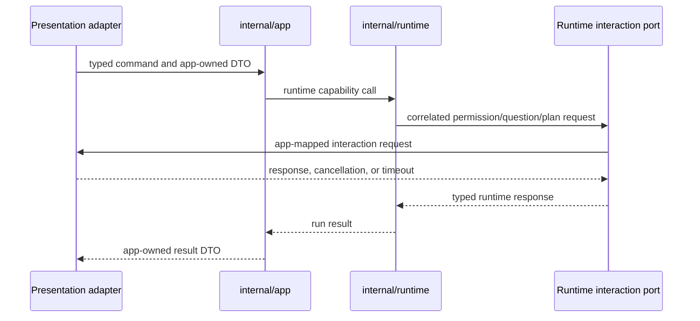
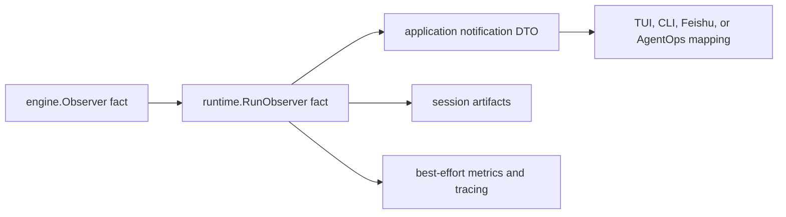

# Fox Package Dependency Contract

This document is the authoritative human-readable package dependency contract for Fox. Automated enforcement lives in `internal/architecturetest/imports_test.go`; `baseline_allowlist.json` preserves the immutable pre-refactor ceiling and `allowlist.json` records the now-empty migration ledger. A dependency-changing commit must update the document and enforcement together.

## Target Import Graph

```mermaid
flowchart TD
    FOX[cmd/fox] --> TUI[internal/tui]
    FOX --> CLI[internal/cli]
    FEICMD[cmd/feishu] --> FEI[internal/feishu]
    AOPCMD[cmd/agentops] --> AOP[internal/agentops]

    TUI --> APP[internal/app]
    CLI --> APP
    FEI --> APP
    AOP --> APP
    APP --> RUNTIME[internal/runtime]

    BEN[internal/benchmark] --> RUNTIME
    BENCHCMD[cmd/bench] --> BEN
    BENCHCMD --> RUNTIME
    AUT[internal/autodev] --> RUNTIME
    FOX --> AUT
    TUI -. injected launch .-> AUT

    SUB[internal/subagent] --> RUNNER[subagent.Runner]
    FOX --> CHILDRUNTIME[internal/childruntime]
    FEICMD --> CHILDRUNTIME
    AOPCMD --> CHILDRUNTIME
    CHILDRUNTIME -. implements .-> RUNNER
    CHILDRUNTIME --> CHILD[runtime.ChildRunner]

    RUNTIME --> ENGINE[internal/engine]
    RUNTIME --> SESSION[internal/session]
    RUNTIME --> PROMPT[internal/prompt]
    ENGINE --> SCHEMA[internal/schema]

    TOOLEXEC[internal/toolexec] --> ENGINE
    TOOLEXEC --> SCHEMA
    TOOLRUNTIME[internal/toolruntime] --> TOOLEXEC
    TOOLRUNTIME --> ENGINE
    TOOLRUNTIME --> TOOLRESULT[internal/toolresult]
    REGISTRYEXEC[internal/registryexec] --> TOOLEXEC
    REGISTRYEXEC --> TOOLS
    TOOLS[internal/tools] --> TOOLPROTOCOL[internal/toolprotocol]
    SUB --> TOOLPROTOCOL
    MODELINVOKE[internal/modelinvoke] --> ENGINE
    MODELINVOKE --> PROVIDER[internal/provider]
    RUNTIMECOMPACT[internal/runtimecompaction] --> RUNTIME
    RUNTIMECOMPACT --> COMPACTION[internal/compaction]
    TURNPOLICY[internal/turnpolicy] --> ENGINE
    TURNPOLICY --> SCHEMA
    TURNPOLICY --> RECOVERY[internal/recovery]
    TURNPOLICY --> REMINDER[internal/reminder]
    RUNTIMEJOURNAL[internal/runtimejournal] --> RUNTIME
    RUNTIMEJOURNAL --> SESSION
    RUNTIMEJOURNAL --> TELEMETRY
    TODOPOLICY[internal/todopolicy] --> TODOFILE[session TODO state]

    WIRE -. injects .-> PROVIDER
    WIRE -. injects .-> TOOLS[tool implementations]
    WIRE -. injects .-> TURNPOLICY
    WIRE -. injects .-> COMPACTION
    WIRE -. injects .-> TELEMETRY[metrics and tracing]
    FOX -. composition .-> RUNTIME
    FOX -. composition .-> REGISTRYEXEC
    FOX -. composition .-> RUNTIMEJOURNAL
    FEICMD -. composition .-> APP
    FEICMD -. composition .-> RUNTIME
    FEICMD -. composition .-> REGISTRYEXEC
    FEICMD -. composition .-> RUNTIMEJOURNAL
    AOP --> LOGSEARCH[internal/agentops/logsearch]
    AOPCMD -. composition .-> APP
    AOPCMD -. composition .-> RUNTIME
    AOPCMD -. composition .-> REGISTRYEXEC
    AOPCMD -. composition .-> RUNTIMEJOURNAL
```

The diagram is a directed acyclic graph, not a rule that every execution path must pass through every package. Benchmark, child invocation, and Autodev are runtime control clients rather than user-presentation clients.

## Package Responsibilities

| Package or package class | Sole responsibility |
|---|---|
| `internal/schema` | Narrow model protocol values: messages, usage, tool definitions, calls, and results. It is not a general DTO or utility package. |
| `internal/engine` | Infrastructure-independent run/turn transitions and consumer-owned model, tool, conversation, policy, and observer ports. |
| `internal/toolexec` | Immutable resolved capability snapshots, parallel/exclusive batch scheduling, cancellation completion, and ordered structured tool results. It does not own catalogs, permissions, session persistence, or presentation. |
| `internal/toolruntime` | Run-local composition of constrained tool execution with the compatibility-preserving full, model-preview, observer-preview, and persisted-artifact result forms. It does not discover tools, decide permissions, or commit conversation state. |
| `internal/registryexec` | Adaptation of an existing concrete tool registry into an immutable runtime-constrained capability list, including optional run-context and completed-result hooks. It does not select a profile or concrete tool set. |
| `internal/toolprotocol` | Narrow tool-invocation lineage, effective-capability snapshot, and structured execution-result values shared without importing the concrete tool registry. |
| `internal/modelinvoke` | Provider transport adaptation, response/error normalization, invocation options, and per-run model-call lifecycle hooks for `engine.ModelInvoker`. It does not own turns, context, or provider configuration. |
| `internal/runtimecompaction` | Translation of concrete compaction mechanics into runtime-owned durable-state and run-local projection proposals plus blocking-budget decisions. It never commits compact state. |
| `internal/runtimejournal` | Run-scoped compatibility persistence for non-authoritative transcript, metrics, and tracing artifacts around runtime facts and model/tool mechanisms. It never owns conversation recovery or terminal outcome policy. |
| `internal/turnpolicy` | Immutable factories for run-scoped recovery, reminder, completion, and TODO decisions. Runtime supplies already-bound queries; this package does not read persistence, select tools, emit telemetry, or own conversation state. |
| `internal/todopolicy` | Pure derivation of the TODO completion reminder from an already-selected session root and effective update capability. |
| `internal/runtime` | Harness construction, immutable profile resolution, live session/run lifecycle, context-injection decisions, recoverable-state commit coordination, and child-run control. |
| `internal/app` | User-entry commands, UI-neutral DTOs, runtime-notification mapping, and correlated interaction ports. |
| `internal/tui` | Fox-specific Bubble Tea input, queue, overlay, and terminal presentation behavior. |
| `internal/cli` | Non-interactive prompt/result, stdout/stderr, artifact-label, and exit presentation behavior. |
| `internal/feishu` | Feishu transport, scheduling, message delivery, and remote approval adaptation. |
| `internal/agentops` | AgentOps transport/control adaptation and incident task policy over application capabilities. |
| `internal/agentops/logsearch` | AgentOps-owned `log_search` schema, permission assessment, bounded scanning, and rooted file access. |
| `internal/prompt` | Deterministic side-effect-free prompt-fragment representation, ordering, and rendering. |
| `internal/session` | Stored session/run records, durable identifiers, message/transcript artifacts, compact records, and `FileStore` mechanics. It does not own live runtime lifecycle. |
| `internal/benchmark` | Benchmark case, fixture, validation, aggregation, provenance, and report control over the shared runtime. |
| `internal/subagent` | Model-facing `delegate_task` and fork-skill request/result adaptation through a consumer-owned `Runner` port. |
| `internal/childruntime` | Concrete composition of the single synchronous `ChildRun` profile and adaptation to `subagent.Runner`; it owns no parent presentation or transport behavior. |
| `internal/autodev` | Durable deterministic backlog, ledger, worktree, SDD stage, gate, Engineer, publication control, and typed core/question/report adaptation over the shared runtime. |
| Provider, tool, compaction, checkpoint, memory, automemory, metrics, and tracing packages | Focused mechanisms injected through consumer-owned contracts. Infrastructure is a classification; there is no aggregate `internal/infrastructure` package. |
| `cmd/*` | Process input/configuration, concrete construction, dependency wiring, entry selection, and startup only. |

## Final Implemented State

The M27 architecture has one Go module and no RPC boundary or generic event bus. `internal/engine` is the pure turn state machine; `internal/runtime` owns live session/run lifecycle, frozen profiles, complete-context decisions, recoverable-state coordination, child execution, and benchmark-facing harness control; `internal/app` exposes UI-neutral commands, DTOs, notifications, and interaction ports. Concrete provider, tool, persistence, memory, compaction, permission, artifact, and telemetry mechanisms remain focused packages wired only by composition roots.

`internal/prompt` imports only the standard library and deterministically renders caller-ordered fragments. Runtime `PromptCollector` performs project-instruction and skill discovery, reads injected memory sources, applies frozen collaboration and effective-tool values, and returns fragments to `ContextController` for final rendering. `internal/context` no longer exists.

`internal/session` imports only `internal/schema` and owns persisted records and file mechanics, not live runtime lifecycle or working memory. `memory.Store` is the sole owner of `working_memory.md`, `PLAN.md`, and `TODO.md`; composition or runtime initialization invokes it explicitly. Only `StoredSession`, `StoredRun`, `FileStore`, `TranscriptLog`, and `TranscriptEvent` remain as persistence vocabulary.

### Production Profile Paths

| Profile | Single production path | Boundary proof |
|---|---|---|
| `TUIInteractive` | `cmd/fox -> tui.Run -> app.InteractiveRuntimeApplication -> runtime.AgentSession -> engine.AgentEngine` | TUI imports application/presentation helpers only; `cmd/fox` is the concrete composition root. |
| `CLIExec` | `cmd/fox -> cli.Run -> app.RuntimeApplication -> runtime.AgentSession -> engine.AgentEngine` | CLI imports only `internal/app`; no legacy CLI runner or direct engine entry exists. |
| `FeishuRemote` | `cmd/feishu -> feishu.Runner -> app.RuntimeApplication -> runtime.AgentSession -> engine.AgentEngine` | Feishu owns transport/scheduling; `cmd/feishu` owns runtime construction. |
| `AgentOpsTask` | `cmd/agentops -> agentops.Runner -> app.RuntimeApplication -> runtime.AgentSession -> engine.AgentEngine` | AgentOps owns incident policy and `log_search`; `cmd/agentops` owns runtime construction. |
| `BenchmarkEval` | `cmd/bench -> benchmark.Runner -> runtime.AgentSession -> engine.AgentEngine` | Benchmark is a direct runtime control client and does not assemble engine internals. |
| `ChildRun` | `subagent.Runner port -> childruntime.Runner -> runtime.ChildRunner -> runtime.AgentSession -> engine.AgentEngine` | `internal/childruntime` is the sole concrete one-level child composition. |
| `AutodevPipeline` | `cmd/fox or TUI launcher -> autodev.RuntimeCoreRunner -> runtime.AgentSession -> engine.AgentEngine` | Autodev is a direct runtime control client; its backlog/worktree/SDD/publication control remains outside runtime. |

`RuntimeHarness` is the only production caller of `engine.NewAgentEngine`. Architecture tests independently reject old app, engine, context, session, benchmark, child, CLI, remote, Autodev, and TUI paths. The production import graph has no target-rule violation, and `internal/architecturetest/allowlist.json` contains an empty `violations` array.

## Migration History

The following milestone notes preserve why each dependency moved. Present-tense statements within a note describe the repository at that milestone; the final implemented state above is authoritative for current code.

`M01` establishes `internal/prompt` as the standard-library-only fragment representation and renderer. It accepts already-resolved fragments in caller-supplied order and performs no file discovery, memory access, collaboration selection, capability selection, persistence, or injection timing.

`M26` deletes `internal/context`. Runtime's `PromptCollector` now performs project-instruction and skill discovery, reads already-selected session and persistent-memory sources, applies the frozen collaboration and capability values supplied by `ContextController`, and returns ordered `prompt.Fragment` values. `ContextController` owns collection timing and final rendering for each run. `internal/prompt` remains a standard-library-only value and renderer package and cannot import runtime or any other project package.

`M02` establishes `StoredSession`, `StoredRun`, `ID`, `RunID`, `FileStore`, `TranscriptEvent`, and `TranscriptLog` as the authoritative persistence vocabulary. `ID` and `RunID` are distinct Go types but retain the exact existing JSON string encodings. `M26` deletes the temporary `Session`, `Run`, `Manager`, `Event`, and `Transcript` aliases, their legacy constructors, and the stored-record lifecycle wrappers after repository-wide migration to the current vocabulary.

`FileStore` is the new-code boundary for file-backed create, lookup, run-start, and run-finish mechanics. The final stored-record contract contains data and derived artifact paths only. `M10` introduces `runtime.AgentSession` and the consumer-owned `runtime.SessionStore` and makes runtime the sole live recoverable-state owner; `M11` moves context, compaction, resume, and rewind coordination to its single commit path. `M25` removes the final direct `StoredSession.StartRun` and `StoredRun.Finish` consumers; `M26` deletes the aliases and compatibility methods. `internal/session` must never import `internal/runtime`.

`M03` makes `internal/memory.Store` the only implementation owner for session `working_memory.md`, `PLAN.md`, and `TODO.md` behavior. `M26` removes the final `internal/session -> internal/memory` dependency and `StoredSession.MemoryPath`; `FileStore.Create` now initializes persistence-owned records only. Runtime harness initializers and composition roots invoke `memory.Store` explicitly. CLI, TUI, Autodev, Benchmark, and ChildRun initialize their complete session files at the existing runtime boundary, while Feishu and AgentOps preserve their prior early scratchpad timing through composition-owned `EnsureWorkingMemory` calls. Runtime receives only injected context paths and never imports the concrete memory mechanism.

`M04` establishes the target `AgentEngine` and its consumer-owned `ModelInvoker`, `ToolExecutor`, `Conversation`, `TurnPolicy`, and `Observer` ports. `RunInput`, immutable per-invocation `RunContext`, and runtime-neutral `RunOutcome` keep session identity, persistence, artifacts, and telemetry outside the target coordinator. A concrete `ToolSnapshot` remains owned by its executor, exposes only cloned model-visible definitions to engine, and is passed back unchanged for later execution. Engine facts use one synchronous sequence assigned per run, and the target engine retains only immutable collaborators.

The previous implementation was explicitly named `LegacyEngine`/`NewLegacyEngine` while production profiles crossed atomically. From `M12`, `RuntimeHarness` is the sole production caller of `NewAgentEngine`; an AST gate rejects every other assembler. `M25` deletes the old implementation and all of its concrete imports.

`M05` expands the target coordinator through the complete shared model-turn and streaming contracts. `ModelInvoker.StartRun` creates one `ModelRunInvoker` whose streaming/fallback state may be shared by thinking and action calls and later turns in that run, but cannot leak into another run. Model deltas return synchronously through a restricted emitter and are sequenced once by engine `Observer`; provider transports, retry/fallback selection, and response normalization remain outside engine. Engine owns thinking/action phase transitions, usage aggregation, tool-free and tool-continuation transitions, and the exact hard turn-limit boundary. Conversation receives defensive ordered proposals, including non-persisted thinking context, and cannot mutate pending model/tool state. All production profiles now execute this coordinator through runtime.

`M06` introduces the focused `internal/toolexec` adapter. Composition supplies already constrained and alias-resolved `Capability` values, so one snapshot freezes each advertised definition, executable function, and parallel-safety decision together. Consecutive parallel-safe calls overlap; non-parallel calls form exclusive boundaries; every batch returns in model-call order; unknown, invalid, business, infrastructure, and cancellation outcomes remain structured and correlated. `ToolExecutionResult` keeps full artifact content, model preview, observer preview, and artifact path distinct. Engine commits model-visible results before preparing the next context and exposes only normalized observer forms. Session-message persistence, permission policy, catalogs, and artifact storage remain outside both engine and toolexec.

`M07` introduces the focused `internal/turnpolicy` factory. `TurnPolicy.StartRun` creates a fresh `TurnRunPolicy` for every engine run, so recovery fingerprints, reminder history/cooldown, completion attempts, and TODO-update state cannot leak through a reused `AgentEngine`. Its binder also creates run-owned, context-aware completion/TODO/next-turn queries instead of sharing mutable callbacks across runs. The run policy receives immutable model and completed-tool facts and returns ordered, source-typed, non-persisted context proposals; engine commits and observes each assistant message before evaluating completion, commits correlated tool results before recovery, and applies ordinary then next-turn reminders before the following invocation. Runtime remains responsible for binding queries to its authoritative state. M08/M11 will make `Conversation` place these typed overlays after compatible context preparation and compaction. The policy package imports only engine/schema contracts and the existing focused recovery/reminder mechanisms.

`M08` closes the target engine boundary without moving any production profile. `AgentEngine` retains exactly the five confirmed immutable collaborators, and engine source imports only its current standard-library primitives plus `internal/schema`; AST gates reject concrete infrastructure, legacy engine contracts, presentation writes, and execution-result fields owned by runtime. `Conversation.Prepare` receives immutable invocation input, while `Conversation.RequestChanges` makes mutation ownership explicit: engine submits ordered typed changes but cannot apply, persist, compact, or recover them itself. `runtime.ContextController` decides when those requests become authoritative state and prepares the next post-compaction projection. Since `M25`, every production file in `internal/engine` is checked under this one boundary with no legacy-file exemption.

`M09` establishes `internal/runtime` with the seven confirmed immutable profiles: `TUIInteractive`, `CLIExec`, `FeishuRemote`, `AgentOpsTask`, `BenchmarkEval`, `ChildRun`, and `AutodevPipeline`. Each resolves independently to one flat value snapshot containing lifecycle, persisted source, session-selection permissions, workspace/model and model-derived context-budget scope, streaming/delta capability, budgets, scheduling, capability ceiling, interactions, permission, state, compaction, extraction, observation, and delegation limits. Dynamic prompt, session selection, collaboration, model/effort, workspace, task, benchmark case, parent lineage, observer, and per-run restrictions remain in `RunSpec`; resolution freezes them into a `ResolvedRunSpec`. Tool restrictions use stable ceiling-order intersection, returned tool lists are defensive copies, bounded turn budgets cannot become unlimited, fixed task timeouts cannot be overridden, forbidden thinking/read-only modes cannot be enabled, and delegation depth cannot differ from the selected profile. Benchmark alone accepts a positive case timeout with a corrected 600-second default. Feishu alone permits its remote forced-new directive without gaining explicit or continue-latest session selection. No production entry uses these profiles before the atomic cutovers beginning at `M14`.

`M10` establishes the runtime lifecycle authority without cutting over a production profile. `RuntimeHarness` retains the concurrency-safe `SessionStore` dependency and an ID-only live-ownership registry; it never retains a current `AgentSession` or run-scoped collaborator. Creation and opening bind a persisted record to exactly one live owner within the shared harness, validate profile/source identity, and release that lease only on a successful close. `AgentSession` serializes runs with context-aware admission while distinct session IDs remain independent. `RunScope` freezes the resolved profile values, model/effort, tool ceiling, observer, cancellation, run identity, and persistence record for one admitted run.

`SessionStore` is defined by runtime and implemented by `session.FileStore`. Its lifecycle methods perform create/open/start/finish mechanics; its context methods load and append exact message records, load and save compact state, and truncate messages for rewind. A run-finish storage failure places the live session in an explicit recovery-required state: new runs and close are rejected, while the same scope may retry the terminal commit. Admission resumes only after that durable commit succeeds, preventing live and persisted lifecycle state from diverging. The lease registry is process-local to the shared harness; composition must share one harness per configured store. Cross-process leases are not part of the existing single-process behavior contract.

`M11` establishes `runtime.ContextController` as the implementation of the engine-owned `Conversation` port. It collects already resolved prompt fragments and delegates deterministic rendering to `internal/prompt`; it does not own durable history. `AgentSession` alone caches and commits exact persisted `MessageRecord` values and `CompactState`, prevents duplicate initial-user commits when a controller is recreated, serializes manual compaction and rewind with runs, and gates those operations by the resolved profile.

Compaction proposals have exactly one authority. Initial-history and manual compaction may propose a durable compact state, which `AgentSession` validates and commits before `ContextController` rebuilds the model projection from stored records. Pre-turn and reactive compaction may propose only a run-local message projection. A proposal containing both forms is rejected. Automatic failures retain the current original-projection fallback, typed blocking decisions remain fatal before model invocation, and a reactive retry occurs only after an actual projection change. One immutable tool snapshot is resolved per turn and is shared by thinking-budget calculation, action visibility, reactive preparation, and execution; thinking still receives no model-visible tools. Compaction facts preserve the existing `compaction` kind and `session_history`, `turn_context`, or `reactive` source names.

`M12` makes `RuntimeHarness` the single target engine assembly boundary. `HarnessDependencies` contains immutable factories for model invocation, constrained tools and permission behavior, turn policy, context collection/compaction, session initialization, session artifacts, and telemetry. Each factory receives a defensive `RunAssembly` containing frozen session identity, run/profile values, the effective tool ceiling, the run permission scope, and the runtime-owned child capability established by M13. `AgentSession.Run` admits one run, applies its resolved timeout, builds fresh collaborators, drives `AgentEngine`, waits for execution cancellation to settle, and always attempts the durable run finish.

`RuntimeFact` adds session and run identity exactly once around the canonical synchronous engine fact. One runtime observer then fans that value to the caller, the session-artifact journal, and the telemetry journal without a generic event bus. Non-terminal facts remain synchronous; the one terminal fact is held until durable run finish succeeds, so a finish failure replaces completion with one same-sequence runtime error rather than exposing contradictory terminal outcomes. Authoritative conversation and terminal persistence failures remain fatal. Artifact and telemetry construction/write failures become ordered `RunWarning` values and cannot alter the engine outcome. Tool artifact paths, outcome usage, finish reason, turn count, and final message are returned once in `RunResult`. A hidden finish failure can be retried through `AgentSession.RecoverRunFinish`, so the high-level `Run` API does not strand a session in an unrecoverable state.

Profile-wide limiters are shared by all sessions created from one harness and enforce the confirmed Feishu/AgentOps global capacity independently of per-session serialization. Unbounded profiles do not receive an artificial global limit. The architecture test requires exactly one production `NewAgentEngine` caller, `internal/runtime/runtime_harness.go`; production profiles still use their legacy path until the profile-atomic cutovers beginning at `M14`.

`M13` establishes `runtime.ChildRunner` as the sole target child-execution capability. A runner freezes its parent session/run lineage, provider/model/workspace values, permission authority, capability ceiling, cancellation context, and delegation ceiling. Every accepted request creates one fresh `ChildRun` session, persists parent session/run plus delegation and agent identity, intersects parent, selected-agent, caller, read-only, and child-profile tool ceilings, and drives exactly one synchronous child through `AgentSession.Run`. Profiles with no delegation authority and every depth-two request reject before session or capacity allocation.

Interactive and remote parent policies must provide a runtime-owned `PermissionScope`; the child scope is derived only after child session and run identities exist and receives the complete frozen lineage and effective tools. Profiles whose confirmed permission policy is `none` or non-interactive full access do not gain a synthetic coordinator. Missing required coordination and nil or failed derivation fail before model/tool construction. The derived scope is supplied to all child factories through the same `RunAssembly` used for model, tools, policy, context, artifacts, and telemetry.

`M14` atomically moves `BenchmarkEval` and `cmd/bench` to the target runtime. `internal/benchmark` now owns only fixture materialization, case snapshots, validation, aggregation, provenance, report formatting, and the privileged runtime control call; it imports `internal/runtime` but no concrete engine, provider, session, or tool implementation. `cmd/bench` is the composition root that resolves settings, creates the concrete provider and compactor, maps the temporary legacy prompt-discovery facade to runtime fragments, constrains the six benchmark tools, creates a fresh CLI-source `AgentSession`, and invokes benchmark control. Runtime fidelity is derived from the resolved `BenchmarkEval` profile and the same `RunSpec` used for execution.

Three focused mechanism packages avoid both legacy import cycles and a generic infrastructure layer. `modelinvoke` normalizes provider responses, prompt-too-long errors, effort, usage-bearing assistant messages, and successful-call compactor recovery. `runtimecompaction` preserves durable initial-history and run-local proactive/reactive compaction proposals while runtime remains the sole commit authority. `toolruntime` composes `toolexec` with the existing absolute output cap, persistence threshold, per-turn budget, model preview, observer preview, and artifact path. Each package implements one already confirmed consumer contract and is reusable by later profile cutovers; none selects profiles or assembles a runtime.

Every benchmark repeat now executes through exactly one production path: `benchmark.Runner -> runtime.AgentSession.Run -> runtime.AgentEngine`. The runner uses the immutable case prompt, retains session/run identity and stable report errors, retries hidden finish persistence, closes the live session under a fresh bounded cleanup context, and only then performs evaluation. The two M14 allowlist rows were removed at cutover; `M25` deletes the completed test-only differential adapter after the target runtime assumed the complete benchmark catalog.

`M15` atomically moves both `delegate_task` and fork-skill execution to `runtime.ChildRunner`. Production `internal/subagent` contains only request/result values, agent selection, compatible formatting, the model-facing tool, and its consumer-owned `Runner`; `M25` also deletes the former `_test.go` `Manager` and child tool snapshot differential adapters. `internal/childruntime` is the single concrete ChildRun composition: it supplies the provider adapter, immutable tool executor, permission scope, prompt collector, session-local compactor, policy, memory initialization, cleanup supervisor, and frozen-parent bridge to runtime.

The legacy parent profiles remain on their own existing engine paths until their scheduled cutovers, so runtime accepts a validated `FrozenParentRun` snapshot without creating a shadow parent session or run. `cmd/fox`, `cmd/feishu`, and `cmd/agentops` construct the concrete child adapter and inject consumer-owned factories; app, Feishu, and AgentOps do not import runtime or childruntime for this workflow. The effective parent capability list travels with the exact tool invocation context; filtered registries preserve the outer authoritative list, and `delegate_task` passes a defensive copy into the child intersection. Fork and delegate therefore share one depth, permission, capability, lifecycle, outcome, and cleanup path.

Hermetic old/target adapters compare tool advertisement, delegated task, agent and project instructions, final report, parent/run/delegation lineage, and persisted final assistant state. Production source contains no child `NewLegacyEngine` or `subagent.NewManager` call. The seven M15 subagent construction rows are removed, reducing the allowlist from 66 to 59 entries; the post-M15 SHA-256 is `b9c976b2655c6bc310554f96a6dff26d6d381c256129339d394caceb8b303b53`, while the immutable baseline remains unchanged.

Parent-scope and invocation cancellation are combined for the child. Runtime panic recovery durably finishes an established run, and ChildRunner then synchronously drains its injected process/permission cleanup, retries any hidden recoverable finish, and closes the child session before returning one typed outcome. Cleanup, close, and panic failures update both the outer child status and nested runtime outcome. Success, start failure, rejection, cancellation, exhaustion, runtime failure, panic, and cleanup failure preserve invocation and lineage correlation. Parent-visible reports come only from the latest complete assistant message emitted after authoritative persistence; streamed, tool-only, stale, and failed-to-commit text cannot become a report, while a previously committed assistant message remains an explicitly failed or exhausted partial result.

Child prompt construction remains a pure use of `internal/prompt` over already resolved values. It contains exact parent lineage, task, execution mode, effective tool names, permission policy, optional selected-agent instructions, and high-density report guidance, without adding interaction, TODO, skill, checkpoint, rewind, or nested-delegation capabilities. M13 does not switch the production `delegate_task` or fork adapters: the corrected legacy `subagent.Manager` remains their sole path until M15 atomically maps the consumer-owned `subagent.Runner` port to this capability and removes legacy child engine assembly.

`M16` establishes the target application language without cutting over a user-entry profile. `RunCommand`, `RunOutcome`, `Usage`, and `Warning` are app-owned values; `RunUseCase` and `NotificationSink` are consumer-facing capabilities. `MapRuntimeFact` and `MapRuntimeRunResult` are the single runtime-to-application mapping boundary: they copy runtime values into presentation-neutral DTOs, preserve canonical sequence and lineage, retain absent versus empty collections, and expose no engine or persistence-record type. `contracts.go` imports only the standard library, while `notifications.go` may import runtime solely for this mapping.

Permission approval, user questions, and Formal Plan review are three explicit blocking request/response ports rather than a generic event bus. Every request carries an application-owned interaction, session, run, and tool-call correlation; every response returns the interaction ID; cancellation and deadlines travel through `context.Context`. Question IDs supplement the existing question-text compatibility key so later adapters can reject stale or duplicate responses. Codex's request/turn/call/question identities and Claude Code's request/tool-use deduplication validate this correlation boundary, but Fox does not adopt their RPC, stream, or transport protocols.

The legacy `AgentRunner`, `RunCLI`, `RunTUI`, inactive Autodev differential adapter, and plan lifecycle remain a closed compatibility facade until `M24`. An exact AST gate fixes their current concrete imports to `autodev.go`, `cli.go`, `plan_lifecycle.go`, `runner.go`, and `tui.go`; no new application file may add a concrete subsystem dependency. Application contracts and mapping cannot construct or drive runtime, engine, persistence, tools, or presentation. M16 adds the already-authorized `internal/app -> internal/runtime` mapping edge, performs no profile cutover, and leaves the 59-entry decreasing allowlist unchanged.

`M17` atomically cuts over the production `CLIExec` path. `cmd/fox` selects and constructs the concrete CLI profile, `app.RuntimeApplication` maps the typed command, notifications, lifecycle hooks, and result, and `internal/cli.Run` owns only the exact final-output labels, logging, and result-before-drain order. `internal/cli` imports only `internal/app`; it cannot construct runtime, persistence, providers, tools, checkpoints, memory, compaction, or telemetry. An AST gate rejects any return to `app.RunCLI`, `app.NewAgentRunner`, or direct engine assembly in the print entry.

The CLI composition root preserves explicit, latest-CLI, and fresh session selection; working memory and automemory; per-message state history and checkpoints; default collaboration; skill discovery and activation reminders; the eight-tool ceiling; automatic compaction; one synchronous run; and tracked extraction joined after presentation. It opens the selected persisted record as the sole live `runtime.AgentSession`, and all model, tool, conversation, policy, and journal collaborators are supplied through `RuntimeHarness`. `runtimejournal` retains the existing transcript, metrics, and trace locations and formats as best-effort artifacts, while authoritative messages and run completion remain runtime-owned.

`registryexec` replaces the former duplicate benchmark and child registry adapters and is also used by CLI composition. It intersects advertised and executable names with the immutable runtime ceiling, retains concrete parallel-safety decisions, propagates exact run/tool-call lineage, and maps completed concrete results once. `todopolicy` supplies the target TODO completion query without making `turnpolicy` or engine read persistence. The legacy engine retains its temporary private equivalent because target engine imports remain schema-only until `M25`.

`app.RunCLI` and its old presentation tests remain as an inactive compatibility facade solely for differential evidence and scheduled deletion at `M24`; no production entry calls it after M17. The M17 cutover introduces no forbidden dependency and therefore leaves the 59-entry decreasing allowlist unchanged.

`M18` atomically cuts over both `fox autodev` and the TUI `/autodev` launcher to one runtime-backed `CoreRunnerFactory` composed in `cmd/fox`. `internal/autodev.RuntimeCoreRunner` directly drives one item-scoped `runtime.AgentSession`; it owns only the typed attempt/outcome, canonical core-event mapping, Engineer question port, model mutation port, stage-prompt port, and item drain/close contract. Backlog selection, durable ledger, worktree lifecycle, fixed CodexSpec stages, deterministic verification, quality gates, Engineer supervision, Git/GitHub publication, retries, and terminal reporting remain in the Autodev control plane.

The target factory preserves a fresh CLI-source session per item runner, same-item serialized runs, the configured model override, unlimited-or-narrowed turn budget, the exact ten-name root capability surface including the `AskUserQuestion` alias, full-access non-human permission semantics, one-level child execution, project instructions, skills, TODO policy, working memory, automemory, checkpoints, state history, automatic compaction, transcript/metrics/tracing artifacts, and extraction ordered after terminal reporting then joined by item drain/close. `cmd/fox` injects this same launcher into both entry adapters; an architecture test rejects every production `app.RunAutodev` caller.

Autodev now owns question, answer, core-reporter, and core-result values instead of importing concrete tool or engine contracts. The inactive app adapter maps these values only for pre-M24 differential tests. The two M18 allowlist rows are removed, reducing the migration ledger from 59 to 57 entries; its SHA-256 is `eeda5615dfe92b8b3b6a12e5f723cb81350b7f12d17514e46220f480afff6f80`.

`M19` atomically cuts over FeishuRemote while retaining webhook intake, durable delivery acceptance, bounded/FIFO scheduling, outbound text, delivery observation, approval callbacks, and shutdown in `internal/feishu`. The adapter now defines a narrow task-execution factory and invokes only `app.RunUseCase`; runtime facts reach Chinese Feishu text through application notifications, and ModeAsk requests cross the application-owned `PermissionPort` before the Feishu callback transport. `cmd/feishu` selects the exact chat/sender session and composes the target runtime with the seven-tool ceiling, one-level child execution, project/session/automemory context, automatic compaction, fire-and-forget extraction, and transcript/metrics/trace journals. All eight M19 exceptions were removed at cutover; `M25` deletes the completed test-only legacy Feishu assembly.

`M20` atomically cuts over AgentOpsTask while retaining its two-channel bridge, global bounded scheduling, task timeout, panic and terminal outcome handling, exact result/artifact presentation, delivery observation, incident prompt, and log-search ownership. A two-stage AgentOps execution port exposes the freshly created session before application initialization, preserving the existing session-notice-before-PLAN/TODO initialization order. `cmd/agentops` composes the target runtime with one exact task provider snapshot, a fresh Feishu-source session, the eight-tool ceiling including AgentOps-owned rooted `log_search`, one-level child execution, project/session/automemory context, automatic compaction, fire-and-forget extraction, and compatibility journals. Remote ModeAsk reuses `feishu.PermissionPort` and the gateway's single callback store with task/session/run/tool correlation. All ten M20 exceptions were removed at cutover; `M25` deletes the completed test-only legacy AgentOps assembly.

`M21` moves TUI run submission and live session presentation state behind `internal/app` commands, queries, outcomes, and notifications. The TUI no longer imports engine, persisted session records, checkpoint, or compaction types for conversation rendering, model/effort/collaboration changes, manual compaction, cancellation restore, or phased rewind. Rewind availability is an explicit application-state capability so `/status` preserves the previous checkpointer-dependent value. `cmd/fox` owns the temporary presentation startup bindings while `app.RunTUI` retains legacy runtime construction until M24; this prevents the reverse `app -> tui` dependency without prematurely moving permission and tool composition scheduled for M22-M23.

`M22` moves permission decisions and state, user questions, Formal Plan review, and permission-review progress behind application-owned contracts. Permission, question, and plan interactions use separate synchronous request/response ports with session/run/tool-call correlation and context cancellation; low-noise review progress uses a distinct one-way `InteractionNoticeSink`, not the canonical runtime notification stream. TUI owns Bubble Tea messages, overlays, terminal input, and queued-prompt presentation, while the temporary app facade maps the legacy permission/tool contracts. Typed-nil ports normalize to absent capabilities. Production TUI no longer imports concrete permission or tool-policy packages; only its M23 tool/composition dependency remains.

Codex validates this boundary by translating TUI actions into typed `AppCommand` values such as `UserTurn`, `Compact`, `ThreadRollback`, and turn-context overrides while core session code owns history and compaction. Claude Code's `QueryEngine` explicitly owns conversation query lifecycle and session state, and its remote adapter projects typed `SDKMessage` values into REPL presentation. Claude's local REPL still contains acknowledged pre-extraction session behavior, so Fox adopts the extracted headless ownership direction rather than copying that transitional coupling. The seven M21 state edges are removed, reducing the allowlist from 39 to 32 rows at SHA-256 `17f251eee28330f907e223716e68fc98b4d1767418b045937b865a76ef37da21`.

`M23` atomically cuts over `TUIInteractive` to the single public `tui.Run` presentation entry. `cmd/fox` composes one runtime-backed `InteractiveRuntimeApplication`, while TUI retains terminal state, interaction overlays, local-shell presentation, and startup/cleanup ownership. The final TUI concrete tool edge is removed, reducing the allowlist from 30 to 29 rows at SHA-256 `c96f5452126a6a3e1b6934201f447f6850743b64134464932aa342f3c6db40b0`.

`M24` deletes the complete obsolete application facade and every test consumer of it: `AgentRunner`, its concrete assembly/configuration, `RunCLI`, `RunTUI`, `RunAutodev`, the legacy interactive adapter, and the old plan lifecycle no longer exist in any Go build. `cmd/fox` owns its private process configuration and injects `childruntime.Config` directly at composition. Production `internal/app` now contains only typed commands, DTOs, notifications, interaction ports, and runtime-backed application workflows; its only project dependency is `internal/runtime`. Benchmark and Autodev remain direct runtime control clients, ChildRun uses `childruntime -> runtime`, and CLI, TUI, Feishu, and AgentOps use their application adapters over runtime-backed composition. The 19 M24 rows are deleted, reducing the allowlist from 29 to the 10 M25 engine rows at SHA-256 `3ffa1b7e1c1f46038356712de8ab7b46aacf83b5db9e6c08ba87e8faac9ca6d4`.

`M25` deletes `LegacyEngine`, its mutable `Config`, Reporter chain, session/context/tool/telemetry ownership, and engine-level differential adapter. The shared RT/ST fixtures now execute only through `AgentEngine`, and the target runtime/profile suites own all higher-level behavior. Model fallback and turn-policy state are created per run, so a reused engine has no cross-run mutable execution state. Prompt composition contracts formerly housed in engine are now minimal consumer-owned interfaces in composition and control clients. Repository-wide AST gates cover production, test, and build-tag files; every engine production file imports only the standard library and `internal/schema`. The decreasing migration allowlist is empty at SHA-256 `c6c5c5ddfb7d7a5198b30c5bc2f9ee0ebb6156dfabc193837c10fd97251ed3ca`.

`M26` deletes `internal/context`, all temporary session aliases and lifecycle wrappers, `StoredSession.MemoryPath`, and the final `internal/session -> internal/memory` edge. Runtime `PromptCollector` becomes the sole complete-context collector used by production composition, while `ContextController` owns frozen collection timing and final fragment rendering. Every profile explicitly invokes `memory.Store` at its existing initialization boundary.

## Allowed Dependencies

| Importer | Allowed target architecture dependencies |
|---|---|
| `internal/engine` | Go standard library and `internal/schema` only. |
| `internal/turnpolicy` | `internal/engine`, `internal/schema`, `internal/recovery`, and `internal/reminder` only. |
| `internal/runtime` | `internal/engine`, persisted values/storage contracts implemented by `internal/session`, and pure `internal/prompt`. Concrete mechanisms arrive through runtime-owned ports. |
| `internal/app` | `internal/runtime` through application use cases and mapping code. Application DTOs and ports are app-owned. |
| TUI, CLI, Feishu, AgentOps adapters | `internal/app` plus adapter-local presentation/transport helpers and independently owned control-plane values. They do not operate concrete runtime subsystems. |
| `internal/benchmark`, `internal/autodev` | `internal/runtime` as privileged control clients plus their own evaluation or deterministic control-plane mechanisms. |
| `internal/subagent` | Its own `Runner` port and protocol/value packages required for model-facing request adaptation. It does not import runtime. |
| `internal/childruntime` | Runtime and the focused provider, tool, permission, runtime prompt collection, compaction, memory, and process-cleanup mechanisms required only to compose `ChildRun`. |
| `cmd/*` | Relevant adapters, runtime constructors, consumer ports, and concrete implementations only for construction and startup. |

An interface belongs to the package that consumes it. Concrete provider, tool, compaction, persistence, memory, and telemetry implementations satisfy those interfaces through composition; their packages do not force inward packages to import outward implementations.

## Forbidden Dependencies

- `internal/engine` must not import runtime, app, adapters, persistence, providers, tools, compaction, checkpoints, memory, telemetry, recovery, reminders, or tool-result storage.
- `internal/turnpolicy` must not import runtime, session persistence, app/adapters, providers, tools, compaction, memory, telemetry, or any package other than engine/schema contracts and the focused recovery/reminder mechanisms.
- `internal/runtime` must not import app, TUI, CLI, Feishu, AgentOps, or the model-facing subagent adapter.
- `internal/session` must not import runtime or own live runtime lifecycle and recoverable-state commit policy.
- `internal/app` must not import presentation adapters or concrete engine, persistence, provider, tool, compaction, checkpoint, memory, or telemetry implementations.
- Presentation and transport adapters must not import or construct engine, runtime, session store, compaction, checkpoint, provider, tool registry, memory, telemetry, or concrete permission-policy implementations.
- `internal/subagent` and `internal/runtime` must not import each other. Composition maps `subagent.Runner` to `runtime.ChildRunner`.
- App and presentation/transport adapters must receive ChildRun factories through consumer-owned ports; only composition roots may import `internal/childruntime`.
- Benchmark and Autodev must not independently assemble the engine or bypass runtime lifecycle and security invariants.
- No package may create or import `internal/infrastructure`.
- No reverse import may be introduced to implement a callback. Bidirectional control uses consumer-owned request/response ports.

## Composition-Root Exception

`cmd/*` and narrowly scoped production factory files may know both consumer contracts and concrete implementations only while constructing, connecting, selecting, and starting an entry point. After startup they must not:

- execute model turns or tools;
- perform compaction or rewind;
- commit session state;
- retain a current session, permission grant, or run-scoped mutable object;
- format presentation output that belongs to an adapter.

This exception permits dependency injection; it does not permit workflow orchestration in `cmd/*`.

## Interaction Flow

Progress is one-way observation. Permission approval, user questions, and plan review are synchronous correlated request/response interactions and must not be modeled as a generic event bus.

## Observation Mapping

A fact is produced once and remains canonically ordered. Session artifacts may be model-visible and are not recoverable-state authority. Metrics and tracing remain best effort and cannot redefine run outcomes. Parallel Reporter, Event, and Journal pipelines must not independently establish ordering.

## Concrete Injection Points

| Capability | Consumer-owned boundary | Concrete implementation owner |
|---|---|---|
| Model invocation | `engine.ModelInvoker` | provider packages and composition |
| Tool snapshot/execution | `engine.ToolExecutor` | tool catalog/executor packages and composition |
| Turn completion/reminders | `engine.TurnPolicy` | `internal/turnpolicy`, configured with runtime-owned queries through composition |
| Conversation projection | `engine.Conversation` | `runtime.ContextController` |
| Recoverable persistence | `runtime.SessionStore` | `session.FileStore` |
| Prompt fragments | `runtime.ContextCollector` and `runtime.ContextController` | `runtime.PromptCollector` resolves inputs; `internal/prompt` renders ordered fragments. |
| Compaction mechanics | runtime-owned compaction capability | `internal/compaction` |
| Runtime observation | `runtime.RunObserver` | app mapper, artifacts, metrics, tracing adapters |
| Child invocation | `subagent.Runner` | composition adapter to `runtime.ChildRunner` |
| User interactions | runtime and app request/response ports | TUI or remote adapter implementations |

## Architecture Enforcement

`internal/architecturetest/baseline_allowlist.json` is the immutable `B00` ceiling. `internal/architecturetest/allowlist.json` is the decreasing migration ledger and must always be a subset of that ceiling. Both contain exact production package edges, and each row has a mandatory `remove_by` boundary. A commit fails when it:

- introduces a violation absent from the allowlist;
- adds or broadens an allowlist row;
- leaves a stale row after removing the corresponding import;
- changes a dependency rule without updating this document and its tests.

The initial allowlist contains 68 exact edges. Its latest deletion boundaries are:

| Boundary | Coupling removed |
|---|---|
| `M14` | Benchmark independent engine/session assembly. |
| `M15` | Subagent invocation adapter's nested runtime construction. |
| `M18` | Autodev core engine/tool bypass. |
| `M19` | Feishu concrete runtime subsystem imports. |
| `M20` | AgentOps concrete runtime subsystem imports. |
| `M21` | TUI concrete engine, persisted-session, compaction, and checkpoint state imports. |
| `M22` | TUI concrete permission and tool-policy interaction imports. |
| `M23` | Remaining TUI concrete tool/composition import. |
| `M24` | Old `internal/app` assembly and presentation imports. |
| `M25` | Old engine concrete infrastructure imports. |

At M27 the migration ledger is empty at SHA-256 `c6c5c5ddfb7d7a5198b30c5bc2f9ee0ebb6156dfabc193837c10fd97251ed3ca`. The immutable B00 ceiling remains available only to prove that no migration commit broadened the violation set; it is not an exception list for current code. This document, the automated rules, and production imports agree on zero forbidden edges.
