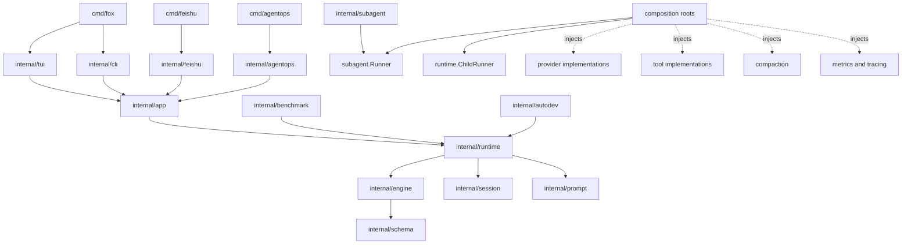
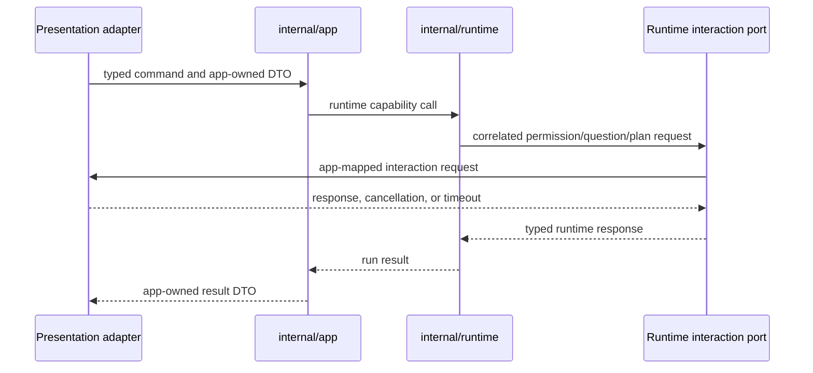
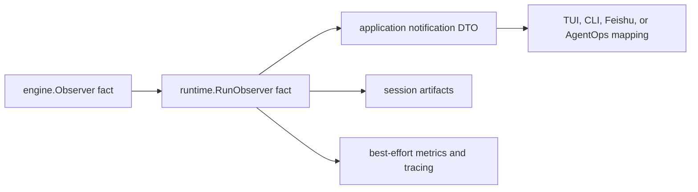

# Fox Package Dependency Contract

This document is the authoritative human-readable package dependency contract for Fox. Automated enforcement lives in `internal/architecturetest/imports_test.go`; the temporary migration ledger lives in `internal/architecturetest/allowlist.json`. A dependency-changing commit must update all three artifacts together.

## Target Import Graph

The diagram is a directed acyclic graph, not a rule that every execution path must pass through every package. Benchmark, child invocation, and Autodev are runtime control clients rather than user-presentation clients.

## Package Responsibilities

| Package or package class | Sole responsibility |
|---|---|
| `internal/schema` | Narrow model protocol values: messages, usage, tool definitions, calls, and results. It is not a general DTO or utility package. |
| `internal/engine` | Infrastructure-independent run/turn transitions and consumer-owned model, tool, conversation, policy, and observer ports. |
| `internal/runtime` | Harness construction, immutable profile resolution, live session/run lifecycle, context-injection decisions, recoverable-state commit coordination, and child-run control. |
| `internal/app` | User-entry commands, UI-neutral DTOs, runtime-notification mapping, and correlated interaction ports. |
| `internal/tui` | Fox-specific Bubble Tea input, queue, overlay, and terminal presentation behavior. |
| `internal/cli` | Non-interactive prompt/result, stdout/stderr, artifact-label, and exit presentation behavior. |
| `internal/feishu` | Feishu transport, scheduling, message delivery, and remote approval adaptation. |
| `internal/agentops` | AgentOps transport/control adaptation, incident task policy, and `log_search` ownership. |
| `internal/prompt` | Deterministic side-effect-free prompt-fragment representation, ordering, and rendering. |
| `internal/session` | Stored session/run records, durable identifiers, message/transcript artifacts, compact records, and `FileStore` mechanics. It does not own live runtime lifecycle. |
| `internal/benchmark` | Benchmark case, fixture, validation, aggregation, provenance, and report control over the shared runtime. |
| `internal/subagent` | Model-facing `delegate_task` and fork-skill request/result adaptation through a consumer-owned `Runner` port. |
| `internal/autodev` | Durable deterministic backlog, ledger, worktree, SDD stage, gate, Engineer, and publication control over the shared runtime. |
| Provider, tool, compaction, checkpoint, memory, automemory, metrics, and tracing packages | Focused mechanisms injected through consumer-owned contracts. Infrastructure is a classification; there is no aggregate `internal/infrastructure` package. |
| `cmd/*` | Process input/configuration, concrete construction, dependency wiring, entry selection, and startup only. |

### Current Migration State

`M01` establishes `internal/prompt` as the standard-library-only fragment representation and renderer. It accepts already-resolved fragments in caller-supplied order and performs no file discovery, memory access, collaboration selection, capability selection, persistence, or injection timing.

`internal/context` remains a temporary compatibility facade for unmigrated callers. It currently owns the legacy discovery and selection work, converts the resolved values to `prompt.Fragment` values, and forwards final ordering and rendering to `prompt.Render`. The dependency is one-way: `internal/context` may import `internal/prompt`; `internal/prompt` cannot import `internal/context` or any other project package. Runtime takes over discovery and injection decisions at `M11`, profile cutovers remove consumers according to their migration boundaries, and `M26` deletes the facade.

`M02` establishes `StoredSession`, `StoredRun`, `ID`, `RunID`, `FileStore`, `TranscriptEvent`, and `TranscriptLog` as the authoritative persistence vocabulary. `ID` and `RunID` are distinct Go types but retain the exact existing JSON string encodings. Production callers use the new names; `Session`, `Run`, `Manager`, `Event`, `Transcript`, and their legacy constructors remain deprecated aliases or wrappers until `M26`. The aliases preserve legacy symbol names, while the repository has been synchronously migrated to the strong ID types; compatibility does not promise unchanged internal Go source typing.

`FileStore` is the new-code boundary for file-backed create, lookup, run-start, and run-finish mechanics. The final stored-record contract contains data and derived artifact paths only. Until the runtime cutover, `StoredSession.StartRun` and `StoredRun.Finish` are the two explicitly allowlisted compatibility exceptions required by the current engine; no new caller may use them. `M10` introduces `runtime.AgentSession` and the consumer-owned `runtime.SessionStore` and makes runtime the sole live recoverable-state owner; `M11` moves context, compaction, resume, and rewind coordination to its single commit path. `M26` deletes the aliases and compatibility methods. `internal/session` must never import `internal/runtime`.

## Allowed Dependencies

| Importer | Allowed target architecture dependencies |
|---|---|
| `internal/engine` | Go standard library and `internal/schema` only. |
| `internal/runtime` | `internal/engine`, persisted values/storage contracts implemented by `internal/session`, and pure `internal/prompt`. Concrete mechanisms arrive through runtime-owned ports. |
| `internal/app` | `internal/runtime` through application use cases and mapping code. Application DTOs and ports are app-owned. |
| TUI, CLI, Feishu, AgentOps adapters | `internal/app` plus adapter-local presentation/transport helpers and independently owned control-plane values. They do not operate concrete runtime subsystems. |
| `internal/benchmark`, `internal/autodev` | `internal/runtime` as privileged control clients plus their own evaluation or deterministic control-plane mechanisms. |
| `internal/subagent` | Its own `Runner` port and protocol/value packages required for model-facing request adaptation. It does not import runtime. |
| `cmd/*` | Relevant adapters, runtime constructors, consumer ports, and concrete implementations only for construction and startup. |

An interface belongs to the package that consumes it. Concrete provider, tool, compaction, persistence, memory, and telemetry implementations satisfy those interfaces through composition; their packages do not force inward packages to import outward implementations.

## Forbidden Dependencies

- `internal/engine` must not import runtime, app, adapters, persistence, providers, tools, compaction, checkpoints, memory, telemetry, recovery, reminders, or tool-result storage.
- `internal/runtime` must not import app, TUI, CLI, Feishu, AgentOps, or the model-facing subagent adapter.
- `internal/session` must not import runtime or own live runtime lifecycle and recoverable-state commit policy.
- `internal/app` must not import presentation adapters or concrete engine, persistence, provider, tool, compaction, checkpoint, memory, or telemetry implementations.
- Presentation and transport adapters must not import or construct engine, runtime, session store, compaction, checkpoint, provider, tool registry, memory, telemetry, or concrete permission-policy implementations.
- `internal/subagent` and `internal/runtime` must not import each other. Composition maps `subagent.Runner` to `runtime.ChildRunner`.
- Benchmark and Autodev must not independently assemble the engine or bypass runtime lifecycle and security invariants.
- No package may create or import `internal/infrastructure`.
- No reverse import may be introduced to implement a callback. Bidirectional control uses consumer-owned request/response ports.

## Composition-Root Exception

`cmd/*` and narrowly scoped production factory files may know both consumer contracts and concrete implementations only while constructing, connecting, selecting, and starting an entry point. After startup they must not:

- execute model turns or tools;
- perform compaction or rewind;
- commit session state;
- retain a current session, permission grant, or run-scoped mutable object;
- format presentation output that belongs to an adapter.

This exception permits dependency injection; it does not permit workflow orchestration in `cmd/*`.

## Interaction Flow

Progress is one-way observation. Permission approval, user questions, and plan review are synchronous correlated request/response interactions and must not be modeled as a generic event bus.

## Observation Mapping

A fact is produced once and remains canonically ordered. Session artifacts may be model-visible and are not recoverable-state authority. Metrics and tracing remain best effort and cannot redefine run outcomes. Parallel Reporter, Event, and Journal pipelines must not independently establish ordering.

## Concrete Injection Points

| Capability | Consumer-owned boundary | Concrete implementation owner |
|---|---|---|
| Model invocation | `engine.ModelInvoker` | provider packages and composition |
| Tool snapshot/execution | `engine.ToolExecutor` | tool catalog/executor packages and composition |
| Conversation projection | `engine.Conversation` | `runtime.ContextController` |
| Recoverable persistence | `runtime.SessionStore` | `session.FileStore` |
| Prompt fragments | pure renderer calls | `internal/prompt` |
| Compaction mechanics | runtime-owned compaction capability | `internal/compaction` |
| Runtime observation | `runtime.RunObserver` | app mapper, artifacts, metrics, tracing adapters |
| Child invocation | `subagent.Runner` | composition adapter to `runtime.ChildRunner` |
| User interactions | runtime and app request/response ports | TUI or remote adapter implementations |

## Decreasing Allowlist

`internal/architecturetest/baseline_allowlist.json` is the immutable `B00` ceiling. `internal/architecturetest/allowlist.json` is the decreasing migration ledger and must always be a subset of that ceiling. Both contain exact production package edges, and each row has a mandatory `remove_by` boundary. A commit fails when it:

- introduces a violation absent from the allowlist;
- adds or broadens an allowlist row;
- leaves a stale row after removing the corresponding import;
- changes a dependency rule without updating this document and its tests.

The initial allowlist contains 68 exact edges. Its latest deletion boundaries are:

| Boundary | Coupling removed |
|---|---|
| `M14` | Benchmark independent engine/session assembly. |
| `M15` | Subagent invocation adapter's nested runtime construction. |
| `M18` | Autodev core engine/tool bypass. |
| `M19` | Feishu concrete runtime subsystem imports. |
| `M20` | AgentOps concrete runtime subsystem imports. |
| `M21`-`M23` | TUI concrete runtime, state, permission, tool, and checkpoint imports. |
| `M24` | Old `internal/app` assembly and presentation imports. |
| `M25` | Old engine concrete infrastructure imports. |

`M27` requires an empty allowlist and exact agreement between this document, automated tests, and production imports.
